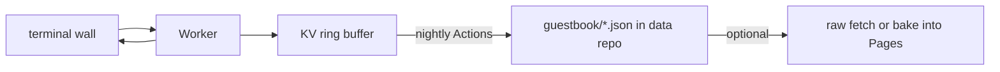

# Ideas

> **Append-only rule:** Never delete *unimplemented* ideas. When an idea is **fully** implemented, **move** it to [`DONE.md`](./DONE.md) (with pointers to commits / paths). Do not leave strikethrough “shipped” ghosts here. Partial progress stays in this file (optional short note). Ideation accumulates otherwise.

## Terminal Commands

### Command Wishlist

| Command | Description | Effort | Impact |
|---------|-------------|--------|--------|
| `figlet <text>` | ASCII art text (bundle 1 font ~2KB) | Low | Medium |
| `gh [activity/repos]` | GitHub recent activity via public API + Worker cache | Medium | High |
| `calc <expr>` | Safe math evaluator | Low | Medium |
| `man <cmd>` | Man page for each command (already have help text) | Low | Medium |
| `todo [add/list/done]` | Simple todo list in localStorage | Low | Medium |
| `note [add/show/search]` | Quick notes in localStorage | Low | Medium |
| `timer <seconds>` | Countdown timer in terminal | Low | Medium |
| `hollywood` | Fake hacking frenzy — scrolling hex dump + random syslog lines | Low | High |
| `sl` | Steam locomotive when you type `sl` instead of `ls` | Low | Medium |
| `sudo <cmd>` | Comedic "permission denied" messages | Very Low | Low |
| `ping [host]` | Fake ping with animated TTL display | Low | Medium |
| `ssh [user@host]` | Fake SSH connection animation then return to shell | Low | Medium |
| `password` | Generate random secure password | Very Low | Low |
| `base64 [encode/decode]` | Base64 encode/decode | Low | Medium |
| `qr <text>` | Terminal QR code (client-side qrcode.js) | Low | High |
| `colors` | Display all 16 ANSI color blocks | Very Low | Low |
| `font [name]` | Switch terminal font (preview mode) | Medium | Medium |
| `theme [name]` | Switch color theme from palette | Medium | Medium |
| `snake` | Playable Snake game in terminal (80x24 grid) | Medium | Medium |
| `type` | Typing speed test using FORTUNES quotes | Medium | Medium |
| `achievements` | Show unlocked easter egg badges | Medium | Medium |
| `tree` | Display VFS directory structure recursively (├── format) | Low | Medium |
| `head [-n] <file>` | Read first N lines of a VFS file | Low | Low |
| `tail [-n] <file>` | Read last N lines of a VFS file | Low | Low |
| `wc [file]` | Word / line / character count on output or file | Low | Low |
| `sort` | Sort output lines alphabetically | Low | Low |
| `uniq` | Remove adjacent duplicate lines from output | Low | Low |
| `tee <file>` | Split output: display to terminal and write to VFS file | Medium | Low |
| `ip` | Public IP + geolocation (city, ISP) via Worker proxy | Low | Medium |
| `uuid [v4]` | Generate UUID v4 via Web Crypto API (no server) | Very Low | Medium |
| `joke` | Random programming joke from JokeAPI | Low | Medium |
| `quote` | Random advice from Advice Slip API | Low | Medium |
| `rps <choice>` | Rock-paper-scissors against the terminal | Low | Low |
| `quiz` | 40-question frontend quiz with XP system and 4 rank tiers | Medium | Medium |
| `zip` / `unzip` | Simulated file compression (tar-style ASCII progress with VFS) | Medium | Low |
| `snippet [add/show/rm]` | Code snippet vault with syntax highlighting in terminal | Low | Medium |
| `color <value>` | Convert colors between HEX, RGB, HSL, OKLCH (Web Crypto) | Low | Medium |

### UX Enhancements

- **`Ctrl+R` reverse search** — incremental search through CMD_HISTORY. Standard bash behavior. Medium effort, high impact.
- **Command auto-suggest** — ghost text showing most likely completion (like fish shell). Right arrow or Ctrl+F accepts. Medium effort.
- **`stats` command** — commands run, uptime, keys pressed, fortune count. localStorage-persisted counters. Low effort.
- **Keyboard shortcut cheat sheet** — `Ctrl+H` overlay listing all shortcuts (Tab, Ctrl+R, Ctrl+C, Ctrl+L, Ctrl+D, arrow keys, etc.). Low effort.
- **Command palette** — `⌘K` / `Ctrl+K` opens a fuzzy-search overlay listing every command with live filtering. Execute any command directly from the palette. Medium effort, very high impact (sourced from khriztianmoreno).
- **Suggestion panel** — Live dropdown of matching commands + arguments as you type. Navigate with Tab/arrows, Esc to dismiss. Upgrade beyond shipped Tab cycling. (sourced from terminal-portfolio-website).
- **Paste auto-clean** — Automatically strips leading `$ `, `❯ `, `root@host:~# ` from pasted commands. Low effort, reduces friction for copy-paste visitors (sourced from RajdeepKushwaha5).
- **Copy button on output** — Hovering any command output block shows a copy icon. Click to copy that output to clipboard. Low effort.
- **Multiple terminal sessions** — tmux-style split panes: `Ctrl+B %` splits vertically, `Ctrl+B "` splits horizontally. Each pane has independent state. High effort, very high impact.
- **Loading spinner variants** — 5 styles: braille dots, ASCII progress bar, typewriter cursor, dots accumulator, rotating line. Cycling `theme` or `spinner` command. Low effort (sourced from terminal-portfolio-website).

### Shell Environment

Transform the terminal from a command-dispatch facade into a real-feeling shell environment.

| Feature | Description | Effort | Impact |
|---------|-------------|--------|--------|
| **Command piping (`\|`)** | Chain commands: `fortune \| cowsay`. Stdout of first feeds stdin of next. Right-associative. | High | Very High |
| **Shell variables** | `$USER`, `$HOSTNAME`, `$PWD`, `$SHELL`, `$EDITOR`. `echo $VAR` and `export VAR=val`. | Medium | High |
| **Output redirection** | `>`, `>>`, `2>` operators for stdout/stderr. `echo "note" > ~/notes.txt` actually writes to VFS. | Medium | High |
| **Scripting mode** | Multi-line input with `\` continuation or `for i in 1 2 3; do ... done` blocks. | High | Medium |
| **Command substitution** | `$(cmd)` or backtick expansion: `echo "Today is $(date)"`. | Medium | Medium |
| **`cowsay` piping / `ponysay`** | Basic `cowsay` shipped — still open: pipe-friendly `fortune \| cowsay`, ponysay. | Low | Medium |
| **`fortune -l`** | Long fortunes. `fortune -c` shows category. Categories: wisdom, code, philosophy, humor. (basic `fortune` shipped) | Low | Low |
| **`cmatrix`** | Matrix rain *in* the terminal (full-screen `matrix` overlay already shipped). | Low | Medium |
| **`yes <text>`** | Repeatedly outputs text until Ctrl+C. | Very Low | Low |
| **`banner <text>`** | Large ASCII banner text (hash-based). | Low | Medium |
| **`watch <cmd>`** | Run command repeatedly, clear screen between runs. `watch -n 2 date`. | Low | Medium |
| **`env`** | List all shell environment variables and their values. | Very Low | Medium |
| **`which <cmd>`** | Show path to a command in the VFS. | Very Low | Low |
| **`alias`** | Define and list command aliases persisted in localStorage. | Low | Medium |

---

## Now Playing Integration

### Last.fm (Recommended — best effort/impact ratio)
- Free API key from [last.fm/api](https://www.last.fm/api)
- Cloudflare Worker proxy: `GET ?user=aptitudepi&method=user.getrecenttracks&limit=1`
- If `track[0].@attr.nowplaying === "true"` → currently playing
- Returns: artist, track name, album art URL, loved status
- Display: `np` command shows album art (via ANSI blocks or sixel) + track info
- Could also show in MOTD header
- Bonus: recent scrobbles, top artists, listening stats

### Spotify (Higher fidelity, more complex)
- OAuth PKCE flow with stored refresh token in Worker
- Worker: `api.spotify.com/v1/me/player/currently-playing`
- Returns: album art (640x640), progress_ms, device, explicit flag
- Display: album art as ANSI blocks + progress bar
- Downside: token refresh requires user to re-auth periodically

### YouTube Music
- No public API for now-playing status — not feasible without a browser extension

### Ambient Audio Visualizer
- Instead of "now playing," create a Web Audio API ambient soundscape
- Terminal beeps, soft hum, key clicks — no audio files shipped
- Visualized as waveform bars in the terminal header
- Demo mode generates synthetic audio
- Could sync with particles for audio-reactive color shifts

---

## Integrations

Beyond music — hook the terminal into the services the user actually visits daily.

| Integration | Command | Data Source | Effort | Impact |
|-------------|---------|-------------|--------|--------|
| **Hacker News** | `hn [top/new/show/ask]` | Firebase API (free, no auth) | Low | High |
| **GitHub notifications** | `gh notify` | GitHub API notifications endpoint | Medium | High |
| **Dev.to articles** | `devto` | Dev.to API (free, no auth) | Low | Medium |
| **Stack Overflow rep** | `so` | Stack Exchange API | Low | Medium |
| **Goodreads reading** | `books` | Goodreads RSS → Worker parser | Low | Medium |
| **YouTube subscriber count** | `yt <channel>` | YouTube Data API via Worker | Low | Medium |
| **Strava** | `strava` | Strava API, OAuth stored in Worker | Medium | Medium |
| **Steam game library** | `steam <user>` | Steam API (free, no auth needed for public) | Low | Low |
| **Crypto prices** | `crypto [btc/eth/sol]` | CoinGecko API (free, no auth) | Very Low | Medium |
| **Stock ticker** | `stock <SYMBOL>` | Finnhub or Yahoo Finance via Worker | Low | Medium |
| **Reddit** | `reddit <subreddit>` | Reddit JSON API (.json suffix, no auth) | Low | Medium |
| **Weather maps** | `weather -m` | OpenWeatherMap tiles or wttr.in ANSI | Medium | Low |

### Weather Radar — Implementation Notes (Attempted, June 2026)

**Goal**: `weather -r` renders a RainViewer radar precipitation map composited over ESRI World_Topo_Map tiles, displayed as ANSI truecolor half-blocks in the terminal, with multi-frame animation cycling through the last hour.

**Data Sources**:
- **Radar tiles**: RainViewer public API (`api.rainviewer.com/public/weather-maps.json`). Gives a manifest of past frames (5–10 min apart) with tile paths. Tile URL: `{host}{path}/512/{zoom}/{lat}/{lon}/{colorScheme}/{opacity}.png`
- **Topo tiles**: ESRI World_Topo_Map (`server.arcgisonline.com/ArcGIS/rest/services/World_Topo_Map/MapServer/tile/{zoom}/{y}/{x}.png`). No auth required.
- **Zoom levels**: RainViewer supports 2–12; ESRI supports 0–18. Used zoom 7 for a good balance of coverage and detail.

**Color scheme**: RainViewer scheme `0` has transparent background (only precipitation has non-zero alpha). Schemes `2+` embed a dark base map (solid fill, no transparency) — the alpha-based `t.a > 10` check rendered every pixel as `▀` because all pixels had alpha=255. Using scheme `0` fixed this, but zoom 7 didn't look great for the test location.

**ANSI Rendering Pipeline**:
1. Fetch topo tile (512×512 PNG via `createImageBitmap`)
2. Fetch radar tile (same dimensions)
3. Composite on a `<canvas>`: topo drawn first (darkened 0.45×), radar drawn on top
4. `ctx.getImageData(0, 0, 512, 512)` samples the composited result
5. Sample to terminal grid: `cols × rows` where each terminal row = 2 canvas rows (half-block `▀`/`▄`)
6. Each grid cell picks the top and bottom canvas pixel; if both have alpha > 10, render `▀` with foreground = top pixel color and background = bottom pixel color via ANSI 24-bit truecolor (`\x1b[38;2;R;G;Bm` / `\x1b[48;2;R;G;Bm`)

**Edge detection attempt**: Replaced uniform darkening with Sobel edge detection (3×3 kernels, threshold `mag > 80 && luma > 100`) to extract only coastlines/roads/borders as white lines on transparent background. Text naturally filtered out by the luminance threshold. This was promising but not fully tuned — many text artifacts remained and the threshold needed per-tile adjustment.

**Marker**: Cyan (`#00ffff`) crosshair at the user's location (canvas center, 256,256): two concentric circles (radii 10 and 5, lineWidth 2) + crosshair + "YOU" label (9px monospace).

**Animation**:
- Filtered past frames within 3600s window, capped at 12
- Pre-composited all frames (topo + radar + marker) into `ImageData` arrays
- Rendered the latest frame as the initial display
- `setInterval` at 250ms: `\x1b[{rows+2}A` cursor-up to grid start, rewrote grid + border + timestamp
- `term._radarAnim` stored on the terminal object, cleared at start of any new command

**Known Problems** (why it was scrapped for now):
1. **Artifacting**: The cursor-up redraw sometimes corrupted the header/border lines. The exact cursor position after the initial render depended on the `\r\n` vs `\n` line endings used in `term.write()` vs `term.writeln()` — xterm.js treats LF only as "move down" without carriage return, so `\r\n` must be used consistently. renderGrid used `\r\n` per line but the last line's trailing `\r\n` was either sliced off or doubled depending on the code path, shifting the border position by one line.
2. **Boundary escape**: The animation rewrite spanned `rows + 2` lines (grid + border + timestamp) but the actual occupied lines sometimes differed by 1, causing writes to bleed into the header area or beyond the box.
3. **Zoom vs detail**: At zoom 7 the radar tile covered too large an area for local weather detail. Zoom 8 caused "zoom level not supported" errors from RainViewer for some configurations.
4. **Color scheme fragility**: Scheme `0` (transparent) worked well for alpha detection but scheme `2+` (base map embedded) filled the entire grid — there was no reliable way to distinguish precipitation pixels from base map pixels without alpha.
5. **Frame count**: 12 frames × 512×512 canvas compositing + `getImageData` was heavy. Adding the edge detection pass (full Sobel over 512×512) added ~5ms per frame.
6. **Animation lifecycle**: If the user typed a command mid-animation, the `setInterval` callback could fire during the new command's output, causing mixed output. Clearing on `executeCommand` fixed the race but left stale cursor positions.

**Future Approach**: Use `wttr.in` ANSI output directly (no composite, no canvas, no animation — just fetch `wttr.in/{city}?format=%C+%t` and display the text). For radar, a static screenshot-like render with a zoom level that renders cleanly at the terminal's native resolution. Skip animation entirely until a reliable diff-based redraw strategy is found.

### Composite Commands

- `mood` — aggregates weather + last played track + GitHub streak + today's commits into one status readout. Medium effort.
- `day` — morning dashboard: weather, calendar events (if Google Calendar linked), HN top story, random fortune. Low effort once integrations exist.
- `whereis db` — geo-IP lookup via Worker + Cloudflare Trace. Replies with approximate city and ISP. Low effort.

---

## Visual Effects

### CRT Scanline Overlay
```css
body::after {
  content: '';
  position: fixed; inset: 0;
  background: repeating-linear-gradient(0deg,
    transparent, transparent 2px,
    rgba(0,0,0,0.06) 2px, rgba(0,0,0,0.06) 4px);
  pointer-events: none; z-index: 9998;
}
```
Very Low effort. Subtle, thematic retro effect.

### Chromatic Aberration on Terminal
- CSS `text-shadow` with 1px red/blue offset on `.xterm` text
- Or SVG `feColorMatrix` filter
- Very subtle CRT feel. Low effort.

### Liquid Glass Cards (from kokonutui)
- SVG `<feTurbulence>` + `<feDisplacementMap>` for realistic glass refraction
- App backdrop blur is now on a fixed `.glass-backdrop` layer (no scroll compositing)
- Upgrade project cards and section headers with SVG displacement glass
- Mouse-following refraction shift. Medium effort, very high impact.

### Flow Field Particle Background (from kokonutui)
- Replace/supplement Three.js particles with Canvas 2D flow field
- Organic noise trails in aurora/ember/ocean color themes
- Thousands of particles flowing through simplex-noise fields
- Medium effort, high impact.

### Animated Gradient Beams (from kokonutui)
- Blurred color beams drifting upward behind glass panels
- `ctx.filter = 'blur(35px)'` for soft glow
- 3 color themes matching the portfolio palette
- Low effort, medium impact.

### Noise Texture Overlay
- Subtle grain texture on glass panels via `<feTurbulence>` SVG filter
- Hides the "too clean" look of pure glass
- Popular on Apple's Liquid Glass. Low effort.

### Border Beam
- Animated conic-gradient beam traveling along container border using CSS `@property --beam-angle` + `mask-composite: exclude`
- Applied to CTA buttons (GitHub, Resume download) — instant visual pop
- Beam cycles blue → red → dim blue through host palette
- Low effort, high impact. Verified working.

### Magnetic Button Effect
- SVG inside social-link buttons follows cursor position within link bounds with spring-physics interpolation
- JavaScript: `mousemove` → `getBoundingClientRect()` → normalized offset → `requestAnimationFrame` lerp → `--mag-x`/`--mag-y` custom properties
- CSS: `transform: translate(var(--mag-x), var(--mag-y))` with `will-change: transform`
- Social link container scales to 1.18 on `mouseenter` (spring-physics via anime.js)
- Medium effort, high impact. Makes static links feel alive.

### AI Loading Spinner
- Animated emoji sequence (🌒🌓🌔🌕🌖🌗🌘) displayed during Transformers.js model loading
- Spinner replaces "Loading..." text, updates every 150ms via `setInterval`
- Cleared when AI pipeline resolves or on error
- Very low effort, medium impact. Gives user feedback during 5-15s WASM model load.

### Theme System
- 5-8 themes accessible via `theme <name>`: Dracula, Matrix (green), Amber, Ocean, Nord, default
- CSS custom properties swapped at runtime
- Persisted in localStorage
- Medium effort, high impact.

### Halation / Glow Bleed
- Simulates CRT bloom: bright elements bleed into surrounding dark areas.
- CSS `box-shadow` with `color-mix(in srgb, currentColor 60%, transparent)` on text, borders, and glowing elements.
- Subtle on white text, pronounced on bright colored elements. Very Low effort.

### Phosphor Burn-in
- Faint ghost of the boot sequence text persists for ~30s after boot, slowly fading.
- CSS `::after` on terminal body with `mix-blend-mode: difference`, animated opacity.
- Low effort. Niche retro effect that rewards repeat visitors.

### Static Interference (VHS Noise)
- Brief full-screen static burst as transition between sections.
- Canvas 2D with random pixel noise, 120ms duration.
- `Ctrl` key press also triggers subtle static. Low effort.

### Dirty Glass Smudge
- Semi-transparent SVG overlay on glass cards with blurred grease spots.
- Randomly generated at page load so no two visits look identical.
- Very low effort once NoiseTexture SVG approach is proven.

### Lens Flare on Light Elements
- Conic-gradient pseudo-elements positioned at "light source" (cursor, glowing border corners).
- Fades in/out on hover. Pure CSS. Low effort.

### Subpixel Rendering Emulation
- Slight RGB color fringing on terminal text edges (Chromatic Aberration, already listed).
- Upgrade to CSS `text-shadow: 0.5px 0 0 rgba(0,0,255,0.3), -0.5px 0 0 rgba(255,0,0,0.3);` for LCD subpixel feel.
- Very Low effort.

### Animated SVG Blobs
- Generative SVG blobs with morphing `d` attribute behind the hero terminal.
- anime.js or CSS `@property` animates path between 4-6 predefined organic shapes.
- Semi-transparent fills in blue/red palette cycle. Layer 3 blobs at different sizes/speeds.
- Medium effort. Adds organic motion behind the rigid terminal layout (sourced from YasaminAlizadeh).

### Hero Shader Displacement (WebGL)
- Custom GLSL fragment shader as hero background: fluid displacement field that distorts toward cursor position.
- Uses raw WebGL2 (not Three.js) for minimal bundle size (~10KB).
- Colors match page palette. Falls back to static gradient if WebGL unavailable.
- High effort, very high impact. Transforms the hero from static to living canvas (sourced from delowarhossain).

### Ghost Cursor / Cursor Trails
- Multiple faint cursor "ghosts" follow the real cursor with increasing delay.
- Each ghost has `opacity: 0.15→0` and slight scale. 5-8 total.
- Canvas-based overlay, or DOM divs with CSS transitions.
- Low effort, medium impact. Makes cursor feel heavy and cinematic (sourced from delowarhossain).

### Magnetic Text
- Section headings subtly shift toward cursor within a bounding radius.
- CSS custom properties + rAF lerp (same pattern as MagicCard orb).
- Maximum offset: 8-12px. Maps to tldraw hovering effect.
- Low effort. Makes otherwise static text feel responsive (sourced from delowarhossain).

### Idle State / Wait Mode
- After 30s of inactivity, terminal enters "wait mode": bouncing DVD-logo-style dvxb.io text, slow glitch pulses, or rotating ASCII art.
- Click or keypress dismisses immediately. Low effort (sourced from jasonbergh/codrops).

### Custom 404 Terminal Page
- `bash: page_not_found: command not found` in large ASCII.
- Suggest similar URLs with Levenshtein distance: "Did you mean `/projects`?"
- Full terminal prompt available on 404 page for instant re-navigation.
- Low effort, high personality (sourced from nomadicmehul / laxitajain).

### Aura Orbs
- 3 floating blurred radial gradients that drift slowly behind content sections.
- Each orb is a `::before` with `filter: blur(60px)` and `animation: auraDrift` (randomized path over 20s).
- Colors: primary blue, red, and a mix. Opacity 0.1-0.15. Very low effort (sourced from Anandhu9255).

### Interactive 3D Keyboard
- CSS 3D-transformed keyboard renders below the hero as a decorative element.
- Keys visibly depress on actual keyboard press via `:active` styles.
- Function row glows blue/red in sync with color cycle. Low-medium effort (sourced from YasaminAlizadeh).

---

## Animations

### Typewriter Boot Sequence
- Current: messages appear synchronously at 180ms intervals
- Typewriter: each character appears with variable timing (30-100ms)
- Natural variance: occasional pauses, bursts of speed
- Cursor blinks during typing
- Low effort, high impact.

### Glitch Text on dvxb.io Title
- CSS `@keyframes` with pseudo-element layering
- Random glitch bursts every 3-8 seconds
- 3 layers: primary (white), before (red offset -3px), after (blue offset 3px)
- `clip-path` inset animation for scan-line glitch effect
- Low effort, high impact.

### Scrolling Text Reveals (from kokonutui)
- Section headers fade up from translateY(20px) with blur
- Each word staggers in sequentially (50ms delay between words)
- Uses IntersectionObserver + CSS transitions
- Low effort, medium impact.

### Character-by-Character Heading Reveal
- Each letter of section `<h2>` is wrapped in a `<span>` with `display: inline-block`
- Spans start `opacity: 0; transform: translateY(20px)` — staggered in at 25ms intervals via `setTimeout` on scroll reveal
- `IntersectionObserver` with `threshold: 0.5` ensures it triggers once per heading
- Subtle premium feel. Low effort.

### Hero Entrance Animation
- Terminal panel fades in on page load with `opacity: 0 → 1`, `transform: scale(0.97 → 1)`, `filter: blur(6px → 0)`
- CSS `@keyframes heroEntrance { to { opacity: 1; transform: scale(1); filter: blur(0); } }` with 1s `var(--ease-out-expo)` 100ms delay
- `animation-fill-mode: forwards` retains final state
- Very low effort, makes page load feel intentional.

### Smooth Spotlight Tracking (RAF)
- Spotlight card `mousemove` handler drives a `requestAnimationFrame` loop with lerp factor 0.15
- Target xy from mouse event → current xy converges with spring-like smoothness
- `mouseleave` cancels RAF, resets to center
- Upgrade from raw mousemove (jittery on low-DPI screens). Low effort.

### Blur + Fade Scroll Reveal
- `.reveal` class extended with `filter: blur(4px)` transitioning to `blur(0)` on `.visible`
- Smoother entry than raw opacity + translateY alone — masks initial jank
- Still `transition: opacity 600ms, transform 600ms, filter 600ms`
- Trivial effort (one CSS property per reveal class).

### 3D Tilt Cards (from kokonutui SpotlightCards)
- Project cards rotate in 3D space toward cursor with spring-physics
- Focus-dim siblings: un-hovered cards scale to 0.96, opacity 0.5
- Shimmer sweep: gradient moves across card on hover
- Accent bottom line expands from w-0 to full width
- Medium effort, very high impact.

### Particle Burst on Click (from kokonutui)
- 6 particles burst from click point on CTA buttons
- Web Animations API — no library needed
- Low effort, medium impact.

### Mouse-Effect Cards (from kokonutui)
- Grid of dots that repel from cursor with spring physics
- Dots have breathing opacity animation
- Edge-factor for natural sparse look at borders
- Medium effort, high impact.

### Scroll Animations
- **Lenis smooth scroll** — replace native scroll (~3KB gzipped)
- **Scroll-velocity skew** — elements skew based on scroll momentum
- **Parallax with depth layers** — multiple elements at different scroll rates
- Medium effort, medium impact.

---

## Audio

### Terminal Key Clicks
- Web Audio API `OscillatorNode` + `GainNode`
- Different sounds for: letter key, backspace, enter, bell
- No audio files shipped — generated at runtime
- Toggle with `sound` command or MOTD preference
- Medium effort, high impact (polarizing — users love or hate).

### Boot Chime
- Short synthesized chime at end of boot sequence
- Web Audio API: two-tone oscillator (ascending)
- Low effort, low-medium impact.

---

## AI Integration

### `ai <prompt>` command
- Calls Cloudflare Workers AI or OpenAI API via Worker proxy
- API key stays server-side in Worker
- Stream response to terminal character-by-character
- System prompt: "You are a Unix terminal assistant..."
- Medium effort, very high impact.

### `chat` mode
- Persistent chat session in the terminal
- Alternate between command mode and chat mode; `/exit` returns to shell
- Chat history persisted in localStorage
- Medium effort, high impact.

---

## Gamification / Easter Eggs

### Achievements System
- localStorage-persisted badges
- "First command", "Konami Master", "Pipe Wizard", "Matrix Veteran", "Terminal Addict" (100 commands)
- `achievements` command to view them
- Hidden: `sudo`, `sl`, secret Konami-enhanced things
- Medium effort, medium impact.

### Snake Game
- Playable in terminal (`snake` command)
- 80x24 character grid, WASD/arrow controls, score tracking
- Medium effort, medium impact.

### Typeracer
- `type` command starts a typing test
- Measures WPM and accuracy
- Quote from FORTUNES array as source text
- Medium effort, medium impact.

### Secret Pixel Grid (/r/place)
- `/place` command shows 40x12 pixel canvas
- Arrow keys move cursor, space to place dot
- Uses ANSI block characters as pixels
- Medium effort, medium impact.

---

## Terminal Content & Portfolio

Surface portfolio content directly through the terminal — not just links to it.

| Feature | Command | Description | Effort |
|---------|---------|-------------|--------|
| **Resume viewer** | `cat resume.md` | Renders a markdown resume with ANSI headers, bullet lists, horizontal rules. Source: `~/.resume.md` in VFS. | Low |
| **Project browser** | `projects [filter]` | Lists projects from page content. `projects web` filters by tag. `projects --json` for machine output. | Low |
| **Case studies** | `case <name>` | Full case study rendered in terminal: problem, approach, tech, outcome. Source: markdown in VFS. | Medium |
| **Skill graph** | `skills` | ASCII bar chart of skill proficiency. Bars are ANSI blocks with color gradient. | Low |
| **Timeline** | `timeline` | Chronological career/education timeline as ASCII tree. Years on left, events branching right. | Low |
| **Guestbook** | `guestbook [add/list]` | Leave a message or browse all visitor messages. Persisted via Durable Object or KV. | Medium |
| **Contact form** | `contact <message>` | Sends message via Cloudflare Email Worker. Prompt for email, validate, send. | Medium |
| **Blog reader** | `blog [list/show <id>]` | Browse and read markdown blog posts. Rendered with ANSI formatting, images as links. | High |
| **Reading stats** | `stats --reading` | Total blog words read across sessions, time spent, articles completed. | Low |
| **Changelog** | `changelog` | Recent git commits displayed as a terminal-friendly changelog. Source: git log fetch via Worker. | Low |

### Markdown Rendering in Terminal

- Basic markdown → ANSI conversion: `#` → bold magenta, `##` → bold cyan, `-` → bullet with indent, `**bold**` → ANSI bold.
- Code blocks get a green border and monospace. Links show `[text](url)` with url dimmed.
- Render engine: simple regex-based converter, 200 lines. Reusable for `cat`, `blog`, `case`.
- Low effort, very high impact. Makes the terminal feel like a real content platform.

---

| Game | Command | Description | Effort |
|------|---------|-------------|--------|
| **2048** | `2048` | Slide tiles to merge powers of 2. 4×4 grid, WASD, score tracking. | Medium |
| **Tetris** | `tetris` | Classic falling blocks. 10×20 grid, WASD/arrow rotate, score + lines. | High |
| **Minesweeper** | `mines` | 9×9 grid with 10 mines. WASD nav, space to reveal, F to flag. | Medium |
| **Hangman** | `hangman` | Word guessing from fortunes dictionary. Hard mode: coding terminology only. | Low |
| **Dungeon** | `dungeon` | Text adventure. Simple 5-room map with items, doors, and a win condition. | Medium |
| **Maze** | `maze` | Generate random maze with DFS, solve with BFS. Arrow keys to walk through. | Medium |
| **Game of Life** | `life` | Conway's Game of Life on a 40×20 grid. Random seed, step/speed controls, patterns. | Medium |
| **Pong** | `pong` | Terminal pong. Player uses Q/A keys. CPU opponent. ASCII ball + paddles. | Medium |
| **Quiz** | `quiz` | 40-question frontend/tech quiz with XP system, 4 rank tiers, localStorage persistence. Multiple choice, timed. | Medium |
| **RPS** | `rps` | Rock-paper-scissors against the terminal. Best of 5. Running score. Stats. | Low |

### Interactive Adventure

- `adventure` — command-line text adventure set in your own career story.
- Start screen: character creation with trait selection (2-3 choices).
- 5-7 "chapters" based on real career milestones.
- Multiple endings depending on choices made (2-3 endings).
- Unlockable achievements per ending.
- High effort, very high impact. Makes the portfolio emotionally memorable — visitors experience your journey instead of reading it (sourced from MeeksonJr's terminal adventure game).

### Hidden Mini-Game: Inspector Mode

- Not a terminal command — a UI mode toggleable via `inspect` command or floating button.
- Once active, clicking any element on the page shows a tooltip overlay with technical implementation details.
- Powered by a data attribute lookup: `data-inspect="This card uses ::after with radial-gradient(currentColor, transparent) + blur(40px) for the orb glow."`
- Content stored in a JS map, not DOM, to keep HTML clean.
- Medium effort, high impact. Shows depth of craftsmanship and invites curiosity (sourced from MeeksonJr).

| Trigger | Reaction |
|---------|----------|
| `42` | "The answer to life, the universe, and everything." Fade in Douglas Adams quote. |
| `coffee` | "brew: illegal option -- all\nUsage: brew install caffeine\nError: no room in mug" |
| `rm -rf /` | "rm: /.bash_profile: Permission denied\nrm: /.ssh: Permission denied\n... nice try." |
| `rm -rf .` | "Congratulations, you played yourself." (no actual deletion) |
| `:(){ :\|:& };:` | The fork bomb ASCII art with a comedic "whoa there, cowboy" response |
| `make me a sandwich` | "What? Make it yourself." / "sudo make me a sandwich" → "Okay." |
| `apt-get install <anything>` | Simulated apt output ending in "0 upgraded, 0 newly installed, 0 to remove." |
| `telnet <anything>` | Star Wars ASCII animation (like the real `telnet towel.blinkenlights.nl`) |
| `kubectl` | "kubectl: command not found. Did you mean `docker`?" → "docker: command not found." |
| `vim` | ":q to exit — wait, no, :q! — ESC : q ! ENTER — okay, :wq — actually just Ctrl+Alt+Del" |
| `emacs` | "Emacs launched. Please come back in 3-5 business days while it initializes." |
| `nano` | Nano actually opens with a real simple text editor in the terminal. |
| `curl <url>` | Simulated wget-style progress bar followed by "Saved to /dev/null" (or actually fetches via fetch API). |
| `meow` / `nyan` | Cat animation with ASCII art. Multiple language variants: `cat language`, `woof`, `bark`. |
| `party` / `disco` / `rave` | Everything turns rainbow. Text cycles through hues. Re-type to disable. |
| `glitch` / `hack` | Temporary screen-wide glitch artifact burst, then return to normal. |
| `flip` / `spin` / `barrel roll` | Terminal content flips upside down, spins 360°, or barrel-rolls. CSS transform. |
| `rickroll` / `rick` | Never gonna give you up — ASCII art + lyrics in terminal. |
| `xyzzy` | "Nothing happens." / "A cold feeling passes over you." (Colossal Cave reference) |
| `iddqd` | "God mode activated. You feel invincible." Next command always succeeds with extra flair. |
| `sus` / `among us` / `amogus` | Red SUS character made of ASCII block chars. |
| `simone` | Explodes typed letters off-screen with physics animation (sourced from simoneraffaelli). |
| `dig [hint]` | Treasure hunt: search for hidden `.secrets` file in VFS. First person to find it gets a custom message. Progress saved in localStorage (sourced from laxitajain). |

### Collectibles System (Acorn Hunt)

- 5-10 hidden collectibles scattered across VFS (dotfiles, nested directories, command outputs).
- `collectibles` command shows found/total count with cryptic hints for the rest.
- Found items saved in localStorage with timestamp.
- Rewards: special ASCII art, secret commands, custom MOTD line, "completionist" badge.
- Medium effort (sourced from laxitajain's acorn hunt concept).

### Visual Mode Effects

- `party` — rainbow color cycle on all terminal text + output. Re-type `party` to toggle.
- `glitch` — brief screen corruption (CSS animation), self-clears after 2s.
- `hack` — fake "breach" sequence: hex dump → loading bars → "Access Granted."
- `ghost` — all text has `opacity: 0.6` with slight blur. Immersion mode.
- `focus` — dims all output except the last command result. Reading mode.
- All modes toggle with the same command. Persisted in localStorage. Low effort (sourced from simoneraffaelli).

---

## Infrastructure

- **Visitor counter** — Cloudflare Worker + KV for daily unique visits (IP-hashed). `visitors` command.
- **GitHub stars widget** — Worker aggregates stars across repos with 1h cache. Display in MOTD or `gh` command.
- **Lenis smooth scroll** — replace native scroll for scroll-triggered animation coherence.

---

## Developer Infrastructure

### CI / Automated Quality

| Tool | What It Does | Effort |
|------|--------------|--------|
| **Lighthouse CI** | GitHub Action running Lighthouse on every PR. Reports performance, a11y, SEO scores. | Low |
| **Bundle size tracking** | GitHub Action + status check for JS/CSS bundle deltas. Alerts on regressions. | Low |
| **Visual regression** | Playwright snapshots of hero, terminal, cards. Catches unintended CSS changes. | Medium |
| **A11y audit** | `axe-playwright` integration in CI. Scans each page section for WCAG violations. | Low |
| **HTML validator** | `html-validate` or W3C validator in CI. Catches unclosed tags, duplicate IDs. | Very Low |

### Performance Budgets

| Metric | Target | Enforcement |
|--------|--------|-------------|
| Total JS (gzip) | < 150 KB | Bundle analyzer in CI |
| Total CSS (gzip) | < 30 KB | CSS stats in CI |
| FCP | < 1.5s | Lighthouse CI |
| LCP | < 2.0s | Lighthouse CI |
| CLS | < 0.1 | Lighthouse CI |
| TBT | < 200ms | Lighthouse CI |

### Security Headers

- Add `Content-Security-Policy` header via Cloudflare Worker or Pages `_headers`.
- Strict CSP: no `unsafe-inline` for scripts (anime.js needs hashes or nonces).
- `X-Content-Type-Options: nosniff`, `X-Frame-Options: DENY`, `Referrer-Policy: strict-origin-when-cross-origin`.
- Medium effort (CSP especially tricky with anime.js + inline event handlers).

### Resource Hints & Preloading

| Hint | Target | Why |
|------|--------|-----|
| `preconnect` | Google Fonts, Cloudflare CDN | Warm DNS + TLS before fetch |
| `preload` | hero-terminal CSS, fonts, anime.js | Critical render path assets |
| `prefetch` | Three.js, Transformers.js | Idle-time fetch for below-fold deps |
| `modulepreload` | `js/main.js` | ES module graph preload |

### Sitemap & Robots

- `humans.txt` — standard "built by" file. Trivial. (`sitemap.xml` / origin `robots.txt` / IndexNow → [`DONE.md`](./DONE.md))
- `security.txt` — `/.well-known/security.txt` with contact + GPG. Trivial, on-brand for a systems person.

### RSS Feed

- Generate `feed.xml` listing portfolio projects, blog posts, and changelog entries.
- If no blog yet, RSS of recent git commits + portfolio projects.
- Low effort. Increases IndieWeb credibility.

### PWA / Offline Support

- Service Worker caching strategy: Cache-first for static assets, network-first for HTML.
- `manifest.json` with theme color, display mode `standalone`, icon set.
- Offline fallback page: cached version of the terminal shell (no API-dependent features).
- Medium effort. Makes the portfolio installable on mobile home screens (sourced from anisul-islam-prog / RajdeepKushwaha5).

### Data Saver Mode

- Check `navigator.connection.saveData` and `navigator.connection.effectiveType`.
- If Data Saver ON or connection is "slow-2g"/"2g": disable Three.js particles, skip heavy anime.js scroll effects, remove noise texture overlay.
- Show subtle badge: "⚡ Data Saver — reduced animations."
- Key commands (`help`, `whoami`, `projects`) still work fully. Low effort (sourced from jasonbergh/codrops).

### DOMPurify Sanitization

- Sanitize all user-generated output (guestbook entries, contact messages, AI responses) with DOMPurify before rendering in the terminal.
- Prevents XSS via command output. Critical if accepting user input. Low effort (sourced from terminal-portfolio-website).

### SSRF Protection

- Any `curl`-like command or external fetch from the terminal needs URL validation.
- Block private IP ranges (10.x, 172.16-31.x, 192.168.x, 127.x.x.x, ::1).
- Block internal metadata endpoints (169.254.x.x, 100.x.x.x).
- Medium effort. Security-critical for Worker proxy endpoints (sourced from terminal-portfolio-website).

### `/now` Live Activity Page

- "What I'm doing right now" — fetches live GitHub events via API, shows recent commits, PRs, issues.
- Auto-refreshes every 30s. Styled as a terminal status board.
- Low-medium effort once GitHub integration exists (sourced from delowarhossain).

### `/uses` Page

- Lists hardware (laptop, monitor, keyboard), software (editor, terminal, tools), and dev environment.
- Terminal-compatible: `uses` command renders it formatted in the shell.
- Low effort. Popular personal site convention.

---

## Top ideas by Impact/Effort (open only)

Shipped rows (`weather`, tab completion, `hn`, `md`, CRT/noise, tilt cards, boot, auto-correct, …) live in [`DONE.md`](./DONE.md).

| # | Idea | Effort | Impact |
|---|------|--------|--------|
| 1 | Glitch text on title | Very Low | High |
| 2 | Last.fm now playing | Medium | High |
| 3 | `figlet` command | Low | Medium |
| 4 | `◔` command | Low | High |
| 5 | Multiple color themes / site light-dark | Medium | High |
| 6 | Shell variables + piping | High | Very High |
| 7 | Guestbook + live visitor counter | Medium | High |
| 8 | Resume `cat resume.md` in VFS | Low | Medium |
| 9 | CRT static transition (VHS noise) beyond toggle | Low | Medium |
| 10 | Performance budget + CI | Low | Medium |
| 11 | Accessibility pass (a11y) | Medium | High |
| 12 | Secret 2048 game | Medium | Medium |
| 13 | Easter egg commands | Low | Medium |
| 14 | Command palette (`⌘K`) | Medium | Very High |
| 15 | PWA + service worker | Medium | High |
| 16 | Particle text playground | Medium | High |
| 17 | Data saver mode | Low | Medium |
| 18 | Hero WebGL displacement shader | High | Very High |
| 19 | Interactive adventure game | High | Very High |
| 20 | Animated SVG blobs | Medium | High |
| 21 | Ghost cursor trails | Low | Medium |
| 22 | `/now` live activity page | Medium | Medium |

---

## Accessibility

### Quick Wins (Low Effort)

| Fix | Description |
|-----|-------------|
| **Skip to content** | First focusable element after `<body>`. Skips terminal, nav, goes to about section. |
| **Focus indicator** | Visible `outline` or `box-shadow` ring on `:focus-visible` for all interactive elements. Current: removed. |
| **Terminal role** | `role="terminal"` or `role="log"` on xterm container. `aria-live="polite"` for output area. |
| **Reduced motion audit** | Verify every anime.js animation respects `prefers-reduced-motion`. Current: partial. |
| **Touch target sizes** | Ensure all buttons/links are min 44×44px interactive area. Cert badges at mobile. |
| **Color contrast** | Verify all theme combinations pass WCAG AA for text (4.5:1) and non-text (3:1). |
| **Alt text** | Cert badge icons and project card images need meaningful `alt` attributes. |
| **Focus trap** | Terminal input captures focus; need Escape to leave terminal focus trap. |

### Structural (Medium Effort)

| Feature | Description |
|---------|-------------|
| **Heading hierarchy** | Verify single `<h1>`, correct nesting (h1 → h2 → h3). Current nav + title may conflict. |
| **Landmarks** | `<header>`, `<main>`, `<nav>`, `<section>` with `aria-label` where ambiguous. |
| **Keyboard navigation map** | Document all keyboard interactions: Tab through sections, arrows in terminal, Enter to activate. |
| **Screen reader announcements** | Terminal output changes need `aria-live="polite"` updates. Boot sequence should announce completion. |
| **Focus management on command output** | After command runs, focus stays in terminal input. After closing modals/overlays, return focus to trigger. |
| **Link purpose** | "View on GitHub" links need `aria-label` with repo name. Social links need `aria-label="GitHub"` etc. |

### Terminal-Specific A11y

| Challenge | Mitigation |
|-----------|------------|
| xterm.js captures all keyboard input | Provide Escape hatch: `Ctrl+Alt` exits terminal focus. Announce to screen reader. |
| ANSI colors may not map to theme | Ensure all text output has a visible foreground color (no `default` that blends into background). |
| Matrix rain overlay obstructs content | Matrix rain should pause or dismiss on focus move or `prefers-reduced-motion`. |
| AI response streaming | Use `aria-live="assertive"` during AI stream, `aria-live="polite"` when complete. |
| Particle burst is decorative | `aria-hidden="true"` on burst canvas. |

---

- [kokonutui](https://github.com/kokonut-labs/kokonutui) — FlowField, LiquidGlassCard, SpotlightCards, MouseEffectCard, BeamsBackground, GlitchText, TypeWriter, ParticleButton, and 30+ other React components (portable to vanilla JS)
- [terminal-portfolio-website](https://github.com/SouleymaneSy7/terminal-portfolio-website) — 46 commands, 31 OKLCH themes, Web Audio key clicks, accessibility
- [TerminalWebsite](https://github.com/TomasPalsson/TerminalWebsite) — Git/vim simulation, AI chat via Bedrock, 3D elements
- [blackgolyb.github.io](https://github.com/blackgolyb/blackgolyb.github.io) — 3D WebGL CRT monitor with xterm.js inside a Three.js scene
- [tim.waldin.net](https://github.com/twaldin) — Real Docker-backed terminal via Socket.IO

---

## Resume Variants

Job-targeted resume variants from the single Full-CV content source. The site
already generates `/resume`, `/cv`, `/man/`, and the PDFs in CI, so a variant is
just another render of the same `.tex` data — no new hosting.

| Variant | Idea | Effort |
|---------|------|--------|
| `--job=sre` | Reorder SRE-relevant work first, filter `\resumeItem`s by tag, drop non-SRE awards | Medium |
| `--job=ml` | Lead with ML research (DIVE Lab, AGGIES Lab, F-DCFPyL), emphasize publications | Medium |
| `--job=research` | Lead with publications + teaching, expand CV-style entries | Medium |
| `--1page` | Hard 1-page constraint with tighter spacing + omitted optional sections | Low |
| `--scan` | Keyword-dense bullet rephrasing to match a specific ATS/req listing | High |

Implementation sketch:
- Tag each `\resumeItem`/entry in `resume.tex`/`cv.tex` with a metadata key, e.g.
  `\resumeItem[job=sre,ml]{...}`. Additive metadata only — the base renders stay
  byte-identical.
- The site's `tex2html.mjs` gains a variant filter that drops non-matching
  bullets and reorders sections by a per-variant section rank table.
- Variants are URL-addressable but **not served yet** — no `/resume?type=sre`.
  Full-CV may trial-build variants (they're just alternate .tex); the site still
  only consumes `resume.tex` and `cv.tex`.

Prior art: the abandoned dynamic-resume system in `~/repos/resume` (source-of-truth
YAML + template renderer). The variant filter is the same idea without a server —
pure static generation.

---

## Magic UI Components (83 components)

### Canvas / WebGL / Shader

| Component | Description | Port Effort |
|-----------|-------------|-------------|
| **RetroGrid** | 3D perspective grid with WebGL GLSL shader, LOD, scroll animation, CSS fallback | High (866 lines, standalone WebGL) |
| **Particles** | Canvas particle system with mouse interaction, inertia, fade at edges | Low |
| **FlickeringGrid** | Canvas grid with random opacity flickering cells (glitching display) | Low |
| **GlyphMatrix** | Animated grid of randomly mutating glyphs/characters (Matrix-like) | Low |
| **IconCloud** | Interactive 3D tag cloud on canvas with Fibonacci sphere distribution | Medium |
| **Confetti** | Canvas confetti cannon via `canvas-confetti` | Low |
| **CoolMode** | DOM particle burst on click (circles, emojis, physics) | Low |
| **Globe** | Interactive 3D globe via `cobe` with city markers | Medium |

### Text Effects

| Component | Description | Port Effort |
|-----------|-------------|-------------|
| **HyperText** | Scramble/unscramble text on hover (glitch character randomizer) | Low |
| **MorphingText** | Seamless text morph/blur transition between words (SVG threshold filter) | Low |
| **AuroraText** | Animated aurora/nebula gradient text via CSS `@keyframes` | Very Low |
| **TextReveal** | Scroll-driven word-by-word fade-in via Motion `useScroll` + `useTransform` | Medium |
| **TextAnimate** | Universal text animation with 10 presets (blurIn, slideUp, scaleUp) by word/char/line | Low |
| **SparklesText** | Floating sparkle stars around text, continuously regenerating | Low |
| **WordRotate** | Vertical word rotation (slide up/down swap) | Low |
| **KineticText** | Letter weight/thickness animation on hover via CSS transitions | Low |
| **FlipText** | Character flipping animation | Low |

### Background / Patterns

| Component | Description | Port Effort |
|-----------|-------------|-------------|
| **WarpBackground** | 3D perspective grid box with animated light beams (CSS 3D transforms) | Low |
| **AnimatedGridPattern** | SVG grid with randomly pulsing square highlights | Low |
| **InteractiveGridPattern** | SVG grid where individual cells highlight on mouse hover | Low |
| **DotPattern** | SVG dot pattern background | Trivial |
| **HexagonPattern** | SVG honeycomb/hexagon grid pattern | Trivial |
| **NoiseTexture** | SVG `feTurbulence` fractal noise overlay for grain texture | Trivial |
| **Meteors** | CSS-animated meteor shower (randomized positions and speeds) | Low |
| **Ripple** | Expanding concentric circle ripple effect as background | Low |
| **LightRays** | Animated volumetric light rays emanating from top with swing effect | Low |
| **ProgressiveBlur** | Multi-layer progressively intensifying backdrop blur gradient | Low |

### Interactive Components

| Component | Description | Port Effort |
|-----------|-------------|-------------|
| **MagicCard** | Card with mouse-following spotlight/orb glow (Motion spring) | Medium |
| **Lens** | Interactive magnifying glass over content (mask-based zoom) | Low |
| **Dock** | macOS-style dock with icon magnification on hover | Medium |
| **Pointer** | Custom mouse cursor follower with scale animation | Low |
| **SmoothCursor** | Physics-based smooth cursor with velocity rotation and spring | Medium |
| **BorderBeam** | Animated beam traveling along container border (CSS `offset-path`) | Low |
| **ShineBorder** | Animated gradient sweep across borders | Low |
| **NeonGradientCard** | Card with animated neon border gradient colors | Low |
| **GlareHover** | CSS glare sweep on hover via pseudo-element gradient transition | Very Low |
| **BlurFade** | Blur + fade in on scroll with configurable direction | Low |

### Buttons (Animated)

| Component | Description | Port Effort |
|-----------|-------------|-------------|
| **ShimmerButton** | Button with rotating shimmer light | Low |
| **ShinyButton** | Button with shiny reflection effect | Low |
| **RainbowButton** | Button with animated rainbow gradient | Low |
| **PulsatingButton** | Button with expanding ring pulse | Low |
| **RippleButton** | Button with click ripple effect | Low |
| **InteractiveHoverButton** | Button with interactive hover animation | Low |
| **AnimatedSubscribeButton** | Subscribe button with icon transition animation | Low |

### Other

| Component | Description | Port Effort |
|-----------|-------------|-------------|
| **Terminal** | Terminal mockup with macOS dots and sequenced typing animation | Medium |
| **AnimatedBeam** | Animated connecting beam between two elements | Medium |
| **Marquee** | Infinite horizontal/vertical scrolling | Low |
| **ScrollProgress** | Scroll progress indicator bar | Low |
| **ScrollBasedVelocity** | Scrolling marquee that speeds up/slows down with scroll velocity | Medium |
| **AnimatedCircularProgressBar** | SVG circular progress gauge | Low |
| **PixelImage** | Pixelated image reveal (retro game style) | Medium |
| **BentoGrid** | Bento-style feature showcase grid | Low |
| **DottedMap** | SVG world dotted map with pulsing markers | Low |

---

## Galaxy UI Components (3,831 files)

All pure CSS/HTML — zero JavaScript. Sourced from [Uiverse.io](https://uiverse.io/).

| Category | Count | Best For |
|----------|-------|----------|
| Buttons | 1,231 | Hover fills, 3D extrude, shimmer, ripple, liquid bubble, glow, border draw |
| Cards | 726 | Glassmorphism, 3D tilt (25-zone CSS grid hover tracker, no JS), shimmer skeleton |
| Loaders | 718 | 3D isometric block assembly, compass/radar, book flip, delivery truck, typing scanner |
| Toggle-switches | 260 | Skeuomorphic 3D toggle, hamburger-to-X morph, sun/moon theme toggle, neumorphic |
| Inputs | 226 | Border highlight, floating label, search bar, blur glow background |
| Forms | 180 | Login forms, glassmorphism containers, floating labels |
| Checkboxes | 171 | Animated wipe/translate, scale+rotate, SVG checkmarks, border morph |
| Patterns | 103 | Conic/radial/linear gradient backgrounds, dot grids, 3D sphere illusions |
| Radio-buttons | 102 | Traffic light flicker, glassmorphism slide, animated fill |
| Tooltips | 62 | Hover reveal, animated gradient, pixel art (Super Mario), 3D border |
| Notifications | 23 | Level-up shield+wings, toast slide, success/error with progress rings |

### Top Galaxy Picks for Portfolio

| Component | File | Effect |
|-----------|------|--------|
| 3D isometric box loader | `loaders/Admin12121_black-sheep-17.html` | 8 animated isometric boxes assembling into structure |
| Piggy bank coin drop | `loaders/JkHuger_light-lion-86.html` | Full CSS-illustrated piggy bank with blinking eye and coin slot |
| Skeuomorphic toggle | `Toggle-switches/njesenberger_brave-firefox-90.html` | Realistic 3D toggle with metallic knob, green/red states |
| Level-up notification | `Notifications/StealthWorm_weak-rattlesnake-4.html` | Shield, wings, crystal, progress rings — all CSS |
| 3D box card button | `Buttons/adamgiebl_big-ape-36.html` | 5 stacked layers fan out in 3D on hover |
| Circle morph button | `Buttons/Cornerstone-04_rude-snake-92.html` | Expanding circle morphs to full background fill |
| Gold shimmer button | `Buttons/vinodjangid07_brave-treefrog-18.html` | Metallic gold gradient with shimmer animation |
| Liquid bubble button | `Buttons/cssbuttons-io_calm-tiger-42.html` | Liquid bubble rises from bottom on hover |
| 25-zone 3D tilt card | `Cards/kennyotsu_witty-deer-12.html` | Pure CSS 3D perspective tilt via 5x5 hover grid |
| Colorful price card | `Cards/Javierrocadev_brave-emu-25.html` | Multi-colored box-shadow cascade on hover |
| Rainbow dot pattern | `Patterns/BadlyWrittenStylesheet_bad-baboon-47.html` | Radial gradient mask over linear rainbow |
| Traffic light radios | `Radio-buttons/Praashoo7_mean-dodo-99.html` | Realistic recessed housing with flickering bulbs |
| Glassmorphism radios | `Radio-buttons/LilaRest_giant-jellyfish-3.html` | Glass panel with elastic slide animation |

---

## Playground System

Interactive canvas demos accessible from the terminal (inspired by simoneraffaelli's portfolio).

| Playground | Command | Description | Tech | Effort |
|------------|---------|-------------|------|--------|
| **Particle Text** | `pg particletext` | Text rendered as ~2000 individual character particles. Hover scatters them with mouse repulsion physics. Spring back on leave. Cycles through phrases. | Canvas 2D + spring physics | Medium |
| **Text Chaos** | `pg chaos` | Bouncing emoji orbs with real-time text reflow. Text flows around circular obstacles. Click to spawn orbs, drag to move, right-click to pop. | `pretext` text layout engine | Medium |
| **Neural Network Viz** | `pg nn` | Live, animated neural network with firing nodes and pulsing connections. 3-4-3 architecture. Toggle input nodes to see forward propagation. | Canvas 2D or Three.js | Medium |
| **Fluid Simulation** | `pg fluid` | WebGL2 fluid dynamics — dye and velocity fields. Move mouse to push "ink" through water. Beautiful chaotic patterns. | WebGL2 (Nvidia GPU Gems) | High |
| **Game of Life** | `pg life` | Conway's Game of Life on a 60x30 grid. Click to toggle cells. Speed controls, preset patterns (glider, pulsar, spaceship). | Canvas 2D | Low |
| **Audio Visualizer** | `pg viz` | Web Audio API generates tones → waveform + frequency bars rendered on canvas. Select waveform: sine, sawtooth, square. Adjustable frequency. | Web Audio API + Canvas | Medium |
| **Procedural City** | `pg city` | 3D cityscape generated from random seed. Buildings of varying heights, lit windows. Orbit controls. Regenerate with new seed. | Three.js | High |
| **Web Synthesizer** | `pg synth` | Playable keyboard synth. Keys map to piano notes. Select waveform, ADSR envelope. Record + playback short loops. | Web Audio API | Medium |

### Playground Infrastructure

- `pg [name]` command opens a playground in a canvas overlay over the terminal.
- `Esc` or `exit` closes playground and returns to shell.
- Each playground is a standalone ES module, lazy-loaded on first use.
- Canvas resolves CSS custom properties (OKLCH → sRGB) via a 1×1 canvas readback technique for theme awareness.
- Playgrounds are auto-registered: adding a `.js` file to `/js/playgrounds/` makes it available as `pg <filename>`.

---

### Phase 1: Foundation — Smooth Scroll + Scroll-Driven Animations

| Component | Source | Effort |
|-----------|--------|--------|
| Lenis smooth scroll | External lib (~3KB) | Drop-in |
| ProgressiveBlur — scroll-edge fade | Magic UI | Low |
| BlurFade — section entry animations | Magic UI | Low |
| TextReveal — word-by-word scroll fade | Magic UI | Medium |
| ScrollProgress — progress bar (upgrade current) | Magic UI | Low |

**Result**: Scrolling feels silky smooth, sections melt in with blur, text reveals word-by-word.

### Phase 2: Background Upgrade — Replace/Supplement Three.js Particles

| Component | Source | Effort | Vibe |
|-----------|--------|--------|------|
| FlowField — organic noise trails (aurora/ember/ocean) | kokonutui | Medium | Colorful, organic |
| Particles — mouse-interactive floating dots | Magic UI | Low | Clean, techy |
| FlickeringGrid — glitching display grid | Magic UI | Low | Hacker aesthetic |
| NoiseTexture — SVG grain overlay on glass | Magic UI | Trivial | CRT texture |
| GlyphMatrix — falling katakana (supplement matrix rain) | Magic UI | Low | Matrix vibe |

**Best combo**: Keep current Three.js particles as primary. Add NoiseTexture SVG overlay on `#app` for grain. Add FlickeringGrid as interstitial background between sections.

### Phase 3: Hero / Title — First Impression Animations

| Component | Source | Effort |
|-----------|--------|--------|
| Typewriter boot sequence | DIY/kokonutui | Low |
| GlitchText on "dvxb.io" title | Magic UI/kokonutui | Very Low |
| MorphingText — tagline cycles through words | Magic UI | Low |
| CRT scanline overlay | DIY CSS | Very Low |
| CRT power-on animation — screen flash on load | DIY | Low |

**Result**: Page loads → CRT flash → typewriter boot → title glitches intermittently → tagline morphs.

### Phase 4: Project Cards — 3D Tilt + Interactive Glass

| Component | Source | Effort |
|-----------|--------|--------|
| 3D tilt cards with spring-physics | kokonutui SpotlightCards | Medium |
| MagicCard — orb glow following mouse | Magic UI | Medium |
| BorderBeam — animated light on card border | Magic UI | Low |
| ShineBorder — gradient sweep on hover | Magic UI | Low |
| GlareHover — glare sweep on hover | Magic UI | Low |
| LiquidGlassCard — SVG displacement glass | kokonutui | Medium |

**Best combo**: Card = frosted glass + NoiseTexture. On hover: BorderBeam animates edges, GlareHover sweeps, card tilts 3D toward cursor with spring. Focus-dim siblings scale to 0.96.

### Phase 5: Navigation + Cursor

| Component | Source | Effort |
|-----------|--------|--------|
| Dock — macOS-style animated dock nav | Magic UI | Medium |
| Pointer / SmoothCursor — custom mouse cursor | Magic UI | Medium |
| MorphicNavbar — glass nav bar | kokonutui | Medium |
| Magnetic buttons — buttons attract toward cursor | DIY | Medium |

### Phase 6: CTA Button Effects

| Component | Source | Effort |
|-----------|--------|--------|
| ShimmerButton / RainbowButton / RippleButton | Magic UI | Low |
| Galaxy button effects (3D fan-out, circle morph, shimmer, liquid) | Galaxy | Very Low (CSS) |
| ParticleButton — burst on click | kokonutui | Low |

### Phase 7: Shader / WebGL Effects (shaders.se / hape.io level)

| Component | Source | Effort |
|-----------|--------|--------|
| RetroGrid — WebGL 3D perspective scrolling grid | Magic UI | High |
| Custom GLSL shader background (fluid, plasma, displacement) | Custom | High |

**RetroGrid** is 866 lines of standalone WebGL with GLSL fragment shader, LOD, and CSS fallback. Port it as a hero background. The 3D perspective grid scrolling as you scroll the page gives a similar scroll-driven feel to hape.io.

### Phase 8: Audio Layer

| Feature | Source | Effort |
|---------|--------|--------|
| Terminal key clicks (Web Audio API) | Magic UI reference | Medium |
| Boot chime (synthesized two-tone) | DIY | Low |
| Background ambient hum | DIY | Low |

### Phase 9: Mobile Optimization

See dedicated Mobile Optimization section below.

### Phase 10: Terminal Commands (from wishlist above)

Prioritize: `history`, `figlet`, `weather`, `man`, `calc`, `todo`, `hollywood`, `sl`, `gh`, `snake`, `np`.

### Phase 11: Terminal Content & Portfolio

| Feature | Based On | Effort |
|---------|----------|--------|
| Markdown → ANSI renderer | Custom (regex-based) | Low |
| `cat resume.md` | Markdown renderer | Low |
| `projects`, `case` | Markdown renderer + section content | Medium |
| `skills` — ASCII bar chart | Canvas or string builder | Low |
| `timeline` — ASCII tree | String builder | Low |
| `changelog` | GitHub API or local commit log | Low |

**Result**: Terminal becomes an actual content platform — users can browse the portfolio without ever leaving the command line.

### Phase 12: Shell Environment

| Feature | Based On | Effort |
|---------|----------|--------|
| Shell variables (`$USER`, `$PWD`, etc.) | Custom parser | Medium |
| `export VAR=val` | Variable store | Medium |
| `echo` expansion | Template parser | Medium |
| `alias` | localStorage key-value | Low |
| `which`, `env` | VFS traversal | Low |
| `cowsay`, `banner`, `yes` | Static string generators | Low |
| `watch` | setInterval loop | Low |
| Output redirect (`> file`) | VFS write | Medium |
| Piping (`command1 \| command2`) | Intermediate buffer | High |

**Result**: The terminal stops feeling like a button panel and starts feeling like a real shell.

### Phase 13: Playground System

| Feature | Based On | Effort |
|---------|----------|--------|
| Particle text playground | Canvas + physics | Medium |
| Text chaos playground | Canvas + pretext library | Medium |
| Fluid simulation playground | WebGL2 Nvidia GPU Gems | High |
| Game of Life playground | Canvas 2D | Low |
| Audio visualizer playground | Web Audio API + Canvas | Medium |
| Playground framework (lazy-load, Esc to exit, theme sync) | Custom | Medium |

**Result**: Terminal becomes a gateway to interactive demos — visitors can play with physics, audio, and WebGL without leaving the command line.

### Phase 14: Infrastructure & Polish

| Feature | Effort |
|---------|--------|
| PWA manifest + service worker | Medium |
| Data saver mode | Low |
| DOMPurify + SSRF protection | Medium |
| `/now` live activity | Medium |
| `/uses` page | Low |
| Custom terminal 404 page | Low |
| Inspector mode | Medium |
| Auto-correction + suggestion panel | Medium |
| Command palette (`⌘K`) | Medium |

**Result**: Production-grade resilience, offline capability, and discoverability. Site works on a 2G connection in data saver mode, is installable on mobile, and has no XSS surface.

---

## Real-time / WebSocket Features

Add live, collaborative, and dynamic elements via Cloudflare WebSocket or Durable Objects.

| Feature | Description | Tech | Effort |
|---------|-------------|------|--------|
| **Live visitor counter** | See how many people are on the site right now. `visitors -l` shows live count in terminal MOTD. | Durable Object + WebSocket | Medium |
| **Terminal cursor heatmap** | Anonymous aggregate of where users click/type. Displayed as overlay heatmap. | WebSocket + Canvas | Medium |
| **Collaborative terminal** | Share terminal session URL. Both users see each other's commands and output in real time. | Durable Object + WebSocket | High |
| **Live coding demo** | Broadcast keystrokes to visitors watching a "live coding" mode. Like twitch for terminal. | Durable Object + WebSocket | High |
| **Guestbook** | `guestbook add <msg>` persists to Durable Object. `guestbook` lists recent entries, visible to all. | DO + KV | Medium |
| **Anonymous polling** | `poll "best editor?" "vim" "emacs" "nano"` — live vote counts visible in terminal. | Durable Object | Medium |
| **Beat / metronome** | `beat 120` — server-synced metronome all visitors can sync to. Party trick. | Durable Object | Low |

---

## Performance

### Bundle Optimization

| Module | Current Est. | Target | Strategy |
|--------|-------------|--------|----------|
| xterm.js + addons | ~80 KB gzip | — | Essential, keep bundled. |
| Three.js | ~50 KB gzip | — | Essential for particles, keep. |
| anime.js | ~15 KB gzip | — | Already loaded. |
| Transformers.js | ~8 MB WASM | — | Dynamic import only when `ai` command is first used. |
| Motion (scroll progress) | ~5 KB gzip | — | Already loaded. |
| **Total main bundle** | ~150 KB gzip | < 120 KB | Review unused xterm addons, tree-shake anime.js. |

### Code Splitting Plan

```
main bundle (critical, loaded synchronously):
  - main.js, terminal.js, shell.js, nav.js, animations.js
  - tokens.css, base.css, layout.css, components.css, terminal.css, responsive.css

deferred (dynamic import on first interaction):
  - three-particles.js (defer until after first paint)
  - matrix-rain.js (load on Konami code only)
  - v86-launcher.js (load on v86 command only)
  - ai.js (load on ai command only) — includes full Transformers.js WASM
  - burst-canvas logic (load on first click)
```

### Caching Strategy

| Asset | Cache Strategy | Detail |
|-------|---------------|--------|
| HTML (`index.html`) | `no-cache` | Revalidate always, ETag for 304 |
| CSS/JS (versioned) | `immutable` / 1 year | `main.a1b2c3.js` — content hash in filename |
| Fonts (Google Fonts) | 1 year | Already CDN-cached |
| Images (badge icons) | 1 week | Resized + optimized via Cloudflare Image Resizing |
| Three.js (CDN) | 1 year | ES module from CDN |
| anime.js (CDN) | 1 year | ES module from CDN |

### Loading Sequence (Critical Path)

1. `preconnect` to Google Fonts, Cloudflare CDN, anime.js CDN
2. `preload` fonts, hero-terminal CSS, anime.js
3. First paint: terminal shell (visible within 1s)
4. `defer` Three.js, matrix-rain, v86, Transformers.js
5. Idle: prefetch v86 WASM binary, Transformers.js models
6. First interaction: eagerly load deferred modules

---

## Mobile Optimization

### Root-Cause Analysis

| # | Problem | Cause | Fix |
|---|---------|-------|-----|
| 1 | **Words wrap wrong / text breaks layout** | No `overflow-wrap: break-word` or `word-break` on `.about-text`, `.spotlight-card p`, and other text containers. Long URLs or technical terms overflow. | `overflow-wrap: break-word; word-break: break-word;` on all text content containers. |
| 2 | **Touch targets focused on buttons, no scroll points** | `#hero-target` has `height: 100vh` with terminal filling entire viewport. Terminal captures touch events. | `touch-action: pan-y` on terminal container. Add visual scroll indicator (down arrow) below terminal on mobile. |
| 3 | **Sections have `min-height: 100vh`** creating massive gaps | Every section forced to full viewport. Contact and Resume look empty on mobile. | `section:not(#hero-target):not(#about) { min-height: auto; }` on mobile. |
| 4 | **Terminal doesn't re-fit on orientation change** | xterm FitAddon only fires on load. | Add orientationchange handler to re-fit terminal. |
| 5 | **Terminal font too small on cramped screens** | 12px at 768px breakpoint, no smaller breakpoint. | Decrease to 10px at < 480px. Reduce xterm line-height proportionally. |
| 6 | **Touch targets below minimum size** | Cert badges are 60x60px at 480px breakpoint (below 44x44px minimum). | Ensure all interactive elements are min 44x44px touch target. Increase padding on mobile. |
| 7 | **Terminal input hidden by mobile keyboard** | No visualViewport resize handling. Terminal doesn't scroll into view when keyboard opens. | Listen for `visualViewport` resize events. Scroll terminal into view. |

### Priority Mobile Fixes (Quick Wins)

1. `overflow-wrap: break-word` on all text containers
2. `min-height: auto` on mobile for Resume/Contact sections
3. `touch-action: pan-y` on terminal container
4. Decrease terminal font to 10px on < 480px screens
5. Re-fit terminal on orientation change

### Mobile Media Queries to Add

```css
/* Add to responsive.css */

/* General overflow fix */
html, body {
  overflow-x: hidden;
  width: 100%;
}

/* Text wrapping on all text containers */
.about-text, .spotlight-card p, .bento-card p, .cert-name {
  overflow-wrap: break-word;
  word-break: break-word;
}

/* Reduce section heights on mobile */
@media (max-width: 768px) {
  section:not(#hero-target):not(#about) {
    min-height: auto;
  }
  .terminal-body {
    touch-action: pan-y;
  }
}

@media (max-width: 480px) {
  .terminal-body {
    font-size: 10px;
  }
}
```

---

## Current Design System Reference

### Color Tokens (tokens.css)

```css
--color-glass: oklch(0.09 0.008 260 / 0.20);
--color-glass-hover: oklch(0.14 0.012 260 / 0.32);
--color-glass-border: oklch(0.2 0.02 260 / 0.35);
--color-terminal-bg: oklch(0.06 0.005 260 / 0.12);
--color-terminal-border: oklch(0.18 0.015 260 / 0.5);
--font-display: 'Space Grotesk', sans-serif;
--font-mono: 'JetBrains Mono', 'SF Mono', 'Menlo', monospace;
```

### Key CSS Files

| File | Purpose |
|------|---------|
| `css/tokens.css` | Design tokens, CSS custom properties, font stacks |
| `css/base.css` | Reset, gradient utilities, section-header, progress-bar, matrix-rain |
| `css/layout.css` | #app, sections, grid layouts, hero-shell, about-grid, section-header |
| `css/components.css` | Spotlight cards, cert badges, social grid, bento grid, scrollbar |
| `css/terminal.css` | Terminal window frame, header, dots, title, clock, body, xterm overrides |
| `css/responsive.css` | Media queries for 1024px, 768px, 480px, prefers-reduced-motion |

### Key JS Files

| File | Purpose |
|------|---------|
| `js/main.js` | Entry point, Konami code, matrix rain trigger, clock update |
| `js/shell.js` | VFS, commands, neofetch, boot sequence, fortunes, history |
| `js/terminal.js` | xterm.js setup, handleInput, arrow key history, v86 mode |
| `js/matrix-rain.js` | Full-screen katakana rain canvas overlay |
| `js/three-particles.js` | WebGL2 particle system with GPU tier detection, rainbow mode |
| `js/nav.js` | Nav dots, active tracking via Motion scroll |
| `js/animations.js` | Anime.js scroll reveals, card effects |
| `js/v86-launcher.js` | Buildroot Linux VM booter |
| `js/matrix-rain.js` | Matrix rain overlay |
| `js/orb.js` | Thought orbs (nav lattice + AI searching/composing) |
| `js/ai.js` | Transformers.js local LLM commands |

---

## Brand Deepening (Aug 2026 brainstorm)

The site already has a rare coherent identity: **a living Unix host that is also a person** — fish prompt, man(7) pages, thought orbs, in-browser x86, local AI, CI-built CV. Most portfolio ideas below that are generic “more cards / more particles” dilute that. Prefer extras that reinforce *dvxb.io as a machine you can talk to*.

### North-star filters (use before adding anything)

1. **Would it belong in a man page or a shell session?** If not, it probably fights the brand.
2. **One composition, not a dashboard.** First viewport stays: brand + terminal + atmosphere.
3. **Motion = status, not decoration.** Orbs already mean “thinking / solving”; new motion should mean something.
4. **Ship the weird depth, not more chrome.** Prefer one unforgettable command over five section redesigns.

### Highest-leverage brand bets

| Idea | Why it’s on-brand | Effort | Impact |
|------|-------------------|--------|--------|
| **`man` completeness** | Every command has a real `man <cmd>` page (roff or HTML), linked from `help`. The site already ships `/man/dvxb.io.7` — lean into being a documented system. | Medium | Very High |
| **`dvxb.io(7)` as the about page** | Make `/man/dvxb.io.7` (or `man site`) the canonical “who/what/how” narrative; homepage terminal demos it. | Low | High |
| **Guest book as `wall` / `write`** | Unix metaphors for visitors leaving notes (Worker + KV). Feels like a multi-user host, not a contact form. | Medium | High |
| **`finger` / `who`** | Live “who’s here” (anon hashed sessions) + optional Last.fm / GitHub “what Dev is doing.” | Medium | High |
| **SSH cosplay that lands somewhere real** | `ssh guest@dvxb.io` animation → drops into a *restricted* guest VFS or the Buildroot VM with a welcome MOTD. | Medium | Very High |
| **Thought-orb language expansion** | More orb states tied to site verbs: `idle` (slow lattice), `reading` (scan while `md`/`hn` fetch), `booting` (VM), `error` (failed AI). Same painter family. | Medium | High |
| **Fish-prompt authenticity** | Prompt already says fish — lean in: right-prompt clock, git-style segment for “section”, `fish_config`-flavored `theme`. | Low–Med | High |
| **`changelog` / `dmesg` of the site** | Terminal command that tails a curated site changelog (orb, IndexNow, man pages…) as kernel-ring-buffer style lines. | Low | High |
| **Signed releases** | `gpg --verify` story: publish detached sigs for PDFs; `verify resume` command checks in-browser. | Medium | High |
| **Colophon as `uname -a`** | One command dumps stack versions (xterm, three, transformers, v86 build, deploy SHA from CI). | Low | Medium |

### Orb / mark system (extend what’s unique)

You already have something almost nobody else has: a ported thinking-orb grammar used as both **status** and **brand mark**.

- **Orb as favicon / apple-touch** — bake a static mid-scramble frame (or tiny animated SVG) so the tab matches the nav mark.
- **Cross-page orb continuity** — same solving lattice everywhere; optional seed from `Date` so all open tabs scramble in phase (creepy-cool, optional).
- **`orb` playground command** — `orb searching|composing|solving` demos states in-terminal without loading a model; great for “look what this is.”
- **Hover lore** — long-press / `?` on the nav mark opens a one-line tooltip: “lattice · scramble/solve · brand mark.”
- **Composing readability at 24px** — still reads as a coil; either retune density or accept “ribbon = generating” as a distinct glyph language (document it in `man ai`).
- **Reduced-motion story** — static frame is fine; consider a single “solved” lattice for nav under `prefers-reduced-motion` so it still looks intentional.

### Terminal-as-portfolio (surface the person through the shell)

Already partially there (`neofetch`, `cv`, resume pages). Gaps that feel *more* like you:

| Command / surface | Idea |
|-------------------|------|
| `projects` | TUI table with ★, language, one-line blurb; `open <n>` jumps to GitHub. |
| `log` / `journalctl -u career` | Reverse-chronology of roles/internships as syslog lines. |
| `labs` | Research + course projects as `ls ~/labs`. |
| `keys` | Fingerprint of GPG key, SSH pubkey if public, Keybase proof links. |
| `now` | Single pane: last commit, last scrobble, open PR count (Worker-cached). |
| `tour` | Tiny “services” list: `sshd` (vm), `httpd` (site), `ollama` (local ai) — joke status board. |
| Hidden `~/.*` | Dotfiles in VFS (`~/.vimrc`, `~/.config/fish`) with real opinions — reward `ls -a`. |

### Man-page universe (double down)

The man-styled resume is a signature. Expand the *namespace*, not the marketing copy:

- `ai(1)`, `vm(1)`, `orb(1)`, `weather(1)` — short roff sources in-repo, built by existing `roff2html`.
- Section **7** for site concepts: `thought-orb(7)`, `glass(7)`, `indexnow(7)`.
- `apropos <keyword>` searches man names/descriptions.
- `whatis` one-liners in `help`.
- Printable `man -P cat` style plain-text dump for each page (nice for `curl https://dvxb.io/man/ai.txt` if you ever expose it).

### Identity & IndieWeb (quiet, durable uniqueness)

- **`humans.txt` + `security.txt`** — trivial credibility.
- **WebMention endpoint** (Worker) — receive pings when people link the site; `mentions` command lists them.
- **`rel=me`** already partly there via links — audit Keybase/GitHub/Mastodon consistency.
- **OpenPGP key UX** — not just download: `gpg` command prints fingerprint + QR of the key URL.
- **Signed changelog** — commits or release notes with a clearchain from Full-CV → site deploy SHA in the MOTD.

### AI that stays local and characterful — **deferred / constrained (Aug 2026)**

Avoid “another chatbot widget.” Keep the Unix framing — but **don’t invest heavily in `ai` until the runtime story improves.**

**Why it sucks today (document in `man ai` / README honestly):**

- **Download weight** — even “small” ONNX instruct models are hundreds of MB; first `ai` call feels like installing software, not running a command.
- **WebGPU gap on Linux browsers** — Firefox/Chromium on Linux often expose no usable `navigator.gpu` for this stack, so many visitors fall back to single-thread WASM and crawl. The site already prints `GPU backend: … → wasm|webgpu`; treat missing WebGPU as expected, not a bug.
- **Device inequality** — phones / low-RAM laptops OOM or thrash; no graceful “your box can’t host this daemon” UX yet.
- **Orb is the good part** — keep searching/composing marks as the shareable craft; the model is optional payload.

**Parked until WebGPU-on-Linux / tiny on-device models mature:** `ai --system fish`, `explain <cmd>`, richer model cards, `ai doctor`. Until then `ai` can stay an easter egg with a blunt preamble and never auto-load on boot. Surface the constraint in `host`/`inxi` as `WebGPU: absent → ai would use wasm`.

### VM / systems flex (you already boot Linux — few portfolios do)

- Preseed a tiny `/etc/motd` and `~/README` in the 9p rootfs that explains *you*.
- `vm` then `cat /mnt/about.txt` as a scavenger path from the local shell docs.
- Network joke: `curl dvxb.io` from inside the VM via the CORS worker — meta recursion.

### Demo reel — **liked, not now**

Scripted `expect`-style `demo` (whoami → neofetch → hn → …) is a strong shareable loop once shell autobiography + guest stats feel solid. **Do not implement yet** — needs stable command output and should not depend on `ai`. Revisit after `host`/`inxi` + `changelog`/`uname` land.

### Visual / motion (only if it strengthens the machine metaphor)

Skip more purple glow and dashboard stats. Prefer:

- **Boot POST screen** — one-time (session) firmware-style checklist before the fish prompt (already partly there; sharpen copy).
- **Phosphor / CRT as `display` modes** — already listed; bind to `fish` title glitch language.
- **Section transitions as `clear` + redraw** — not parallax cards.
- **Nav crumb as path** — `dvxb.io / projects` already; make deep-linking `dvxb.io/#projects` update a fish-style PWD in the title.

### SEO / discovery (beyond IndexNow — already shipping)

- JSON-LD `Person` + `WebSite` audit (partially present) — keep in sync with Full-CV.
- `llms.txt` — emerging convention: a markdown map of the site for AI agents that *respect* opt-in (distinct from blocking GPTBot in CF robots). On-brand if worded as “here’s how to cite me.”
- OG image generated in CI: terminal screenshot with orb + fish title (Playwright in Actions).
- Bing Webmaster + Google Search Console property verification (manual once).

### Anti-ideas (explicitly deprioritize)

- Generic bento “stats strip” in the hero (breaks brand-first / hero budget).
- Second chatbot bubble outside the terminal.
- Replacing the terminal with a conventional hero image.
- More card grids without a shell entry point.
- Trend aesthetics that fight the glass+mono system (cream/serif broadsheet, purple SaaS gradients).

### Suggested next three (if doing a focused season)

1. **`host` / `inxi` — visitor machine autobiography** — zero server cost, instantly personal.
2. **Site `changelog` / deploy SHA in MOTD + richer `uname`** — makes CI/IndexNow/orb work *visible* as *this* host’s history.
3. **Unix social v1: `wall` + Worker/KV** (git archive later via Actions) — multi-user host fantasy; keep AI and `demo` parked.

---

## Client-side host probes (`host` / `inxi` / dual neofetch)

`neofetch` today already peeks at UA / cores / `deviceMemory` for a faux CPU line ([`js/shell.js`](js/shell.js)). Lean hard into that: **the visitor’s browser is a machine you can `uname`**, and almost everything interesting is available with zero backend.

Mental model: two hosts in one session —

| Host | Command flavor | Whose stats |
|------|----------------|-------------|
| **dvxb.io** (the site) | `uname`, `changelog`, `dmesg`, MOTD | Deploy SHA, stack versions, orb build, IndexNow last ping |
| **guest** (the browser) | `host`, `inxi`, `lscpu`, `free`, `neofetch --guest` | Client-side probes only |

### Probe inventory (what browsers actually expose)

Group output like a real `inxi -F` / `fastfetch` block. Mark privacy sensitivity.

| Block | APIs / signals | Notes |
|-------|----------------|-------|
| **OS / arch** | `navigator.userAgentData` high-entropy (`platform`, `platformVersion`, `architecture`, `bitness`, `model`, `fullVersionList`); UA regex fallback | Chrome/Edge rich; Firefox/Safari thinner — always degrade gracefully |
| **CPU** | `navigator.hardwareConcurrency`; optional UA model string | Can’t get real CPU name on most browsers; say `N-core` honestly, not fake “Ryzen” |
| **RAM** | `navigator.deviceMemory` (Chrome, GiB buckets) | Absent elsewhere → `unknown` |
| **GPU** | WebGL `WEBGL_debug_renderer_info` → unmasked vendor/renderer; `navigator.gpu` + `requestAdapter()` → vendor/device/features when present | Great “does WebGPU exist?” line for the AI constraint story |
| **Display** | `screen.width/height`, `devicePixelRatio`, `window.devicePixelRatio`, `screen.colorDepth`, `matchMedia('(prefers-color-scheme)')`, `prefers-reduced-motion`, `prefers-contrast`, HDR/`dynamic-range` media queries | Format as `1920x1080 @2x`, color gamut if available |
| **Viewport / term** | `term.cols`×`term.rows`, CSS px size of `#terminal-container` | “TTY” line — extremely on-brand |
| **Locale / time** | `navigator.language(s)`, `Intl.DateTimeFormat().resolvedOptions()` (timeZone, calendar), `new Date()` | `LANG`, `TZ` |
| **Network** | `navigator.connection` (`effectiveType`, `downlink`, `rtt`, `saveData`) when present | Label clearly as Network Information API estimate |
| **Battery** | `navigator.getBattery()` | Often missing; nice when present |
| **Storage** | `navigator.storage.estimate()` → usage/quota | “disk” metaphor for origin storage |
| **Sensors (opt-in)** | Geolocation only if already granted for `weather`; never prompt from `host` | Reuse permission state, don’t ambush |
| **Capabilities** | `navigator.pdfViewerEnabled`, shared/service worker support, `crossOriginIsolated`, WASM SIMD feature detect, `isSecureContext` | Feature flags as `lsmod`-style lines |
| **Performance** | `performance.memory` (Chromium), long-task observer optional | Heap used — fun for nerds, omit if undefined |
| **Input** | `navigator.maxTouchPoints`, coarse/fine pointer media queries, keyboard `Keyboard.getLayoutMap` if allowed | `hid: touch+mouse` |
| **Browser chrome** | Brand list from UA-CH; standalone PWA `display-mode` | `BROWSER=Chromium 130 (dvxb.io PWA)` fantasy |

**Honesty rules (brand-critical):**

- Never invent a CPU/GPU marketing name you didn’t read from an API.
- Print `n/a` / omit sections rather than lying — feels more `inxi` than fake neofetch.
- One-line privacy footer: `all probes are local; nothing leaves the tab` (true unless they later opt into `who` presence).

### Command UX sketches

```
guest@browser ~> host
guest@browser ~> inxi -Fz          # full block
guest@browser ~> lscpu             # cores + arch only
guest@browser ~> free -h           # deviceMemory + storage.estimate
guest@browser ~> neofetch          # site/resume (current)
guest@browser ~> neofetch --guest  # dual column: you | me
```

**Dual neofetch** is the showpiece: left column = visitor machine (probes), right column = Dev/resume ASCII (existing). Same visual language, instant “this site sees my box the way a sysadmin would.”

Optional flex lines that reinforce *site* constraints without loading a model:

- `WebGPU: absent (Linux browser?) → ai would use wasm`
- `Save-Data: on → particles suppressed` (ties to Data Saver idea)

### Unix social — deepen

Keep the multi-user host fantasy; pair with guest probes.

| Piece | Idea | Server? |
|-------|------|---------|
| **`who` / `w`** | Anon presence: short-lived KV counter of active tabs (heartbeat via Worker websocket or Beacon). Show `3 users`, not IPs. | Yes (KV) |
| **`finger guest`** | *Your* probe summary (client-only) — `finger` of yourself. | No |
| **`finger aptitudepi`** | Static/cached: role, Last.fm, last GitHub event. | Optional Worker |
| **`wall` / `write`** | Guestbook notes, rate-limited, DOMPurify, shown as `Broadcast message from …`. | Yes — see persistence below |
| **`last`** | Recent wall messages + deploy events from changelog. | Yes |
| **`talk` (fake)** | Split-pane local echo joke, or async wall thread. | Maybe |
| **MOTD** | `N guests online · last wall 2h ago · deploy fee655e`. | Partial |

Presence used to say “no fingerprinting beyond a count.” That’s still a good *default*, but identity for `wall`/`who`/`finger` can be layered — see **Guest identity & fingerprinting** below. Prefer transparent Unix metaphors (`uid`, `pts`, `lastlog`) over silent adtech graphs.

### Guestbook persistence while the site stays static

The HTML/JS artifact can stay fully static on Pages. Persistence is a **side channel** the terminal fetches at runtime (`wall`, `last`). “Static site” ≠ “no API anywhere” — it means the *portfolio bytes* don’t need a traditional server. You already run a Worker for v86 CORS; a sibling Worker (or routes on the same worker) is on-brand.

#### Option A — Worker commits into git (yes, possible)

Flow: browser `POST /wall` → Worker validates/rate-limits → GitHub Contents API (or Git Data API) creates/updates a file → optional Pages rebuild.

| Variant | How | Pros | Cons |
|---------|-----|------|------|
| **A1. Commit JSON to this repo** | e.g. `data/wall.json` or `guestbook/YYYY-MM-DD/<id>.json` on `main` | History is the archive; `git log` *is* `last`; reviewable | Write token on Worker; spam = noisy commits; every note can trigger Pages deploy if on `main` |
| **A2. Separate data repo** | `aptitudepi/wall` (public JSON) or private | Keeps portfolio history clean; site fetches `raw.githubusercontent.com` / jsDelivr | Second repo to manage; same token/spam issues |
| **A3. Worker → queue → Actions commits** | Worker only writes KV/R2; cron or `repository_dispatch` Action batches into one commit/PR | **Best of git archive**: no PAT on the edge for push-to-main; batching; PR moderation | Minutes of lag; more moving parts |
| **A4. Open a PR per message** | GitHub App opens PR from `wall-bot` branch | Moderation is the merge button; very Unix-admin | High friction for guests; PR spam aesthetics |

**GitHub API sketch (A1/A2):** `PUT /repos/{owner}/{repo}/contents/{path}` with `message`, `content` (base64), `sha` of existing file for updates. Fine-grained PAT or GitHub App: Contents: Read/Write on one repo only (mirror how `FULL_CV_PAT` is scoped).

**Hardening if you ever commit from a Worker:**

- Turnstile / proof-of-work / invite phrase before accept
- Max length, unicode normalize, DOMPurify on read path too
- IP hash rate limit in KV (not raw IP storage)
- Append-only objects (`guestbook/<ulid>.json`) instead of rewriting one giant file (fewer merge conflicts, smaller API payloads)
- **Never** let the Worker push arbitrary paths — allowlist `guestbook/**/*.json`
- Prefer **A3** over direct push-to-`main` so a leaked Worker secret can’t rewrite the site

#### Option B — Worker + Cloudflare storage (static site, dynamic reads)

No git involvement. Site stays static; `wall` does `fetch('https://wall.dvxb.io/…')`.

| Store | Fit |
|-------|-----|
| **KV** | Simple list / ring buffer of last N notes; eventually consistent; perfect for a guestbook |
| **D1** | SQL if you want paging, reports, `wall \| grep` |
| **R2** | One JSON object per note; cheap archive; list by prefix |

**Recommended default for v1:** KV (or D1) behind a Worker. Instant, cheap, no deploy storm, matches “multi-user host” more than “commit log.” Export-to-git can be a later `crontab` for vanity.

#### Option C — GitHub as the database without a write-Worker

| Approach | Write path | Read path |
|----------|------------|-----------|
| **giscus / utterances** | User OAuth → Discussion/Issue comment | Embed or GitHub API |
| **Public Issues labeled `wall`** | “Open issue” link or deep-link prefilled body | List issues via API (no secret) |
| **Discussions** | Same | GraphQL |

Pros: moderation, identity, zero custom persistence code. Cons: breaks the pure `wall` fantasy unless you wrap the API so the terminal still speaks Unix (`Broadcast message from @alice`).

#### Option D — Hybrid (often the sweet spot)



1. **Live path:** Worker + KV — `wall` / `last` feel instant  
2. **Archive path:** nightly job dumps KV → commits to `aptitudepi/wall` (or `data/wall/` on a branch that doesn’t deploy Pages)  
3. **Static vanity (optional):** weekly bake of `wall.json` into the Pages artifact for readers who block the Worker

You get persistence + git archaeology without turning every “hi” into a production deploy.

#### What “static” still means

| Stays static | Allowed dynamic edge |
|--------------|----------------------|
| HTML/CSS/JS/orb/PDF artifact on Pages | Worker for `wall`/`who` |
| No PHP/Node origin | GitHub API from Worker/Actions |
| Deploy = content you wrote + CI Full-CV | Runtime fetch of guestbook JSON |

#### Recommendation (ideation, not a decision locked in)

| Goal | Pick |
|------|------|
| Ship `wall` soon, feels alive | **B — Worker + KV** |
| Want `git log` as the guestbook | **A3 — KV/R2 + Actions commit batches** (not direct Worker→main) |
| Zero backend appetite | **C — giscus**, skinned as `wall` in the terminal |
| Avoid | Unthrottled Worker with `repo` scope pushing every message to `main` |

Unix framing that fits A3/B: KV is `/var/mail` or `/var/spool/wall`; nightly git export is `logrotate` + archival.

**Free-plan design notes (confirmed doable):** Workers Free ≈ 100k req/day, **1k KV writes/day**, 100k KV reads/day, 10 ms CPU/request, 5 cron triggers. Shared with the v86 CORS Worker. Design `wall` around the write cap: one KV write per accepted note (or a single ring-buffer key updated carefully — same-key write ≤ 1/s on KV). Prefer Actions for any git export so edge stays under 10 ms.

### `wall` UX that feels like a host, not a form

| Command | Behavior |
|---------|----------|
| `wall` | Show last ~20 broadcasts (newest last, like a scrollback). |
| `wall Hello from <nick>` | Post; Worker returns id + `Broadcast message from nick@guest (pts/web)…`. |
| `write aptitudepi` | Alias that mails *you* (same store, tagged `to=ops`) — optional email/Telegram notify via Worker. |
| `last -n 5` | Mix wall + deploy changelog lines. |
| `wall -f` | Fake follow mode: poll KV every N seconds until Ctrl+C (watch-style). |
| `mesg n` | Local preference: hide MOTD wall teaser / skip `who` heartbeat. |

**Nick rules:** 3–16 chars `[A-Za-z0-9_-]`; default nick from a **short identity hash** (see below) so people aren’t “Anonymous.” Persist chosen nick in localStorage like `$USER`; Worker may still bind posts to a stable `uid` for rate limits / “same guest” continuity.

**Message rules:** ≤ 200 chars; strip controls; reject URLs on v1 (or allowlist); no markdown render in terminal (plain + ANSI faint metadata). Linkify only on a future `/wall` HTML mirror if you add one.

**Anti-spam without killing vibe:** Cloudflare Turnstile invisible on POST; exponential backoff per IP-hash; honeypot field; optional shared “door code” in MOTD for a week when under attack (`wall --key fish3.7`).

### Guest identity & fingerprinting (2026 reality check)

Goal for the multi-user fantasy: recognize *the same human/machine* across tabs, sessions, and ideally browsers — enough for `who`, rate limits, and “oh hey, coral-lynx again” — without pretending you’re running a surveillance product.

**Harsh truth:** same-browser persistence is easy; **cross-browser uniqueness is correlation, not a single magic hash.** Canvas/WebGL/Audio often *differ* between Chrome and Firefox on the same box (different renderers, font stacks, anti-aliasing). Privacy browsers (Brave/Tor/Firefox resistFingerprinting) add noise or freeze values on purpose. What’s stable across browsers tends to be **network + OS/hardware**, not paint hashes.

Treat identity as three Unix-ish layers:

| Layer | Metaphor | Lifetime | Typical inputs |
|-------|----------|----------|----------------|
| **`pts/N`** | This tab / PTY | Tab session | `sessionStorage` UUID, heartbeats |
| **`tty`** | This browser profile | Until storage clear | `localStorage` UUID + canvas/WebGL/Audio (browser-bound) |
| **`uid` / host** | Machine ∩ network (probabilistic) | Weeks–months | Salted IP/ASN + stable HW + tz/lang; *not* canvas alone |

`coral-lynx` should hash from **`uid` signals**, not from a canvas hash that flips when they open Firefox.

#### Signal inventory (what you’d actually correlate)

**A. Edge / network (Worker sees these “for free” on every `wall`/`who` POST)**

| Signal | Entropy / use | Notes |
|--------|---------------|-------|
| **`CF-Connecting-IP` → salted hash** | High for short windows; mediocre long-term (CGNAT, mobile, VPN) | Never store raw IP in KV/public wall JSON. Daily-rotating HMAC salt = `lastlog` without a subpoena magnet |
| **`CF-IPCountry` / colo** | Low alone; great cross-check vs `Intl` timezone | Already useful for `who` “US×3, DE×1” |
| **ASN / bot score** (if exposed on your plan) | Separates residential vs datacenter; spam filter | Don’t need city-level geo |
| **JA3/JA4 TLS** (Bot Management / enterprise-ish) | Strong browser-*stack* signal | Usually overkill / not on free Workers — park unless you already pay for it |
| **Header order / `Accept-Language` / Sec-CH-UA*** | Passive consistency checks | Chrome UA is reduced; Client Hints matter more in 2026 |

**B. Stable “machine” probes (client → Worker, cross-browser-friendly)**

These tend to agree across Chrome/Firefox/Safari on one laptop:

- `hardwareConcurrency`, `deviceMemory` (Chrome; often missing elsewhere)
- `screen.width/height`, `devicePixelRatio`, color depth / `gamut`
- `Intl` timezone + resolved locale(s)
- OS family from UA-CH `platform` / `platformVersion` (when available) or coarse UA parse
- Max touch points / `pointer: fine|coarse` media
- WebGL **unmasked renderer/vendor** when not blocked — often same GPU string across browsers, sometimes not (ANGLE vs native)
- Font *presence* set (small allowlist probe) — sticky per OS install; heavy / fingerprint-y; optional

**C. High-entropy but browser-bound (great for `tty`, bad alone for cross-browser `uid`)**

| Probe | Role |
|-------|------|
| **Canvas 2D hash** | Still top entropy *within* one browser engine; Brave/Firefox may noise it |
| **WebGL shader/readback hash** | Same story; pairs with renderer string |
| **AudioContext fingerprint** | Extra bits; often randomized in hardened browsers |
| **Offline Audio / oscillator** | Same family |
| **Installed fonts (full enum)** | High entropy; ethically loud; prefer tiny allowlist if at all |
| **WebGPU adapter info** | New frontier when available; Linux often absent |

Use C to answer: “same Chrome profile as yesterday?” Use A+B to answer: “probably same person who posted from Firefox an hour ago on this LAN?”

**D. Soft / behavioral (optional, anti-bot more than identity)**

- Timing of `wall` keystrokes (human vs paste-flood)
- Focus/visibility heartbeat cadence
- Don’t bother with mouse heatmaps on a terminal portfolio — off-brand and creepy

#### Correlation model (how “unique user” actually works)

```text
uid ≈ H( salt_day || ip_hmac || asn || tz || cores || mem || screen || gpu_family || lang )
tty ≈ H( localStorage_id || canvas || webgl || audio || ua_ch_brand )
match_score = w1·ip_recent + w2·hw_jaccard + w3·tz_country_ok − penalties(vpn_mismatch, canvas_noise)
```

- **Same browser, returning visitor:** `tty` via localStorage wins; fingerprint is backup if they wipe cookies but not… actually if they wipe storage you’re down to soft `uid`.
- **Cross-browser, same café Wi‑Fi:** IP-hash + HW vector often enough for a personal guestbook (“likely same guest”).
- **Cross-browser, different networks (phone LTE vs home):** hard. Accept probabilistic “maybe” or ask them to keep a nick / `ssh-key` joke (paste a passphrase once → Worker issues opaque `uid` cookie).
- **Hardened browser:** expect collisions and noise — identity degrades to IP window + whatever HW isn’t spoofed. That’s fine; show `uid=ambiguous` in `id`.

**Don’t ship FingerprintJS-as-spyware.** Ship a tiny in-house collector that only gathers fields you document in `man id` / `man privacy`, hashed before storage. Third-party FP scripts fight your “probes are local / honest host” brand even if the UX is cute.

#### Privacy tiers (make the creepy dial explicit)

| Mode | Command / default | What leaves the tab |
|------|-------------------|---------------------|
| **0 — hermit** | `mesg n` / default until first social cmd | Nothing. Nick + probes stay local. |
| **1 — presence** | `who` heartbeat on | Opaque `pts` id + country (+ optional coarse HW for de-dupe tabs) |
| **2 — wall identity** | first `wall` post | Tier 1 + salted IP/day + HW vector hash + chosen nick |
| **3 — signed guest** | `wall --sign` or `ssh-add` theater | Tier 2 + attach human-readable probe footer; still no raw IP in public JSON |

MOTD / footer honesty rewrite:

- Hermit: `probes stay in this tab`
- After wall: `identity: salted network + hardware hash for rate-limits; see man id`

Public wall JSON should expose **nick + country + maybe gpu_family**, never IP, never full canvas hash, never raw UA string.

#### Unix UX that makes fingerprinting *the product* (education > tracking)

| Command | Behavior |
|---------|----------|
| **`id`** | Print `uid=… gid=guest groups=wall,who` plus which tier you’re on |
| **`id -a` / `fingerprint`** | Entropy breakdown: which signals contributed, which are browser-local vs cross-browser, what’s noisy/blocked |
| **`getent passwd $USER`** | Show the derived nick + first-seen + last-seen (from Worker if tier≥2) |
| **`lastlog`** | Your prior wall times (self only) |
| **`who am i`** | Classic joke → `guest pts/3 (coral-lynx)` |
| **`passwd`** | Set/change nick; optional “link browsers” code: Worker returns 6-char code, enter in other browser → merge `tty`s under one `uid` |

**`passwd --link`** is the honest cross-browser solution when correlation isn’t enough — user-mediated account merge without email. Very Unix (pairing codes), very 2026 (beats pretending canvas is universal).

#### What Cloudflare free actually gives you

- Connecting IP + country on Worker `request.cf` / headers — enough for salted `ip_day` and geo cross-check.
- No need for city DB or MaxMind on v1.
- JA3/JA4 / advanced bot fields: treat as **later / paid**; don’t design the whole identity story around them.
- One Worker route `POST /id/bootstrap` can return `{ pts, suggestedNick, tier }` after hashing; keep CPU under 10 ms (hash + KV get, no canvas on the edge).

#### Abuse & ethics (portfolio-sized)

- **Purpose limitation:** identity exists for rate limits, nick continuity, `who` de-dupe — not ads, not selling, not cross-site.
- **Retention:** KV TTLs (who: minutes; uid map: 30–90 days; wall text: longer). Nightly git archive can strip identity hashes and keep nick+message only.
- **User kill switch:** `mesg n` + `passwd -d` clears local ids; `wall --forget` hits Worker to delete uid mapping (keep messages as `orphaned` or tombstone nick).
- **Recruiters / friends on Tor:** expect shared exit `uid`s — show counts, don’t claim perfect uniqueness.
- **Legal vibe:** a personal guestbook with documented hashing ≠ building a fingerprinting SaaS; still avoid storing what you wouldn’t put in a public `lastlog` joke.

#### Ideation sparks specific to correlation

- **`diff id chrome firefox`** — local demo page: run probes in two browsers, show which fields matched (share via QR/`passwd --link`, not automatic). Killer teachable moment for the portfolio.
- **Family LAN mode** — same IP + different HW → two uids; same IP + same HW + two browsers → one uid. Document the heuristic in `man id`.
- **VPN penalty** — tz vs `CF-IPCountry` mismatch lowers match confidence; surface as `uid≈0.6` instead of lying.
- **Canvas as *integrity* check** — if canvas says “Firefox noise profile” but UA-CH says Chrome, treat as bot/spoof for Turnstile harden, not as a stable uid.
- **Emoji / animal nick from hash** — `coral-lynx`, `amber-kite` (word list) rather than hex; regenerate only when `uid` material changes.
- **Don’t** use WebRTC local IP leakage — permissions UX is hostile and feels stalkery on a portfolio.
- **Don’t** fingerprint to deanonymize wall posters against their nick choice — nick is the social identity; `uid` is the account key behind the curtain.

### More Unix-social sparks (beyond guestbook)

| Idea | Notes | Free-plan fit |
|------|-------|---------------|
| **`who` heartbeat** | `sendBeacon` / tiny POST every 60s while tab visible; KV TTL keys `who:<id>`; `who` lists count + optional coarse region from `CF-IPCountry` (country only). | Writes are the cost — heartbeat ≤ 1/min/tab; cap concurrent IDs |
| **`uptime` for the host** | Site uptime from deploy `build-info.json` + Worker “first seen” — not visitor uptime (already have session uptime). | Reads only |
| **`paste` / `sprunge`** | Short text → R2/KV → returns `https://dvxb.io/p/<id>`; `cat` via fetch. Ephemeral TTL. | Watch KV/R2 writes |
| **`fortune -w`** | Random *approved* wall quote in MOTD — curation flag on notes you star in a private admin path. | Reads |
| **`mail` stub** | Local VFS `~/Mail/` that only receives your `write aptitudepi` copies — no SMTP. | KV |
| **Shared `tmux` fantasy** | Read-only “spectator” of a recorded session JSON (you publish demos); not true multiplayer. | Static R2/JSON |
| **`w` with load average** | Fake load = f(active tabs, wall rate) — playful, label as joke metric. | Derived from `who` |
| **Invite-only `talk`** | Two browsers + Durable Objects would need Paid-friendly DO pricing check — **park**; free plan DO isn’t the same as KV. | Skip for free v1 |

### Guest probes × social (fun collisions)

- **`wall` footer:** `(from 8-core, WebGPU=no, tz=America/Chicago)` — only fields the user already saw in `host`, opt-in via `wall --sign`.
- **`finger guest` == local `host -s` + `id` tier.**
- **`compare wall`** — “people who posted today were mostly … language/timezone” aggregates in Worker (country + lang only, never raw UA dump).
- **Boot line:** `2 users, 1 note in the last hour` before fish prompt — sells the multi-user fantasy immediately.
- **`who` de-dupe:** count distinct `uid`s (tier 1+), not raw tabs — one human with 4 terminals ≠ 4 users.

### Tiny admin surface (you only)

- Secret path or `Authorization: Bearer` on Worker: list/delete/hide notes, mark `fortune`-eligible.
- Or: Telegram bot “approve/reject” inline buttons — Worker sends notify on `write aptitudepi` / flagged spam.
- Never ship an admin UI in the public JS bundle; keep it out-of-band.

### Seasonal roadmap (refined)

| Phase | Ship | Why |
|-------|------|-----|
| **P0** | `host` / `inxi` / dual `neofetch --guest` | Pure client; teaches the two-host model |
| **P1** | `build-info.json` + `uname` + `changelog`/`dmesg` | Site autobiography; CI one-liner |
| **P2** | Worker + KV `wall` / `last` / nick + Turnstile + tiered `uid` (IP-salt + HW) | Social host; free plan |
| **P2b** | `id` / `id -a` + `passwd --link` for honest cross-browser merge | Education > silent FP |
| **P3** | `who` heartbeat de-duped by `uid` + MOTD teaser | Presence without creepiness |
| **P4** | Nightly KV → git archive (optional) | Archaeology when you care |
| **Later** | `demo` reel; `paste`; fortune-from-wall; AI revisit | After the host feels inhabited |

### Ideation parking lot (more sparks)

- **`strace neofetch`** — theatrical fake syscall trace that *names* the real APIs (`openat(navigator.gpu)`, …) as education.
- **`compare`** — after `host`, show a one-liner vs a snapshot of Dev’s last known machine (manual stub in VFS) — “your box vs mine.”
- **Share card** — `host --share` copies a markdown stats block for Discord (client-only).
- **Capability matrix in `/man/browser.7`** — documents what each browser exposes; doubles as content for recruiters who nerd out.
- **Don’t** send probe blobs to analytics by default — kills the trust line in the footer.
- **`/etc/issue` + `/etc/issue.net`** — pre-login banners in VFS; `issue.net` text shown before fake `ssh` lands.
- **Coworker mode** — `su guest` / `su aptitudepi` toggles prompt + which autobiography `neofetch` shows (no auth; theater).
- **Wall → IndexNow?** — don’t; guestbook churn shouldn’t ping search engines.
- **Single Worker, many routes** — fold CORS + `wall` + `who` into one script with path routing to stay under “number of Workers” clutter; still one request budget.

### Machine autobiography — deepen (the *site* as host)

| Piece | Idea |
|-------|------|
| **`uname -a`** | `dvxb.io 2e78547 … xterm/… three/… orb/… pages@github` |
| **`changelog` / `dmesg -T`** | Curated ring buffer: orb landed, IndexNow wired, man unified, CF robots prepend… dated like kernel messages |
| **/etc/os-release** in VFS | `NAME="dvxb.io"`, `VARIANT="glass terminal"`, `BUILD_ID=<sha>` injected at CI |
| **`systemctl status`** | Joke units: `orb.service active`, `ai.service degraded (no WebGPU)`, `v86.service inactive` |
| **Boot bank** | Keep POST lines; add one line referencing guest probes once: `Detected guest: 8-core, WebGPU=no` |
| **Deploy provenance** | CI writes `build-info.json` (sha, time, Full-CV ref) into the artifact; shell reads it |

---

## Innovation season — go deeper (Aug 2026)

Broader than identity/`wall`. Research skim of what ambitious personal sites are doing in 2025–26 (Rust-WASM pipeline shells, 3D desk + real PTY, View Transitions, v86+9p persistence, Ghostty-on-WebGPU terminals) — then **filter hard** through dvxb.io’s north star: a Unix host that is also a person. Skip “46 more commands” and purple SaaS chrome. Prefer ideas that only *this* stack can own.

### Competitive gap (what you already uniquely have)

Most “terminal portfolios” are command façades. You already ship:

1. **Real x86 Linux (v86 + 9p)** — not a fake `ssh`
2. **Thought-orb grammar** as brand + status
3. **CI-built man/resume universe** from private TeX
4. **Glass host aesthetic** with particles, not a dashboard

Innovation = deepen those four, or invent a fifth pillar that fits the man-page test. Generic quiz/`figlet`/`snake` is filler unless it’s a gateway to one of those pillars.

### Pillar A — Projects as a queryable dataset (pipeline shell)

Inspired by Fanaperana’s Rust-WASM `projects | lang rust | sort stars` — but keep it on-brand as **`/proc` + pipes**, not a new framework flex.

| Idea | Detail |
|------|--------|
| **`projects` is structured** | JSON/YAML in VFS (`/var/lib/projects.json`) generated in CI from GitHub API or a hand-curated file. Columns: name, lang, stars, year, blurb, url, tags. |
| **Real pipes for *this* data** | v1 doesn’t need a full shell parser — special-case `projects \| …` with filters: `lang`, `tag`, `year`, `sort`, `head`, `grep`. Later generalize. |
| **`open 3` / `xdg-open`** | Opens GitHub / `#projects` card; orb briefly `reading`. |
| **`ps aux` career mode** | Running “processes” = jobs/labs: `PID 1042 phd-adjacent … STATUS=interned`. Kill is a joke (`SIGTERM: nice try`). |
| **`find ~/labs -name '*ml*'`** | VFS search over research blurbs — rewards filesystem literacy. |

**Why innovative here:** recruiters type one pipeline and get a filtered story; the site *is* a database with a Unix UI, not a card grid with a CLI skin.

### Pillar B — The VM as a second world (lean harder than anyone)

Research: humphd/browser-shell and slashpc show **warm resume + IndexedDB 9p** makes return visits feel like waking a laptop. You already boot Buildroot — most portfolios never will.

| Idea | Detail |
|------|--------|
| **Warm suspend** | After first `vm`, snapshot to Cache Storage / IndexedDB; next `vm` resumes in seconds. Document in `man vm`: cold boot vs resume. |
| **Scavenger filesystem** | 9p `/mnt` ships `ABOUT.md`, `tree` of labs, a tiny `hire-me.txt`, maybe a `ctf/` with a one-line flag for people who actually boot the guest. |
| **Bridge fantasy** | Local shell `cp ~/about.txt` → guest sees it on `/mnt` (or one-way: guest files appear in a `~/from-vm/` VFS after halt). Even a *demo* of one file crossing the boundary is mind-bending. |
| **`curl dvxb.io` from inside** | Via existing CORS Worker — the guest fetches its own host. Print the HTML title or `robots.txt`. Meta recursion as party trick. |
| **`ssh guest@dvxb.io`** | Animation that *lands* in restricted guest shell *or* auto-starts `vm` with MOTD — not a dead-end cosplay. |
| **Twin prompts** | Fish (host) vs ash/bash (guest) — teach “two kernels” in the boot banner. |

**Park:** full E2B/cloud PTY (braelyn-ai desk). Cool, expensive, fights “static Pages + local craft.” Your differentiator is *local* x86, not rented Linux.

### Pillar C — Orb as operating-system metaphor

Don’t add more particle libraries. Expand the **orb language** until the site feels instrumented.

| State / verb | When |
|--------------|------|
| `idle` | Default nav lattice |
| `booting` | POST / first paint / `vm` start |
| `reading` | `hn`, `md`, `weather`, `wall` fetch |
| `searching` | AI download (existing) / `apropos` |
| `composing` | AI generate (existing) / long `demo` |
| `solving` | Nav mark / task complete pulse |
| `error` | Failed fetch / VM panic — brief red scramble |
| `load` | Optional: particle density or orb spin couples to fake `loadavg` from `who`/wall rate |

**Wilder orb ideas:**

- **Favicon = orb frame** baked in CI (tab matches host).
- **`orb` TUI** — `orb states` prints the glyph legend; `orb play error` demos without side effects.
- **Cross-tab phase lock** — optional shared `BroadcastChannel` seed so two tabs’ nav orbs scramble in sync (haunted mainframe energy).
- **ANSI orb** — low-res braille/half-block render of the lattice *inside* xterm for `neofetch` “logo” alternate — same brand in pure text (shareable in screenshots that kill canvas).

### Pillar D — Navigation as context switch (platform APIs, not more JS motion libs)

2026 platform juice: **View Transitions** (same- + cross-document) and **scroll-driven animations**. Use them as *Unix metaphors*, not Awwwards flex.

| Idea | Detail |
|------|--------|
| **`cd` between worlds** | Home ↔ `/man/dvxb.io.7` ↔ `/resume` uses View Transitions: terminal morphs into man page (shared `view-transition-name` on the glass panel). Feels like `chvt`. |
| **Title PWD** | `document.title` = `guest@dvxb.io:~/projects` as you scroll sections / deep-link — fish right-prompt energy in the tab. |
| **Scroll = `less`** | Projects section: scroll-driven opacity/offset on the *terminal chrome* only (not card carousels). Firefox fallback = static. |
| **`open man ai` from shell** | Soft-nav with transition instead of hard load when possible. |

### Pillar E — Hypermedia terminal (links that behave like the web)

ANSI doesn’t have to be a dead end.

| Idea | Detail |
|------|--------|
| **OSC-8 hyperlinks** | xterm.js supports them — `projects` output has clickable URLs; `man` cross-refs `See also` as real links. |
| **Inline “widgets”** | Rare: after `weather`, a single sparklines row; after `hn`, number keys `1`–`9` open stories. Keyboard-first, not cards. |
| **`md` as `lynx`** | Render GFM in-terminal (ANSI) *or* overlay — toggle `export BROWSER=lynx|glass`. |
| **Copy-as-share** | `neofetch --share` / `host --share` copies a markdown block for Discord (you already ideated; keep it). |

### Pillar F — Live host telemetry (without becoming a dashboard)

| Idea | Detail |
|------|--------|
| **`/proc/gh`** | Worker-cached GitHub: last push, public repos, contribution spark in ANSI. `cat /proc/gh` or `now`. |
| **`journalctl -u career`** | Roles as syslog with timestamps — better than a timeline component. |
| **`services` / `sv status`** | `httpd`, `sshd(vm)`, `orbd`, `walld`, `ai.socket` — status board as comedy + truth. |
| **Deploy time-travel** | `uname -r` shows SHA; `man 7 changelog` deep-links; optional `?at=SHA` serves… no, Pages doesn’t. Instead: changelog entries link to GitHub tree at that commit. |
| **OG via CI** | Playwright screenshot of terminal+orb each deploy → social card is always current host, not a stale PNG. |

### Pillar G — Modes for audiences (without a mode switcher bar)

| Mode | How you enter | What changes |
|------|---------------|--------------|
| **Explorer** (default) | Land on `/` | Full boot, neofetch, fish, toys |
| **Recruiter express** | `dvxb.io/?hire` or `su hire` | Short MOTD → `neofetch` → `cv` → `projects \| head 5` → contact; skips matrix/ai teasers |
| **Pure TTY** | `dvxb.io/tty` or `?chrome=0` | No particles, minimal nav, maximum terminal — print/SSH aesthetic |
| **Man-first** | `/man/dvxb.io.7` | Already exists; cross-link “open a shell” CTA that View-Transitions home |

No floating “Recruiter Mode” pill. URLs and commands only.

### Pillar H — Sound as machine presence (optional, tasteful)

Research shows lofi-OS portfolios; you’d do **modem/TTY**, not Spotify widgets.

- Web Audio: keyclick opt-in (`set beep on`), short 1200-baud handshake on first boot (once per session).
- VM boot: subtle HDD spin-up sample (200ms) — then silence.
- Always `prefers-reduced-motion` + explicit `beep` default **off**.

### Pillar I — Offline / installable host

| Idea | Detail |
|------|--------|
| **Service Worker “single-user mode”** | Cache shell+orb+man; `wall`/`hn` degrade with `ENETDOWN` in-terminal. |
| **PWA display-mode** | `host` reports `BROWSER=… (standalone)` when installed — already fits guest-probe story. |
| **`apt update` joke** | Checks `build-info.json` vs cached; “1 upgrade: reload to 2e78547.” |

### Pillar J — Weird durable surfaces (IndieWeb + agent web)

| Idea | Detail |
|------|--------|
| **`llms.txt`** | Map of cite-able pages for polite agents — worded as man-page index. |
| **`humans.txt` / `security.txt`** | Still free credibility. |
| **WebMention → `mentions`** | Worker inbox; terminal lists “sites that linked here.” |
| **`curl`able text** | `/man/dvxb.io.7.txt`, `/cv.txt` — classic. Pair with IndexNow URL list. |
| **GPG verify path** | `verify resume` checks detached sig in-browser (WebCrypto/openpgp.js). |

### Pillar K — Generative craft that isn’t “chatbot”

AI stays parked for heavy models; these are lighter and more original:

| Idea | Detail |
|------|--------|
| **Orb-seeded ASCII** | Hash of deploy SHA → unique braille banner in MOTD each deploy (deterministic art). |
| **`figlet` from orb geometry** | Sample lattice → 5-line banner — brand generator, not FIGlet font pack. |
| **Shadertoy-in-shell** | `shader plasma` drops a tiny canvas overlay driven by the same palette tokens — one effect, documented, not a gallery. |
| **Procedural `fortune`** | Tiny Markov over your own quotes/VFS — no model download. |

### Pillar L — Physical / IRL bridges (portfolio as object)

| Idea | Detail |
|------|--------|
| **Conference QR** | Badge QR → `/?hire&from=DEFCON` sets MOTD + tags wall nick default. |
| **Business-card URL** | `dvxb.io/c` ultra-minimal contact + GPG fingerprint. |
| **Print CSS for man pages** | `man -t` fantasy: `/man/*.html` print stylesheet that looks like troff output. |

### Pillar M — Ambition park (research-aware, maybe later)

| Idea | Why park | Revisit when |
|------|----------|--------------|
| **3D CRT with terminal-as-texture** (braelyn / CSS3D TV) | Huge scope; fights first-viewport simplicity | After pure tty + orb language feel done |
| **Ghostty/WebGPU terminal renderer** (restty) | xterm.js works; migration cost high | If WebGPU Linux story improves alongside `ai` |
| **Cloud sandbox PTY (E2B)** | Not local; ongoing cost | Never, unless teaching a class |
| **Full Rust pipeline WASM shell** | Cool flex; JS special-case pipes ship 80% value | If pipes become core identity |
| **True multiplayer `talk` (Durable Objects)** | Free-plan / complexity | After `wall`/`who` loved |
| **Desktop-OS window manager** | Dilutes terminal-first brand | Anti-idea unless parody one-shot |

### Cross-cutting “only dvxb.io” combo ideas (highest novelty)

These compose pillars — the innovative bets worth arguing about:

1. **`ssh` → warm VM → `cat /mnt/hire-me.txt` → `wall`** — one story from cosplay to real guest OS to social host.
2. **`projects | tag systems | open` + View Transition into a man page for that project** — each major project gets `foo(1)` or `foo(7)`.
3. **Recruiter URL that still looks like a machine** — `?hire` runs a 20-second scripted boot (lite `demo`) ending on contact; orb stays the hero mark.
4. **Neofetch dual column (site | guest) + ANSI orb logo** — screenshot that can’t be mistaken for any other portfolio.
5. **Changelog as culture** — every ship adds a `dmesg` line; MOTD quotes yesterday’s line; OG image regenerates — the host visibly ages.

### Research footnotes (inspiration, not templates)

| Source | Steal the idea, not the look |
|--------|------------------------------|
| Fanaperana portfolio | Structured data + pipe language over projects |
| braelyn-ai personal-site | Terminal mapped into a world (you already have a world: the host itself) |
| humphd/browser-shell, slashpc | Warm v86 resume + bidirectional 9p |
| TomasPalsson TerminalWebsite | In-browser vim/git theater — optional `vi` on VFS later |
| SouleymaneSy7 terminal-portfolio | Polish bar (Ctrl+R, themes); don’t copy command count arms race |
| Chrome View Transitions / scroll-driven | `chvt` between HTML surfaces |
| restty / libghostty-vt | Future terminal renderer research only |

### Anti-ideas (innovation edition)

- Command-count arms race (“80 commands!”).
- Second hero with bento stats for recruiters.
- Replacing v86 with a cloud IDE embed.
- Generic OS-desktop clone (draggable windows, start menu).
- Autoplaying music.
- Another particle system beside Three + orbs.

### If picking an innovation season (3 bets)

| Bet | Pillars | Outcome |
|-----|---------|---------|
| **1. Dual-host autobiography** | guest `host`/`inxi` + site `changelog`/`uname` + dual neofetch | Instantly personal, zero backend |
| **2. VM second world** | warm resume + 9p scavenger + `ssh` lands somewhere | Owns the systems niche |
| **3. Hypermedia man universe** | OSC-8 + View Transitions + per-project `*.7` + `apropos` | Documentation as product |

Social (`wall`/`who`) and `demo` reel still fit *after* 1–2; AI stays constrained.

---

## Innovation season II — more research, more weird (Aug 2026)

Continues season I. **Still append-only.** Fresh research pass: Sixel-capable browser terminals, OPFS/SQLite-in-tab, BBS revitalizations, WASI sandboxes, CSS-native 2026 motion, transmission-art sites, deterministic generative audio. Same filter: man-page / shell-session test; deepen v86 + orbs + man/CV + glass host.

### Pillar N — Rich terminal graphics (Sixel / IIP)

[libdb.so](https://libdb.so) runs a Go WASM backend + xterm with **SIXEL** — `cat` a PNG in the terminal. xterm.js ships [`@xterm/addon-image`](https://github.com/xtermjs/xterm.js/tree/master/addons/addon-image) (Sixel + iTerm IIP + partial Kitty).

| Idea | Detail |
|------|--------|
| **`imgcat` / `cat portrait.six`** | Emit a small Sixel of the neofetch portrait or orb snapshot — graphics without leaving the TTY. |
| **`neofetch --sixel`** | Dual mode: ANSI portrait (default, shareable) vs Sixel (when addon loaded). |
| **Man pages with figures** | `man orb` shows a tiny lattice still as Sixel under the SYNOPSIS — documentation as craft. |
| **VM screenshot bridge** | After `vm`, `import -window root` joke that dumps a fake/guest framebuffer slice via IIP. |
| **Progressive enhance** | No addon → ASCII fallback forever. Never require graphics for core UX. |

**Why innovative:** almost no portfolio does in-band terminal images; you already own xterm + a visual brand (orb/portrait).

### Pillar O — Real local disk (OPFS + optional SQLite)

Map/`localStorage` VFS is fine until notes, wall drafts, and VM bridges want **bytes**. OPFS is the 2026 answer: origin-private, sync-in-worker, no permission prompt. SQLite-wasm-on-OPFS is a known pattern (Chrome docs; `opfs-sahpool` avoids COOP/COEP pain on Pages).

| Idea | Detail |
|------|--------|
| **`$HOME` on OPFS** | `~/notes`, `~/.history`, `~/Mail` persist across visits for real; ship a read-only skeleton from the static VFS on first boot (`cp -a /etc/skel ~`). |
| **`df -h` tells truth** | `navigator.storage.estimate()` → real quota/usage line in `host`/`df`. |
| **`sqlite3` toy** | Optional: `SELECT * FROM wall_local` for offline-cached guestbook; sync when Worker reachable. |
| **VM overlay store** | Warm-resume blobs + 9p writable layer in OPFS/IDB (slashpc / browser-shell pattern). |
| **`exportfs` / `tar czf - ~ \| …`** | Download a zip of the guest’s OPFS home — “my session on a USB stick.” |

**Park:** full COOP/COEP isolation just for SQLite speed — can break third-party embeds; prefer sahpool or IDB until needed.

### Pillar P — BBS / door energy (without running a BBS)

Modern BBS stacks (OxideBBS, BinktermPHP, rabbit.direct) prove people still want **ANSI menus, doors, who’s online**. You don’t need FidoNet — steal the *feeling*.

| Idea | Detail |
|------|--------|
| **`doors`** | Menu of tiny games/toys: `snake`, `quiz`, `matrix`, a one-screen “hire-me” door that prints contact. |
| **ANSI login screen** | Rare optional boot art (CP437-ish) before fish — toggle `set ansi_boot on`. |
| **`bulletins`** | Curated MOTD files in VFS (`/var/bulletin/01.txt`) — changelog for humans. |
| **`files` area** | `list` / `download` of resume.pdf, gpg.asc, orb favicon — BBS file section cosplay over static assets. |
| **Node fantasy** | `who` shows `Node 1: coral-lynx` — multi-node language even on one Worker. |
| **Gemini capsule** | Tiny `/.gemini` or separate capsule text for gemini:// clients later — park; `*.txt` curlables cover 80%. |

### Pillar Q — Transmission / instrument metaphor (orbs²)

[Interference Archive](https://github.com/zazieproductions/interference-archive)-style sites treat the page as a **recovered instrument**: coupled audio, visuals, anomaly logs. You already have orbs-as-status — push toward *instrument*, not synth-demo.

| Idea | Detail |
|------|--------|
| **`rx` / `tx`** | Commands that “tune” the host: `rx wall`, `rx hn` — orb enters `reading`, output framed as a transmission log. |
| **Anomaly log** | `dmesg` lines include playful “signal lock” when View Transition / SW cache hits. |
| **Case file export** | `report > case-YYYYMMDD.txt` bundles `host`, `uname`, last wall, deploy SHA — downloadable incident report. |
| **Scope on orb** | Optional tiny analyser under AI orb (waveform of keyclick or fetch RTT) — only while a verb is active. |
| **Site-specific fiction (light)** | One VFS file `~/lore.txt` — the glass host as a character. Don’t build a ARG unless you love it. |

### Pillar R — WASI micro-tools (not another agent runtime)

Research: peerd / agent-in-a-browser run WASI + QuickJS in workers. For dvxb.io, **don’t** become an agent harness. Do ship **one or two wasm32-wasi toys** that prove systems chops:

| Tool | Use |
|------|-----|
| **`jq`-lite / JSON query** | Pipe `projects.json` without inventing a filter DSL forever |
| **`sqlite3` CLI stub** | If OPFS DB exists |
| **`sha256sum` / `age` decrypt demo** | Already have WebCrypto — WASM optional |
| **Tiny Lua or QuickJS** | `lua hire.lua` easter egg reading VFS — park if size hurts |

Rule: each WASI binary must earn its KB vs a 20-line JS command.

### Pillar S — CSS 2026 as machine chrome (no new motion library)

Native platform: `animation-timeline: scroll()/view()`, View Transitions, `@starting-style`, CSS Anchor Positioning, `sibling-index()`, OKLCH tokens (you may already be partway).

| Idea | Detail |
|------|--------|
| **Scroll = `loadavg` meter** | A 1px phosphor bar (`scaleX` from `scroll()`) reading as kernel load — not a SaaS progress bar. |
| **Section bring-up** | `@starting-style` for projects/contact — POST-like fade, not Framer. |
| **Anchor tooltips** | `man`-style `?` popovers via CSS anchor, zero Floating UI. |
| **Staggered `ls`** | If a visual file list exists, `sibling-index()` delays — filesystem spin-up. |
| **OKLCH deploy tint** | Deterministic hue from deploy SHA for a single accent token per release — host chromatically ages. |
| **`:has()` focus mode** | When terminal focused, dim particles (`body:has(#terminal:focus-within)`). |

### Pillar T — Deterministic sound (seeded, opt-in, short)

AlgoWASM / bellowsjs show **seed → music**. You want **seed → machine**, not a synth portfolio.

| Idea | Detail |
|------|--------|
| **Deploy SHA → boot chirp** | 120–400ms Web Audio motif unique per release; `set beep on` required. |
| **RTT sonar** | After `hn`/`wall` fetch, a click whose pitch maps to latency — debug as aesthetic. |
| **Keyclick palette** | fish vs ash (VM) different click — two machines, two voices. |
| **Export** | `arecord -d 1 boot.wav` joke downloads the chirp (WebCodecs Opus if present, else WAV). |

Never autoplay on land; never background lofi stream.

### Pillar U — Alternate Linux-in-tab stacks (awareness, not FOMO)

| Stack | What it is | dvxb.io stance |
|-------|------------|----------------|
| **v86 + Buildroot (you)** | True x86 emulate | **Keep & deepen** — warm resume, 9p lore |
| **CheerpX / WebVM** | JIT x86→WASM, fuller Debian | Park — huge assets, license/size; different product |
| **linuxontab** | Alpine + v86 + social public folder | Steal “public folder viewer” idea for `/mnt/public` |
| **webtui + Tailscale** | Real net via exit node | Anti-idea for a portfolio (ops burden) |

Innovation path = **make the small Buildroot guest legendary**, not chase desktop Debian in-tab.

### Pillar V — Agent-facing & alternate clients

| Idea | Detail |
|------|--------|
| **`llms.txt` + `skills.md`** | How agents should cite Dev; link man pages. |
| **MCP? (park)** | Personal MCP server is a product; out of scope unless you want `dvxb` as a tool. |
| **`Accept: text/plain`** | Content negotiation on `/resume` → cv.txt (Worker or Pages `_headers` tricks). |
| **SSH.ca joke** | Document that “real ssh” is the in-browser path — sticker on README. |

### Pillar W — Peer weirdness (careful)

| Idea | Detail |
|------|--------|
| **WebRTC `talk` (park)** | True P2P terminal — cool, hard, privacy-heavy. |
| **Shared read-only session** | You publish a recorded `typescript` (script) replay; visitors `script -p demo.tape` — no live P2P. |
| **CRDT wall (park)** | Overkill vs Worker+KV; revisit if offline-first wall matters. |

### More “only here” combos

6. **`neofetch --sixel` + OPFS `~/Screenshots/`** — capture lands in the local home; `vm` can `cp` it to `/mnt` later.
7. **BBS `files` door → GPG-signed PDFs → `verify`** — distribution channel as ritual.
8. **Scroll loadavg + orb `load` state + `uptime`** — one metaphor across CSS, canvas, shell.
9. **Deploy-tinted OKLCH + boot chirp + MOTD art** — each release is a recognizable “build flavor.”
10. **`report` case file** as the share card for weird bugs (“my WebGPU is dead”) — community support as content.

### Micro-innovations backlog (small, sharp)

- **`watch -n 5 host -s`** — real `watch` over guest probes.
- **`diff <(host) <(cat /etc/dev-machine)`** — compare visitor to a stub of your box.
- **`script` / `typescript` recorder** — save session to OPFS; `--replay`.
- **`alias` + fish abbreviations** — `gco` theater.
- **`tldr` vs `man`** — short cards vs full roff.
- **`cal` with commit heatmap** — GitHub contributions as calendar (cached).
- **`units`** — toy converter; low priority.
- **`qr $(gpg --fingerprint)`** — already adjacent to keys ideas.
- **Custom element `<dvxb-orb>`** — orb as real web component for man pages + home.
- **HTTP `103 Early Hints`** for orb/font — CI/Pages if available.
- **Speculation Rules API** for `/man/` prefetch — recruiter path feels instant.
- **`content-visibility` on below-fold projects** — perf as polish.
- **Terminal `font-size` tied to `pinch`** on mobile — `stty rows cols` updates live.
- **`BROADCAST` wall messages styled as `wall(1)` exact format** including hostname and TTY.

### Research footnotes (season II)

| Source | Steal |
|--------|-------|
| libdb.so | Sixel-in-portfolio; Go/WASM backend as aspiration (you can stay JS) |
| @xterm/addon-image | Concrete Sixel/IIP path |
| OPFS + sqlite-wasm | Persistent `$HOME`, local wall cache |
| OxideBBS / Binkterm / rabbit.direct | Doors, nodes, ANSI culture — not full FTN |
| Interference Archive | Instrument/transmission framing for orb + logs |
| peerd / browser WASI shims | Optional micro-tools; avoid agent-platform scope creep |
| webtui / CheerpX | Know the ceiling; don’t abandon v86 for fashion |
| CSS scroll-driven + `@starting-style` + anchor | Machine chrome without Anime.js growth |
| bellowsjs / AlgoWASM | Seeded audio ideas; keep motifs tiny |

### Anti-ideas (season II additions)

- Shipping a full Debian WebVM image for the flex (size/ethics/maintenance).
- Turning the portfolio into an AI agent harness with BYOK.
- Background generative music that competes with the terminal.
- Rebuilding the shell in Go/Rust WASM “because libdb did” without a pipe/Sixel need.
- FidoNet/echomail ops as a side quest.

### Extended season pick (if hungry after I’s three bets)

| Bet | Pillars | Outcome |
|-----|---------|---------|
| **4. Sixel neofetch + man figures** | N + C | Visual host still inside the TTY |
| **5. OPFS `$HOME` + `df` + session `script`** | O + I | The machine remembers you |
| **6. Doors + bulletins + files** | P + J | BBS soul, static bones |

---

## Innovation season III — spray wider (Aug 2026)

Append-only continuation. New research axes: WebGPU compute as *honest capability theater*, Speculation Rules as `prefetch(1)`, IndieWeb/SSH-blog energy, generative ASCII runtimes, hardware bridges (Serial/BLE), spatial audio crumbs, invoice-as-particles absurdity (steal spirit, not the game-portfolio). Still filter: Unix host / man-page test; don’t become a WebGPU game that hides the terminal.

### Pillar X — Honest WebGPU compute (not a second particle flex)

Portfolios like gpukernel / Kuramoto sims / Laxenaire’s game-site show compute shaders as résumé. Your edge: **`ai` already tells the truth about GPU**. Turn that into a *lab*, not a landing-page takeover.

| Idea | Detail |
|------|--------|
| **`bench gpu`** | Tiny WGSL kernel (SAXPY or N-body toy) + CPU twin; print updates/sec like `openssl speed`. Orb = `composing` during run. |
| **`glxinfo` / `vulkaninfo` fantasy** | Dump adapter limits/features when `navigator.gpu` exists; `ENXIO` on Linux Firefox — same honesty as `host`. |
| **Orb on compute** | Optional: scramble lattice driven by a compute buffer (positions) — same painter, GPU path when present, CPU path else. |
| **Invoice-spheres energy (steal absurd)** | Laxenaire mapped freelance invoices→spheres. You map **deploy SHAs / changelog entries → phosphor dots** in a `top -o history` viz — career/host aging, not billing. |
| **`make test-gpu` in CI** | Playwright skips WebGPU asserts on runners without it; documents matrix in `man ai`. |

**Anti:** replacing the hero with a unlock-by-playing WebGPU game.

### Pillar Y — Speculative navigation as `readahead(2)`

Speculation Rules API (prefetch / prerender / emerging prerender-until-script): Chromium-strong progressive enhancement.

| Idea | Detail |
|------|--------|
| **`readahead /man /resume`** | JSON speculationrules on `/` and `?hire` — moderate eagerness on high-intent links. |
| **Shell-aware hints** | After `man` typed once, inject rules for `/man/*.html`; after `cv`, prefetch resume/PDF. |
| **`iotop` joke** | `dmesg` line: `prerender activated: man/dvxb.io.7` when Speculation succeeds (PerformanceNavigationTiming / activation API if available). |
| **Don’t prerender `vm`/`ai`** | Heavy; prefetch HTML docs only. Prerender man pages; prefetch contact. |
| **Hire funnel** | `?hire` prerenders `/resume` + `/man/dvxb.io.7` — recruiter path feels like warm cache. |

### Pillar Z — Fediverse / IndieWeb without leaving the host

Stegodon (SSH→ActivityPub), termblog (WASM TUI blog), Fedify (TS federation). Full AP on static Pages is awkward — **hybrid** ideas:

| Idea | Detail |
|------|--------|
| **`toot` / `compose` local** | Draft in VFS; “publish” opens share intent or copies markdown — not a Mastodon server. |
| **Read-only actor mirror** | CI pulls your public Mastodon/GitHub RSS into `/var/spool/activity/` for `cat` / `tail -f` cosplay. |
| **WebMention inbox** (again, deeper) | `mentions` lists; `wall` can `@` a URL and ping if you add Worker. |
| **POSSE stubs** | `syndicate --dry-run` shows where a changelog line *would* go. |
| **SSH-blog fantasy (park ops)** | Dream: `ssh write@dvxb.io` — reality for static site: document the dream in `man 7 lore`; implement as in-browser only. |
| **Fedify on a Worker (park)** | Possible later microblog subdomain; don’t block core host work. |

### Pillar AA — Generative ASCII / textmode engine

aiscii (cell shaders), GlyphStream, ASCIIGround, milli (`.milli` playback), textmode.js.

| Idea | Detail |
|------|--------|
| **`demo --ascii`** | Seeded plasma/tunnel in xterm truecolor — deploy SHA seed; no canvas required. |
| **Orb → braille field** | Sample lattice → braille/halfblock frame at 10fps in-terminal while `reading`. |
| **`.milli` splash** | Pre-bake a short animation of the portrait or orb; `play boot.milli` on first visit. |
| **`cmatrix` upgrade** | Matrix rain as a proper generative field with your palette tokens, not only the overlay. |
| **Demoscene night** | Hidden `demo scene` cycles 3 effects then returns to prompt — shareable clip bait. |
| **`aafire` / `bb` nods** | Classic Linux console toys as tiny ports or links in `doors`. |

### Pillar AB — Hardware as `/dev` (Serial / USB / BLE)

webserial-core unifies Web Serial, WebUSB, Web Bluetooth. Chromium-only, opt-in, magical for a systems person.

| Idea | Detail |
|------|--------|
| **`cu /dev/ttyUSB0`** | Prompt for serial port → raw xterm bridge to a real MCU (ESP32, Pi UART). Document: “your metal, your risk.” |
| **`bluetoothctl` toy** | NUS UART to a badge/ESP — conference flex: badge talks to dvxb.io tab. |
| **`dmesg` on connect** | Fabricate + real: `usb 1-1: new device` when picker succeeds. |
| **Park default-off** | Never probe hardware without a command; Firefox users see `ENODEV` helpfully. |

### Pillar AC — Spatial / XR crumbs (not a museum rebuild)

| Idea | Detail |
|------|--------|
| **Headphones spatialize keyclick** | Two oscillators L/R based on caret X — silly, memorable, 1 afternoon. |
| **`openxr` park** | Full WebXR gallery fights terminal-first; optional `xr` door later that drops terminal texture on a plane (blackgolyb energy) as easter egg only. |
| **Listener on orb** | If Three scene stays, orb position = audio listener attachment for boot chirp — one coherent machine. |

### Pillar AD — Scheduling, calendars, “cron of self”

| Idea | Detail |
|------|--------|
| **`crontab -l`** | Your real routines as jokes + links (office hours, “push Fridays”). |
| **`cal -3` + contrib heatmap** | ANSI calendar; overlay GitHub weeks (cached JSON). |
| **`at` / `batch`** | Local reminders via Notification API + OPFS queue — `at teatime wall ping`. |
| **`leave` / `mesg`** | Already adjacent; `leave 10` sets a countdown in the prompt. |
| **ICS subscribe** | `/dev.ics` public busy/free if you ever want recruiters to book — or anti-idea if too opsy. |

### Pillar AE — Print, paper, and physical artifacts

| Idea | Detail |
|------|--------|
| **`lpr man`** | Print CSS that makes man pages look like line-printer output. |
| **`enscript` PDF** | Client-side print-to-PDF of `neofetch` + contact — leave-behind for career fairs. |
| **Thermal printer door** | Web Serial → ESC/POS receipt of contact card (AB + AE combo). |
| **Sticker sheet SVG** | `/stickers.svg` — orb mark, fish prompt, `dvxb.io` wordmark for download. |

### Pillar AF — Teaching / workshop mode

| Idea | Detail |
|------|--------|
| **`course`** | VFS syllabus for a talk you gave; `lesson 1` steps. |
| **`workshop --clone`** | Instructions to fork the repo + run locally — portfolio as textbook. |
| **Live `tmux` share park** | Recorded asciinema embed via `script -p`. |
| **`explain pipes`** | Interactive tutor for Pillar A filters — education as product. |

### Pillar AG — Security theater that educates

| Idea | Detail |
|------|--------|
| **`nmap localhost`** | Joke scan of “open ports”: 22/vm, 80/site, 443/pages, 631/orbd. |
| **`fail2ban-client status`** | Shows Turnstile / wall rate-limit stats from Worker (anon). |
| **`ssh-keygen -t ed25519` local** | WebCrypto keypair into OPFS; `ssh-add` for wall identity (ties to earlier passkey ideas without replacing them). |
| **CSP report-only dashboard** | `journalctl -u csp` from collected reports (Worker) — meta security flex. |
| **`disclosure`** | Opens `security.txt` + vulnerability contact flow. |

### Pillar AH — Data sonification & absurd metrics

| Idea | Detail |
|------|--------|
| **GitHub confetti-cannon energy** | Map stars/forks to a one-shot particle burst in terminal (ANSI) when `projects` runs — Laxenaire nod, constrained. |
| **`pv` pipe viewer** | Fake throughput meter while `hn` loads. |
| **Sonify changelog** | Each `dmesg` severity → MIDI nibble (WebMIDI out if a device exists). |
| **`wc -c /proc/career`** | Sum of characters in resume HTML — pointless & perfect. |

### Pillar AI₂ — Alternate “AI” meanings (avoid model weight)

Name collision with local LLM — use different verbs:

| Idea | Detail |
|------|--------|
| **`apropos` as retrieval** | TF-IDF over man + VFS — “AI” as search, no weights. |
| **Markov `fortune`** | Already ideated; brand as `fortune --markov`. |
| **Embedding park** | Transformers.js embeddings for `man -k` — only if models get tiny. |
| **Agent web respectful** | `llms.txt`, clear `notraining` signals where you want them; cite-me page. |

### Pillar AJ — Multiplayer-adjacent without Durable Objects

| Idea | Detail |
|------|--------|
| **Asciinema.club style** | Upload `script` tapes to R2; others `play <id>`. |
| **Shared seed of the day** | Worker returns daily seed; everyone’s `demo --ascii` matches — silent sync. |
| **`wall --channel lounge`** | Multiple KV lists; still free-plan aware. |
| **Presence heatmap (country only)** | ANSI world sparklines in `who -w` — not a dashboard map widget. |

### Pillar AK — Packaging & distribution weirdness

| Idea | Detail |
|------|--------|
| **`nix-shell -p dvxb` fantasy** | Document flakes that don’t exist — lore. Or publish a real flake that wraps the static site in a local server. |
| **`docker run` joke** | `docker run -it dvxb.io` prints “you’re already in the container (the browser).” |
| **npm `npx dvxb`** | Tiny CLI that opens the site / prints neofetch in system terminal via ANSI fetch. |
| **Browser extension park** | Omnibox `dvxb <cmd>` — only if you want distribution beyond the page. |

### Pillar AL — Accessibility as systems features

| Idea | Detail |
|------|--------|
| **`stty blind`** | Forces high-contrast + ARIA-live verbose mode for screen readers. |
| **`speak` (Speech Synthesis)** | `fortune \| speak` — optional. |
| **`captions on`** | Dual-line prompt descriptions for matrix/orb motion. |
| **Reduced motion = `init 1`** | Single-user mode: no particles, static orb, instant boot. |

### More combos (11–20)

11. **`bench gpu` + `host` + MOTD** — capability card that writes itself.  
12. **Speculation Rules + View Transitions + `?hire`** — instant man/resume context switch.  
13. **Daily ASCII seed + `wall` quote** — synchronized demoscene + guestbook.  
14. **Web Serial receipt printer + `enscript` contact** — IRL leave-behind.  
15. **OPFS `script` tape + R2 share link** — watch-my-session.  
16. **`crontab` + Notification `at`** — the host nags you gently.  
17. **Braille orb + Sixel orb + canvas orb** — three resolutions of one mark.  
18. **`nmap` + `services` + real Worker health** — comedy that sometimes tells truth.  
19. **npx neofetch + site neofetch** — same art in system terminal and browser.  
20. **Conference BLE badge ↔ `wall`** — post from hardware.

### Micro-spray (one-liners to park in the buffer)

- `strace -e network hn` theatrical trace  
- `ldd $(which ai)` lists JS module graph sizes  
- `perf top` fake hot functions (`orb.paint`, `xterm.write`)  
- `systemd-analyze blame` boot timing of real modules  
- `locales` / `timedatectl` from guest probes  
- `lsblk` shows OPFS / CacheStorage / IDB as block devices  
- `free -h` = JS heap + `deviceMemory`  
- `sensors` = battery API + thermal zone jokes  
- `iwconfig` = Network Information API  
- `bridge` diagram of Pages ↔ Worker ↔ KV ↔ guest VM  
- `graphviz` in-terminal via ASCII from a tiny layout  
- `diff -u resume cv`  
- `patch` apply a joke diff to MOTD  
- `git` VFS theater: `git log --oneline` = changelog  
- `make love` → `Not war.`  
- `emacs` vs `vim` holy war easter egg  
- `ed` for the brave  
- `telnet towel.blinkenlights.nl` proxy-or-embed nod  
- `finger @gatech.edu` historical quote in VFS  
- `whois dvxb.io` via Worker RDAP  
- `dig +short` DoH query command  
- `traceroute` fake hops through CF colo  
- `mtr` live while `weather` fetches  
- `htop` of open tabs via naive guesses  
- `cowsay` but orb-shaped speech (`orbsay`)  
- `lolcat` truecolor gradient pipe  
- `toilet` / `figlet` with orb seed font  
- `banner` deploy SHA  
- `factor` / `primes` CPU burn joke  
- `openssl s_client -connect` cert peek for dvxb.io  
- `age -d` decrypt a hired-only message with a passphrase in the talk Q&A  
- `qrencode` contact vCard  
- `vcard` write to OPFS  
- `ab` / `wrk` load-test joke against yourself  
- `lynx -dump`  
- `w3m`  
- `elinks`  
- `rclone` fantasy to R2  
- `restic` backup OPFS home  
- `zfs list` comedy pool `tank/home`  
- `btrfs subvolume`  
- `lxc` / `machinectl` list: host vs vm  
- `podman ps`  
- `kubectl` contexts: `local/fish`, `guest/buildroot`  
- `terraform` destroy joke  
- `ansible-playbook hire.yml`  
- `nomad` / `consul`  
- `ipfs cat` if you ever mirror  
- `tor` mode instructions for wall  
- `proxychains`  
- `wireshark` ASCII packet of a wall POST  
- `tcpdump -A`  
- `bpftrace` one-liner easter eggs  
- `gdb` attach to orb  
- `rr replay`  
- `valgrind`  
- `asan`  
- `pprof`  
- `flamegraph` of boot in ASCII  
- `hyperfine` for command timings  
- `entr` reload on VFS change  
- `watchexec`  
- `just` / `make` targets listed from a real Justfile in repo  
- `task`  
- `direnv`  
- `asdf` / `mise`  
- `nix why-depends`  
- `guix`  
- `brew info`  
- `pacman -Qi` CachyOS nod (your machine)  
- `aur`  
- `flatpak list`  
- `snap`  
- `appimage`  
- `wasmer` / `wasmtime` run  
- `lunatic`  
- `firecracker`  
- `qemu-system-x86_64` → `vm`  
- `spice` / `vnc` fantasy for vm  
- `novnc`  
- `x11vnc`  
- `wayland` vs X in `host`  
- `swaymsg`  
- `hyprctl`  
- `i3-msg`  
- `tmux` real split (again)  
- `zellij`  
- `screen`  
- `byobu`  
- `dvtm`  
- `abduco`  
- `dtach`  
- `mosh`  
- `eternalterminal`  
- `kitty icat` → Sixel path  
- `wezterm`  
- `alacritty`  
- `foot`  
- `ghostty` renderer park  
- `windows terminal`  
- `conhost`  
- `Command Prompt` cosplay mode  
- `PowerShell` joke prompt  
- `cmd.exe`  
- `4dos`  
- `DESQview`  
- `Norton Commander` dual-pane `mc`  
- `ranger` / `lf` / `yazi`  
- `nnn`  
- `vifm`  
- `far`  
- `Total Commander`  
- `Midnight Commander` skin  
- `k9s`  
- `lazydocker`  
- `lazygit`  
- `tig`  
- `gitui`  
- `fzf` integration for commands  
- `sk` / `skim`  
- `peco`  
- `zoxide`  
- `autojump`  
- `fasd`  
- `broot`  
- `exa` / `eza` / `lsd`  
- `bat`  
- `fd`  
- `rg` in VFS  
- `ag`  
- `ack`  
- `grep -R`  
- `sift`  
- `ugrep`  
- `jq` / `jo` / `yq` / `xq`  
- `fx`  
- `jless`  
- `gron`  
- `jc`  
- `pup`  
- `htmlq`  
- `xidel`  
- `pandoc` bridge for `md`  
- `glow`  
- `mdcat`  
- `slides` / `lookatme` presentation in terminal  
- `presenterm`  
- `patat`  
- `tpp`  
- `reveal.js` export from man  
- `marp`  
- `quarto`  
- `jupyter` nbconvert of a lab  
- `observable` notebook link door  
- `code-server` anti-idea  
- `theia`  
- `gitpod`  
- `codespaces`  
- `devcontainer.json` in repo as teaching artifact  
- `editorconfig`  
- `dprint` / `biome`  
- `oxlint`  
- `typos`  
- `lychee` link check in CI shown via `dmesg`  
- `hyperlink`  
- `actionlint`  
- `zizmor`  
- `gitleaks`  
- `trivy`  
- `grype`  
- `syft`  
- `cosign` sign pages artifact  
- `slsa` provenance in `build-info.json`  
- `in-toto`  
- `rekor`  
- `sigstore`  
- `npm audit`  
- `osv-scanner`  
- `dependabot` theater in changelog  
- `renovate`  
- `release-please`  
- `changesets`  
- `git-cliff` for changelog command  
- `cocogitto`  
- `conventional commits` enforced in MOTD tip  
- `semantic-release`  
- `goreleaser`  
- `cargo-dist`  
- `tauri` wrapper park  
- `wails`  
- `electron` anti  
- `neutralino`  
- `pwa builder`  
- `bubblewrap`  
- `capacitor`  
- `cordova`  
- `react-native` anti  
- `flutter` anti  
- `swiftui`  
- `gtk4`  
- `iced`  
- `egui`  
- `druid`  
- `xilem`  
- `ratatui` web via ratzilla (termblog path)  
- `ink` React CLI  
- `pastel`  
- `charm` ecosystem: gum, glow, soft-serve, wish  
- `soft-serve` git SSH fantasy  
- `gitea`  
- `forgejo`  
- `sourcehut` builds aesthetic  
- `codeberg` mirror  
- `radicle`  
- `pijul`  
- `jj` / Jujutsu VFS theater  
- `sapling`  
- `gitoxide`  
- `libgit2`  
- `isomorphic-git` in browser for real `git log` on a data repo  
- `mercurial`  
- `fossil` (single-file energy — on brand!)  
- `darcs`  
- `bitkeeper` lore  
- `cvs` / `svn` museum doors  
- `sccs`  
- `rcs`  
- `m4`  
- `autoconf`  
- `automake`  
- `cmake`  
- `meson`  
- `bazel`  
- `buck2`  
- `please`  
- `pants`  
- `gradle`  
- `maven`  
- `sbt`  
- `mill`  
- `cargo`  
- `go build`  
- `zig build`  
- `hare`  
- `nim`  
- `crystal`  
- `v`  
- `odin`  
- `carbon`  
- `cobol` door  
- `fortran`  
- `apl`  
- `j`  
- `k` / `q`  
- `common lisp`  
- `scheme`  
- `racket`  
- `clojure`  
- `erlang` / `elixir` `iex` toy  
- `prolog`  
- `smalltalk`  
- `squeak`  
- `self`  
- `forth`  
- `postscript` `gs`  
- `tex` / `lualatex` — you already CI TeX; `tex` command shows build log excerpt  
- `bibtex`  
- `typst` rival door  
- `groff` / `troff` / `nroff` — lean harder, you have roff2html  
- `mandoc`  
- `man2html`  
- `info` (emacs info) rival to man  
- `texinfo`  
- `pod`  
- `rdoc`  
- `doxygen`  
- `sphinx`  
- `mkdocs`  
- `vitepress`  
- `docusaurus`  
- `gitbook`  
- `notion` anti  
- `obsidian` publish anti  
- `logseq`  
- `org-mode`  
- `org-roam`  
- `dendron`  
- `zk`  
- `neuron`  
- `foam`  
- `tiddlywiki` single-file host mirror idea  
- `twiki`  
- `mediawiki`  
- `xwiki`  
- `c2 wiki` quote in fortunes  
- `everything2`  
- `h2g2`  
- `FAQ` as `~/.faq`  
- `RFCs` `rfc 1149` carrier pigeons door  
- `ietf`  
- `w3c`  
- `whatwg`  
- `tc39`  
- `khronos` WebGPU notes in man  
- `ieee`  
- `acm` queue link  
- `usenix`  
- `lol`  
- `foo`  
- `bar`  
- `baz`  
- `quux`  
- `xyzzy`  
- `plugh`  
- `adventure` / `zork` door with a 5-room subset  
- `nethack` / `rogue` tiny  
- `angband`  
- `crawl`  
- `dwarf fortress` ASCII nod  
- `cataclysm`  
- `brogue`  
- `cogmind`  
- `shenzhen I/O` puzzle link  
- `exapunks`  
- `tis-100`  
- `opus magnum`  
- `spacechem`  
- `the witness` anti  
- `myst`  
- `riven`  
- `hypnospace outlaw` — **web-as-OS fiction**; strong brand cousin; optional lore skin  
- `neon genesis` no  
- `serial experiments lain` wired aesthetic park (easy to overdo)  
- `hackers` (1995) movie mode  
- `war games` dialer  
- `sneakers`  
- `tron`  
- `the matrix` already have  
- `ghost in the shell`  
- `serial`  
- `mr robot` fsociety joke carefully  
- `silicon valley`  
- `halt and catch fire` MOTD quotes  
- `pioneer one`  
- `download: the true story of the internet`  
- `BBS documentary` link in `bulletins`  
- `textfiles.com` mirror door  
- `ascii.museum`  
- `16colo.rs` ANSI art pack viewer  
- `artscene.textfiles.com`  
- `lileks`  
- `geocities` park (dilutes brand)  
- `neocities` sibling energy — `neocities` command opens your other pages if any  
- `tilde.club` / `tildeverse`  
- `circu.st`  
- `sdf.org`  
- `grex`  
- `blinkenshell`  
- `hashbang.sh`  
- `rawtext.club`  
- `envs.net`  
- `tilde.team`  
- `cosmic.voyage`  
- `town`  
- `cyberia`  
- `system6`  
- `heckin`  
- `ctrl-c.club`  
- `gopher` client fantasy + `meek`  
- `gemini` capsule (again)  
- `spartan`  
- `nextgraph`  
- `hypercore` / `dat` / `cabal`  
- `scuttlebutt`  
- `nostr` read-only wall bridge park  
- `bluesky` ATProto firehose park  
- `threads` anti  
- `instagram` anti  
- `tiktok` anti  
- `linkedin` `invite` generates a message template  
- `email` `mailto:` with filled subject from `hire`  
- `pgp` clearsign a wall message  
- `remailer`  
- `mixmaster`  
- `I2P`  
- `Freenet`  
- `ZeroNet`  
- `IPFS` gateways  
- `Arweave`  
- `Filecoin`  
- `BitTorrent` magnet for rootfs  
- `rsync` mirror instructions  
- `syncthing`  
- `nextcloud`  
- `webdav`  
- `carddav` / `caldav`  
- `matrix` room link  
- `irc` web gateway park  
- `xmpp`  
- `signal`  
- `session`  
- `briar`  
- `delta chat`  
- `uuCP` lore  
- `FidoNet` (park ops, keep aesthetic)  
- `QWK`  
- `ZMODEM` over WebSocket joke  
- `Kermit`  
- `XMODEM`  
- `YMODEM`  
- `SEAlink`  
- `HS/Link`  
- `Hydra`  
- `FTP`  
- `SFTP`  
- `SCP`  
- `rcp`  
- `FTP bounce` educational  
- `wget` / `curl` real with SSRF guards  
- `httpie`  
- `xh`  
- `aria2`  
- `axel`  
- `lftp`  
- `youtube-dl` anti  
- `yt-dlp` anti  
- `streamlink`  
- `mpv`  
- `vlc`  
- `ffmpeg` wasm park  
- `sox`  
- `cacophony`  
- `espeak`  
- `festival`  
- `piper` TTS  
- `whisper` local park (size)  
- `ocr`  
- `tesseract` wasm park  
- `zxing` QR decode from camera → open wall link  
- `Barcode`  
- `v4l2`  
- `ffmpeg device`  
- `obs`  
- `pipewire`  
- `jack`  
- `pulseaudio`  
- `alsa`  
- `oss`  
- `sndio`  
- `coreaudio`  
- `wasapi`  
- `asio`  
- `midi` through WebMIDI  
- `osc`  
- `supercollider`  
- `puredata`  
- `max/msp`  
- `csound`  
- `faust`  
- `chuck`  
- `tidal`  
- `sonic pi`  
- `orcas`  
- `norns`  
- `eurorack`  
- `vcv`  
- `cardinal`  
- `plugin`  
- `clap`  
- `vst3`  
- `lv2`  
- `ladspa`  
- `dssi`  
- `juce`  
- `iPlug2`  
- `daisy`  
- `teensy`  
- `arduino` `cu` target  
- `esp-idf`  
- `zephyr`  
- `freertos`  
- `riot`  
- `tinygo`  
- `micropython`  
- `circuitpython`  
- `lua` on MCU  
- `forth` on MCU  
- `lisp` on MCU  
- `uxn` / `Varvara` — **tiny VM cousin**; door to run `.rom` in-tab is extremely on-brand  
- `pico-8`  
- `tic-80`  
- `love2d`  
- `godot` export  
- `unity` anti  
- `unreal` anti  
- `source`  
- `id tech`  
- `quake` in wasm door  
- `doom` already classic; `chocolate-doom`  
- `wolfenstein`  
- `duke nukem`  
- `build engine`  
- `pixel art` editor in terminal  
- `aseprite`  
- `libresprite`  
- `grafx2`  
- `krita`  
- `gimp`  
- `inkscape`  
- `blender`  
- `magica voxel`  
- `blockbench`  
- `tiled`  
- `ldtk`  
- `ogmo`  
- `ase`  
- `spine`  
- `dragonbones`  
- `live2d`  
- `vrm`  
- `gltf` viewer door for a project  
- `usd`  
- `alembic`  
- `openexr`  
- `ocio`  
- `openvdb`  
- `nanovdb`  
- `embree`  
- `oidn`  
- `luxcore`  
- `cycles`  
- `eevee`  
- `workbench`  
- `freestyle`  
- `grease pencil`  
- `geometry nodes` as metaphor for orb graph  
- `GN`  
- `shadertoy` embed one  
- `twigl`  
- `glslsandbox`  
- `compute.toys`  
- `wgsl` playground link when `bench gpu` fails  
- `caniuse` query command  
- `mdn` `man` opener  
- `devdocs`  
- `zeal`  
- `dash`  
- `devhints`  
- `cheat.sh` integration `curl cht.sh/js`  
- `tldr` remote  
- `navi`  
- `pet`  
- `eg`  
- `howdoi`  
- `how2`  
- `bropages`  
- `explainshell` embed  
- `commandlinefu`  
- `ss64`  
- `mankier`  
- `linux.die`  
- `die.net`  
- `man7.org`  
- `kernel.org`  
- `lwn`  
- `phoronix`  
- `hackaday`  
- `lobste.rs` `lobsters` command like `hn`  
- `reddit` anti or `/r/commandline`  
- `lemmy`  
- `kbin`  
- `pieville`  
- `hn favorite` local OPFS  
- `pinboard`  
- `raindrop`  
- `cubox`  
- `wallabag`  
- `omnivore`  
- `readwise`  
- `instapaper`  
- `pocket`  
- `are.na`  
- `pinterest` anti  
- `cosmos`  
- `mymind`  
- `capacities`  
- `reflect`  
- `rome`  
- `roam`  
- `mem`  
- `remnote`  
- `anki` deck export of interview Qs  
- `mnemosyne`  
- `supersmemo`  
- `quizlet`  
- `brainscape`  
- `notion calendar`  
- `cronhub`  
- `healthchecks.io` ping from deploy  
- `better uptime`  
- `pingdom`  
- `uptime robot`  
- `status page` as `status.dvxb.io` or `/status` JSON  
- `cachet`  
- `gatus`  
- `uptime-kuma`  
- `kuma`  
- `grafana` ASCII  
- `prometheus`  
- `victoria metrics`  
- `influx`  
- `timescale`  
- `clickhouse`  
- `duckdb` wasm — **strong**: `duckdb` query over `projects.json` / changelog parquet  
- `chdb`  
- `datafusion`  
- `polars`  
- `arrow`  
- `parquet`  
- `feather`  
- `orc`  
- `avro`  
- `protobuf`  
- `flatbuffers`  
- `capnproto`  
- `msgpack`  
- `cbor`  
- `bson`  
- `ion`  
- `json5`  
- `jsonc`  
- `toml`  
- `yaml`  
- `kdl`  
- `ron`  
- `edn`  
- `hcl`  
- `cue`  
- `dhall`  
- `nickel`  
- `pkl`  
- `starlark`  
- `jsonnet`  
- `ytt`  
- `helm`  
- `kustomize`  
- `cdk8s`  
- `pulumi`  
- `crossplane`  
- `ansible`  
- `salt`  
- `chef`  
- `puppet`  
- `cfengine`  
- `nixops`  
- `colmena`  
- `deploy-rs`  
- `morph`  
- `terragrunt`  
- `terraspace`  
- `atlantis`  
- `spacelift`  
- `env0`  
- `scalr`  
- `tfc`  
- `opa` / `conftest`  
- `kyverno`  
- `gatekeeper`  
- `falco`  
- `tetragon`  
- `cilium`  
- `ebpf` museum  
- `bcc`  
- `bpftrace` (again)  
- `pixie`  
- `parca`  
- `pyroscope`  
- `async-profiler`  
- `perf`  
- `vtune`  
- `tracy`  
- `renderdoc`  
- `nsight`  
- `rr`  
- `uftrace`  
- `strace`  
- `ltrace`  
- `dtrace`  
- `systemtap`  
- `sysdig`  
- `aqua`  
- `falco`  
- `osquery`  
- `fleet`  
- `santa`  
- `crowdstrike` anti  
- `yara`  
- `sigma`  
- `suricata`  
- `snort`  
- `zeek`  
- `wireshark`  
- `tshark`  
- `tcpdump`  
- `mitmproxy`  
- `charles`  
- `fiddler`  
- `burp` educational only  
- `zap`  
- `nuclei`  
- `ffuf`  
- `gobuster`  
- `feroxbuster`  
- `dirsearch`  
- `wfuzz`  
- `sqlmap` anti-howto  
- `metasploit` anti  
- `nmap` (joke form only)  
- `masscan`  
- `zmap`  
- `rustscan`  
- `naabu`  
- `httpx`  
- `katana`  
- `gau`  
- `waybackurls`  
- `gau`  
- `hakrawler`  
- `gospider`  
- `paramspider`  
- `arjun`  
- `x8`  
- `qsreplace`  
- `anew`  
- `unfurl`  
- `qsreplace`  
- `notify`  
- `interactsh`  
- `projectdiscovery` suite as `doors` names only  
- `bug bounty` disclosure page  
- `CVE` search command via OSV API  
- `ghsa`  
- `nvd`  
- `mitre`  
- `attack` matrix mapped to your skills as a joke  
- `d3fend`  
- `capec`  
- `cwe`  
- `owasp asvs` checklist door for `hire`  
- `slsa` (again)  
- `in-toto`  
- `guarantee`  
- `vex`  
- `cyclonedx` SBOM of the site in `/sbom.json` — **shippable, on-brand**  
- `spdx`  
- `cdxgen`  
- `syft`  
- `grype`  
- `trivy`  
- `snyk`  
- `socket`  
- `chainguard`  
- `wolfi`  
- `distroless`  
- `scratch`  
- `busybox` (guest already)  
- `musl`  
- `glibc`  
- `uclibc`  
- `dietlibc`  
- `newlib`  
- `picolibc`  
- `wasm-libc`  
- `wasi-libc`  
- `emscripten`  
- `wasix`  
- `wasmig`  
- `component model`  
- `wit`  
- `bindgen`  
- `jco`  
- `wasm-tools`  
- `wit-bindgen`  
- `cargo component`  
- `spin`  
- `slight`  
- `wasmCloud`  
- `lunatic`  
- `wasmer edge`  
- `fastly compute` park  
- `cloudflare workers` (you have) deepen  
- `winterjs`  
- `workerd` local  
- `miniflare`  
- `wrangler`  
- `terraform cf`  
- `pulumi cf`  
- `sst`  
- `encore`  
- `nitric`  
- `shuttle`  
- `railway`  
- `render`  
- `fly.io`  
- `deno deploy`  
- `netlify`  
- `vercel` anti-default  
- `pages` (you)  
- `gitlab pages`  
- `sourcehut pages`  
- `neocities`  
- `codeberg pages`  
- `surge`  
- `firebase hosting`  
- `s3+cloudfront`  
- `r2`  
- `b2`  
- `wasabi`  
- `garage`  
- `minio`  
- `seaweedfs`  
- `ipfs cluster`  
- `storj`  
- `sia`  
- `maidsafe`  
- `hypercore`  
- `holepunch`  
- `keet`  
- `pear`  
- `cabal`  
- `ssb`  
- `earthstar`  
- `automerge`  
- `yjs`  
- `electric`  
- `replicache`  
- `rxdb`  
- `pouchdb`  
- `couchdb`  
- `mongodb realm`  
- `firebase` anti  
- `supabase` park  
- `appwrite`  
- `pocketbase` as local wall alternative park  
- `surrealdb`  
- `neon`  
- `planetscale`  
- `turso` / libsql — Worker+SQLite story  
- `d1` (CF) for wall SQL  
- `drizzle`  
- `prisma`  
- `kysely`  
- `knex`  
- `sqlx`  
- `sea-orm`  
- `diesel`  
- `ecto`  
- `active record`  
- `hibernate`  
- `jooq`  
- `querybuilder`  
- `edgeql`  
- `graphql`  
- `relay`  
- `apollo`  
- `urql`  
- `trpc`  
- `ts-rest`  
- `hono` rpc  
- `connectrpc`  
- `grpc`  
- `cap'n proto rpc`  
- `twirp`  
- `soap` museum  
- `xmlrpc`  
- `jsonrpc`  
- `msgpack rpc`  
- `zeromq`  
- `nanomsg`  
- `nng`  
- `multipart`  
- `capnp`  
- `flatbuffers rpc`  
- `tarpc`  
- `tonic`  
- `axum`  
- `actix`  
- `rocket`  
- `warp`  
- `tide`  
- `poem`  
- `salvo`  
- `mayhem`  
- `dropshot`  
- `swagger`  
- `openapi` for Worker routes — **`openapi.yaml` + `man 7 api`**  
- `asyncapi`  
- `json schema`  
- `typebox`  
- `zod`  
- `valibot`  
- `arktype`  
- `effect/schema`  
- `runtypes`  
- `io-ts`  
- `superstruct`  
- `yup`  
- `joi`  
- `ajv`  
- `typia`  
- `ts-reset`  
- `type-fest`  
- `tsd`  
- `expect-type`  
- `eslint`  
- `oxc`  
- `biome`  
- `deno lint`  
- `rome` historic  
- `jshint`  
- `jslint`  
- `standard`  
- `prettier`  
- `dprint`  
- `clang-format`  
- `rustfmt`  
- `gofmt`  
- `zig fmt`  
- `black`  
- `ruff`  
- `yapf`  
- `autopep8`  
- `isort`  
- `usort`  
- `google java format`  
- `ktlint`  
- `scalafmt`  
- `ormolu`  
- `fourmolu`  
- `stylish-haskell`  
- `cabalfmt`  
- `nixfmt`  
- `alejandra`  
- `treefmt`  
- `editorconfig`  
- `prettierd`  
- `eslint_d`  
- `comrak`  
- `pulldown-cmark`  
- `markdown-it` (you use marked)  
- `remark`  
- `rehype`  
- `unified`  
- `mdx`  
- `contentlayer`  
- `velite`  
- `astro content`  
- `eleventy`  
- `hugo`  
- `jekyll` — **ironic**: generate a `/journal` with jekyll aesthetic via your own tools  
- `hexo`  
- `pelican`  
- `zola`  
- `mdbook` for labs  
- `gitbook`  
- `docsify`  
- `vitepress`  
- `docusaurus`  
- `mkdocs-material`  
- `sphinx`  
- `jupyter-book`  
- `quarto`  
- `observable framework`  
- `myst`  
- `diataxis` documentation structure for man universe  
- `divio`  
- `the good docs project`  
- `write the docs`  
- `plainlanguage.gov`  
- `google developer docs style`  
- `microsoft writing style`  
- `apple style guide`  
- `chicago`  
- `APA`  
- `MLA`  
- `IEEE` citation for papers in `~/pubs`  
- `bibtex`  
- `biblatex`  
- `zotero`  
- `jabref`  
- `mendeley`  
- `endnote`  
- `papers`  
- `readcube`  
- `research rabbit`  
- `connected papers`  
- `litmaps`  
- `inciteful`  
- `semantic scholar` API command  
- `openalex`  
- `crossref`  
- `orcid` in `finger aptitudepi`  
- `doi` resolver  
- `arxiv` `arxiv` command like `hn`  
- `biorxiv`  
- `medrxiv`  
- `osf`  
- `zenodo`  
- `figshare`  
- `dryad`  
- `harvard dataverse`  
- `kaggle`  
- `huggingface` datasets door (not auto-pull models)  
- `papers with code`  
- `catalyzex`  
- `connectedpapers`  
- `researchgate` anti  
- `academia.edu` anti  
- `google scholar`  
- `pubmed`  
- `ieee xplore`  
- `acm dl`  
- `springer`  
- `elsevier` rant fortune  
- `sci-hub` do not deep-link  
- `libgen` do not  
- `anna's archive` do not  
- `open library`  
- `internet archive` `wayback` command for dvxb.io snapshots  
- `memento`  
- `robust links`  
- `perma.cc`  
- `archive.today`  
- `ghost archive`  
- `browsertrix`  
- `warc`  
- `pywb`  
- `replayweb.page` embed of an old version of your site — **time travel**  
- `ipwb`  
- `wacz`  
- `screenshotbot`  
- `percy`  
- `chromatic`  
- `lost pixel`  
- `backstopjs`  
- `playwright` screenshots (you want OG)  
- `puppeteer`  
- `cypress`  
- `selenium`  
- `webdriverio`  
- `testcafe`  
- `nightwatch`  
- `vitest`  
- `jest`  
- `ava`  
- `tape`  
- `mocha`  
- `jasmine`  
- `qunit`  
- `uva`  
- `uuplot`  
- `chart` ASCII  
- `spark`  
- `youplot`  
- `termgraph`  
- `gnuplot`  
- `plotly`  
- `vega`  
- `vega-lite`  
- `observable plot`  
- `d3`  
- `echarts`  
- `highcharts` anti  
- `chart.js`  
- `uplot`  
- `dygraphs`  
- `metricsgraphics`  
- `nivo`  
- `recharts`  
- `visx`  
- `triumph`  
- `rawgraphs`  
- `gephi`  
- `cytoscape`  
- `sigma.js`  
- `graphology`  
- `viz.js` / graphviz wasm — **`dot` command**  
- `mermaid` in `md`  
- `plantuml`  
- `d2`  
- `pikchr`  
- `svgbob`  
- `ascii-diagram`  
- `markmap`  
- `mindmap`  
- `excalidraw` export door  
- `tldraw`  
- `eraser`  
- `whimsical`  
- `figjam`  
- `miro` anti  
- `figma` tokens export  
- `penpot`  
- `framer` anti  
- `webflow` anti  
- `wix` anti  
- `squarespace` anti  
- `cargo cult CMS` fortunes  
- `wordpress` museum  
- `drupal`  
- `joomla`  
- `ghost`  
- `ghost(pro)`  
- `medium` anti  
- `substack` park  
- `beehiiv`  
- `buttondown` for a tiny newsletter of changelog  
- `listmonk`  
- `mailchimp` anti  
- `sendgrid`  
- `postmark`  
- `resend` for `write aptitudepi` notify  
- `mailgun`  
- `ses`  
- `postal`  
- `mxroute`  
- `fastmail`  
- `proton`  
- `tutanota`  
- `migadu`  
- `ohmysmtp`  
- `mailcow`  
- `mail-in-a-box`  
- `modoboa`  
- `postfix`  
- `exim`  
- `sendmail`  
- `opensmtpd`  
- `haraka`  
- `maddy`  
- `stalwart`  
- `dovecot`  
- `cyrus`  
- `courier`  
- `roundcube`  
- `snappymail`  
- `rainloop`  
- `aerc`  
- `neomutt`  
- `mutt`  
- `alpine`  
- `pine`  
- `elm` mail  
- `mh`  
- `nmh`  
- `notmuch`  
- `mu`  
- `himalaya`  
- `meli`  
- `thunderbird`  
- `evolution`  
- `kmail`  
- `mailspring`  
- `spark`  
- `superhuman` anti  
- `front`  
- `help scout`  
- `zendesk` anti  
- `intercom` anti  
- `crisp`  
- `tawk`  
- `olark`  
- `livechat` anti — you have a terminal  
- `gitter`  
- `discord` invite template command  
- `slack` anti  
- `teams` anti  
- `mattermost`  
- `rocket.chat`  
- `zulip`  
- `revolt`  
- `guilded`  
- `twitch`  
- `youtube live`  
- `owncast`  
- `peertube`  
- `odysee`  
- `vimeo`  
- `bunny stream`  
- `cloudflare stream` park  
- `mux`  
- `livekit`  
- `mediasoup`  
- `janus`  
- `jitsi`  
- `bigbluebutton`  
- `zoom` anti  
- `webex` anti  
- `whereby`  
- `around`  
- `mmhmm`  
- `loom` recording of `demo`  
- `screen.studio`  
- `obs` + `demo` pipeline  
- `asciinema` (again) — first-class  
- `agg`  
- `svg-term`  
- `termtosvg`  
- `vhs` (charm) tape → GIF in CI for README  
- `freeze`  
- `silicon`  
- `carbon.now`  
- `ray.so`  
- `chalk.ist`  
- `overlayed`  
- `keycastr`  
- `showtime`  
- `peek`  
- `kooha`  
- `gpu-screen-recorder`  
- `wf-recorder`  
- `simplescreenrecorder`  
- `recordmydesktop`  
- `vnc2flv`  
- `byzanz`  
- `licecap`  
- `kap`  
- `gifox`  
- `cleanshot`  
- `shottr`  
- `flameshot`  
- `spectacle`  
- `gnome-screenshot`  
- `scrot`  
- `maim`  
- `grim`  
- `slurp`  
- `swappy`  
- `satty`  
- `watershot`  
- `hyprshot`  
- `ms paint` door  
- `kolourpaint`  
- `xp paint` nostalgia  
- `deluxe paint`  
- `brushes`  
- `mypaint`  
- `opentoonz`  
- `synfig`  
- `pencil2d`  
- `blender grease`  
- `tvpaint`  
- `toon boom`  
- `adobe animate` anti  
- `after effects` anti  
- `resolve`  
- `kdenlive`  
- `shotcut`  
- `openshot`  
- `pitivi`  
- `cinelerra`  
- `olive`  
- `flowblade`  
- `natron`  
- `fusion`  
- `nuke`  
- `houdini`  
- `maya`  
- `c4d`  
- `modo`  
- `lightwave`  
- `zbrush`  
- `substance`  
- `mari`  
- `mudbox`  
- `3ds max`  
- `softimage` lore  
- `wavefront`  
- `alias`  
- `electric image`  
- `mental ray`  
- `renderman`  
- `arnold`  
- `v-ray`  
- `redshift`  
- `octane`  
- `corona`  
- `luxrender`  
- `appleseed`  
- `mitsuba`  
- `pbrt` — **`pbrt` command** renders a 64px orb to ASCII/Sixel; systems+graphics flex  
- `tacky`  
- `yafaray`  
- `povray` classic door  
- `blender bpy` headless in CI for OG orb turntable  
- `ffmpeg` palettegen for orb GIF favicon  
- `imagemagick`  
- `graphicsmagick`  
- `vips`  
- `libvips wasm`  
- `squoosh`  
- `imagemin`  
- `sharp` in CI  
- `jxl`  
- `avif`  
- `webp`  
- `heif`  
- `qoi`  
- `png`  
- `apng`  
- `gif`  
- `exr`  
- `tiff`  
- `psd`  
- `xcf`  
- `kra`  
- `ora`  
- `svg` orb as living stroke dashoffset  
- `lottie`  
- `rive` — orb states as Rive SM; park if it fights canvas orb  
- `spine`  
- `dotlotte`  
- `svga`  
- `pag`  
- `vap`  
- `alpha video`  
- `webcodecs` AV1 OG encode in CI  
- `mp4`  
- `webm`  
- `mkv`  
- `avi`  
- `mov`  
- `prores`  
- `dnxhr`  
- `cineform`  
- `hap`  
- `notchlc`  
- `animation codec`  
- `lottiefiles`  
- `iconify`  
- `lucide`  
- `phosphor icons` vs thought-orbs (name clash joke in man)  
- `heroicons`  
- `feather`  
- `fontawesome` anti  
- `sf symbols`  
- `material icons` anti  
- `bootstrap icons`  
- `tabler`  
- `remix`  
- `radix icons`  
- `simple icons` for skill chips in `neofetch`  
- `skill icons`  
- `devicons`  
- `badgen`  
- `shields.io` dynamic from Worker  
- `nodeico`  
- `stars` badge  
- `repobeards`  
- `github readme stats` park (dashboard smell)  
- `metric`  
- `streak` anti  
- `activity graph` in `cal`  
- `snake` contribution gif in README only not hero  
- `typist`  
- `keybr`  
- `monkeytype` `type` command already ideated  
- `10fastfingers`  
- `parker`  
- `voidtools everything`  
- `listary`  
- `alfred`  
- `raycast` extension that runs `dvxb` commands — distribution idea  
- `spotlight`  
- `launchy`  
- `wox`  
- `flow launcher`  
- `ulauncher`  
- `rofi`  
- `wofi`  
- `bemenu`  
- `fuzzel`  
- `dmenu`  
- `choose`  
- `gum filter`  
- `fzf` (again)  
- `terminal-picker` for projects  
- `…` (buffer continues whenever — never delete)

### Research footnotes (season III)

| Source | Steal |
|--------|-------|
| Martin Laxenaire portfolio / gpu-curtains | Absurd data→viz; site as engine — constrain to host metrics |
| gpukernel / Kuramoto WebGPU | `bench gpu` honesty + fallback |
| Speculation Rules (MDN / 2026 guides) | `readahead` for man/resume/hire |
| Stegodon / termblog / Fedify | SSH-blog & AP energy; mirror not self-host first |
| aiscii / GlyphStream / milli / ASCIIGround | Seeded textmode demos in xterm |
| webserial-core | `/dev/tty*` & BLE badge doors |
| Hypnospace / tildeverse / textfiles | Lore cousins; optional skins & links |
| uxn/Varvara | Tiny VM sibling to v86 — dream door |
| DuckDB-wasm | SQL over local JSON datasets |
| CycloneDX / SBOM | `/sbom.json` as sysadmin flex |
| charm VHS | CI GIFs of the terminal for README/OG |
| replayweb.page / WACZ | Time-travel old deploys |

### Anti-ideas (season III additions)

- Unlock-the-site WebGPU game as the only entry.  
- Full ActivityPub homeserver on the portfolio critical path.  
- Auto-connecting Serial/BLE on page load.  
- Second 3D particle system “because WebGPU.”  
- Embedding every classic hacker movie aesthetic at once.  
- Literally implementing the entire micro-spray list (it’s a brainstorm buffer, not a backlog commitment).

### Season III pick menu (if spraying must eventually aim)

| Bet | Pillars | Outcome |
|-----|---------|---------|
| **7. `bench gpu` + honest `glxinfo`** | X + guest probes | Capability theater that teaches |
| **8. Speculation `readahead` + `?hire`** | Y + G | Instant recruiter context switch |
| **9. Seeded ASCII demo + daily seed** | AA + AJ | Demoscene host, shareable |
| **10. `/sbom.json` + `openssl`/`cosign` story** | AG + F | Supply-chain autobiography |
| **11. DuckDB / `dot` over projects** | pipes + data | Queryable career |
| **12. Web Serial receipt / BLE badge** | AB + AE | IRL systems party trick |

---

## Innovation season IV — push the static ceiling + card + theme + CV brand (Aug 2026)

Append-only. Explicit asks this round: **business-card / custom linktree page** (same glass + Three theming, not required in nav), **light/dark mode toggle**, keep spraying how far a “static” site can go, and mine **Full-CV** for personal-branding surfaces.

### How far can “static” go? (boundary map)

“Static” here still means: **portfolio bytes on GitHub Pages**; dynamic = Workers / browser / CI. The ceiling is higher than people think.

| Layer | Still “static site” | Boundary push |
|-------|---------------------|---------------|
| **Bytes** | HTML/CSS/JS/WASM on Pages | Multi-MB v86 + optional Sixel + OPFS homes |
| **Edge** | One Worker (CORS today) | Same Worker: `wall`, `who`, DoH, RDAP, Web Push, OpenAPI |
| **Client runtime** | xterm + Three + orb | Warm VM, DuckDB-wasm, WASI toys, WebGPU bench |
| **Installable** | — | PWA + SW offline shell + (opt-in) Web Push on deploy |
| **Identity** | Keybase file, GPG asc | Passkeys / `ssh-add` theater / signed PDFs |
| **Time** | Deploy SHA in MOTD | WACZ replay of old deploys; OG regen each ship |
| **Social** | — | KV guestbook, WebMention, read-only fedi mirror |
| **Hardware** | — | Opt-in Web Serial / BLE (Chromium) |
| **CI as backend** | Full-CV → HTML/PDF | SBOM, cosign, VHS tapes, IndexNow, sitemap |

Research proof points: Web Push + D1 on CF free with zero npm (dsalathe blog); Pages/Workers static assets with API on the side; GitHub JSON as “DB” via Actions. You’re already on this continuum — lean into **one Worker, many routes** + **browser as the OS**.

### Pillar AM — Business card / custom linktree (`/c` or `/card`)

**Ask:** standalone HTML (need **not** appear in main nav) — Linktree-class contact hub with **same theming**: Three.js animated background + frosted glass, orb mark, OKLCH tokens.

| Piece | Detail |
|-------|--------|
| **URL** | `dvxb.io/c` (short for QR/bio) and/or `dvxb.io/card` alias; also `dvxb.io/link` if you want muscle memory |
| **Not in primary nav** | Discoverable via QR, Instagram/LinkedIn bio, `card` shell command, footer easter, `?hire` related links — keeps homepage terminal-first |
| **Visual** | Reuse `templates/shell.html` chrome lite: particles canvas, glass panel, nav-orb (or card-only orb), Space Grotesk / JetBrains Mono — **not** a generic Linktree skin |
| **Hero** | Brand-first: **dvxb.io** / name as the big signal; one line role stack (see CV brand below); no dashboard stats |
| **Links (glass rows)** | Site · Resume (HTML) · CV · Resume PDF · CV PDF · GitHub · LinkedIn · Keybase · Email (`dkb@tamu.edu`) · GPG (`/assets/gpg.asc`) · Man `dvxb.io(7)` · optional `/tty` |
| **GPG block** | Fingerprint display + copy button + `qr` of key URL / fingerprint; “Download `.asc`” |
| **vCard** | `Download contact.vcf` (no phone on public card by default — email + URLs; phone is on resume, keep off link-in-bio unless you consciously want it) |
| **Web Share / copy** | Share API on mobile; copy-all markdown blurb for Discord |
| **JSON-LD** | `Person` schema (name, email, sameAs: GitHub/LinkedIn/Keybase/dvxb.io) |
| **OG** | Dedicated card OG image (CI) — orb + name + “links” |
| **Light/dark** | Same toggle as site (below) — card is where light mode gets tested first (recruiters outdoors) |
| **Unix twist** | Tiny readonly prompt strip: `guest@dvxb.io:~/card$ ls` → link names; or skip if it clutters mobile |
| **IndexNow / sitemap** | Add `/c` to `tools/site-urls.mjs` when shipped |
| **Anti** | Don’t turn `/c` into a second full portfolio with project grids — one job: **reachability** |

Shell glue (optional): `card` / `links` / `contact` opens `/c` or prints the same URLs in-terminal.

### Pillar AN — Light / dark mode toggle

Site is dark-OKLCH today (`tokens.css`). Explicit idea:

| Piece | Detail |
|-------|--------|
| **Toggle UI** | Sun/moon or `theme` switch in glass nav (and on `/c`); also `theme dark\|light\|auto` in shell |
| **Tokens** | `:root` + `[data-theme="light"]` (or `color-scheme`); map surfaces/text/glass/particle clear color — keep blue/red cycle accents coherent in both |
| **Persistence** | `localStorage` + `prefers-color-scheme` for `auto` |
| **Three / orb** | Particles + orb tint must read on light bg (darker points / higher contrast stroke) |
| **Terminal** | xterm theme pair (light phosphor vs current); `crt`/`noise` retune |
| **Man/resume templates** | Inherit `data-theme` so CI pages aren’t stuck dark |
| **View Transition** | Optional crossfade on theme flip (`document.startViewTransition`) |
| **Reduced complexity v1** | Light mode on `/c` + home only; expand later |
| **Brand caution** | Light mode must still pass the brand test (not generic LinkedIn white); paper-glass + particles, not purple SaaS |

Already adjacent in IDEAS: multi-theme terminal palettes (`Dracula`/`Amber`/…). Light/dark is the **site chrome** axis; terminal palettes can remain a separate `theme` namespace (`theme site light` vs `theme term amber`).

### Pillar AO — CV-aligned personal branding (from Full-CV)

Read of `Full-CV` resume/cv (Aug 2026): identity is not “generic CS student site.” Surfaces that strengthen **Devkumar Banerjee / dvxb.io**:

| CV signal | Site / card / shell idea |
|-----------|---------------------------|
| **TAMU CS ’29 + Brown Eng. Honors + University Honors** | One honest line on `/c` and `neofetch`: `CS @ TAMU (Brown Eng. Honors) · Class of 2029` |
| **Lockheed Martin — AI Systems / SRE (Splunk, Ansible, MTTR)** | `journalctl -u sre` / labs blurb; systems reliability as a pillar next to “terminal toys”; avoid sounding like a Splunk ads page |
| **MD Anderson — cancer radiology / EHR cohort (Epic, genomics)** | Research door: `labs radiology` — careful, no patient data, high-level only; selectivity line is CV-strong but use tastefully (once, not spam) |
| **DIVE Lab — physics-informed spatiotemporal GNNs (PyG, alloys)** | `labs dive` + project man page; GNN viz playground later (WebGL graph), optional |
| **AGGIES Lab — ICS/OT security benchmarks (SWaT/WADI), manuscript** | Security pillar: `labs ot` + GIAC story; pairs with `security.txt`, GPG, fail2ban jokes |
| **Prior: Houston Methodist nanomedicine ML; UTHSCSA transcriptomics** (about.txt / CV) | Timeline in `journalctl -u research` |
| **Hack wins: Aggie Map (Best Aggie Hack), AI Voice MFA (hardware), Hospital Plunge** | `projects` pipes + doors; hardware MFA pairs with Web Serial / Pi lore |
| **Certs: GIAC GSEC, GFACT, LF RVFA (RISC-V), CompTIA ITF+, Azure AI Fundamentals** | `certs` command / `/c` row “Credentials”; RVFA → fun RISC-V note next to x86 v86 (“I study RV, I emulate x86”) |
| **National Merit Finalist; Brown Foundation Scholar (top 0.5%)** | Keep on CV/resume pages; **light touch** on marketing surfaces — awards strip in hero = anti-pattern; fine in `neofetch`/CV |
| **Orgs: Aggie Computing Club PM; EH Exec Ops VC; Cybersecurity Club; Emergency Care Team** | `groups` / `id` supplementary; service as `systemctl --user list` |
| **Teaching / outreach / publications sections in long CV** | `/pubs` or `~/pubs` in VFS; man pages when manuscripts land |
| **Contact graph** | Email · LinkedIn `/in/dvkb` · GitHub `aptitudepi` · Keybase `dvkb` · GPG fingerprint · dvxb.io — **`/c` is the canonical aggregator** |
| **Phone on resume** | Keep off public `/c` by default |

**Positioning one-liner options** (pick later, put on card + `finger`):

1. `Systems · research · security — a Unix host that is also a person`  
2. `SRE + research (med × materials × OT) · TAMU CS`  
3. `I boot Linux in your browser and study how real systems fail`

**Recruiter paths tied to CV:**

- `?hire=sre` → MOTD emphasizes Lockheed/Ansible/Splunk/observability  
- `?hire=research` → MD Anderson / DIVE / AGGIES  
- `?hire=security` → GIAC + OT lab + GPG  
- Default `?hire` → balanced + link to `/c`

### Pillar AP — Static-ceiling stunts (new spray)

| Stunt | Why it pushes the boundary |
|-------|----------------------------|
| **Web Push on deploy** | SW + Worker VAPID; notify “dmesg: new release `abc1234`” — blog pattern, zero Firebase |
| **Workers Static Assets merge** | Optional future: serve Pages-equivalent from Worker with API same-origin (no CORS pain) |
| **`/status.json` + uptime** | Tiny JSON from Worker cron; `status` command |
| **Signed pages artifact** | cosign/sigstore on release tarball; `verify site` |
| **Offline `single-user`** | SW caches shell+man+card; wall shows `ENETDOWN` |
| **OPFS home + export** | Browser disk as real `$HOME` |
| **Warm v86 resume** | Laptop-sleep fantasy |
| **DuckDB over `projects.json`** | SQL résumé |
| **Sixel neofetch** | Graphics in-band |
| **Prerender man/resume** | Speculation Rules |
| **WACZ time machine** | `/history` replay |
| **npx dvxb** | Site escapes the browser |
| **BLE badge → wall** | Conference physical+static |
| **SBOM + OpenAPI** | Host documents its own supply chain & edge API |
| **i18n park** | `LANG=es` thin MOTD — only if you care |
| **AMP anti** | Don’t |
| **AMP… no. `View Transitions` yes** | Already ideated |

### Pillar AQ — Card × host × CV combos

21. **`/c` + GPG QR + Keybase proof** — trust pack for security-minded recruiters.  
22. **`/c` light mode default at noon?** — no; respect `prefers-color-scheme` + toggle.  
23. **QR on printed resume** → `dvxb.io/c` (not bare homepage) for mobile-first links.  
24. **`certs` on card + `verify resume`** — credential + document integrity.  
25. **`?hire=security` → card highlight GSEC/GPG** — deep link sections via hash `#crypto`.  
26. **Card is PWA start_url option** — “install contacts” vs install full host.  
27. **v86 README in 9p points to `/c`** — scavenger endgame.  
28. **IndexNow includes `/c`** — bio link SEO.  
29. **Same orb phase-lock on `/c` and `/`** — haunted brand continuity.  
30. **`finger` output === card plaintext** — one identity, two renderers.

### More wide spray (season IV)

- **`/c.pdf`** — one-page leave-behind generated in CI (contact + QR + fingerprint).  
- **NFC tag** programmed to `/c` for hackathon badges.  
- **Apple Wallet / Google Wallet pass** park — contact card as pass (opsy).  
- **Matrix-style verified accounts** via Keybase — already have `keybase.txt`.  
- **`rel=me` audit** on card + home for IndieAuth.  
- **PGP signature of `links.json`** — tamper-evident link list.  
- **`links.json` + renderer** — data-driven card; shell `card` reads same JSON.  
- **UTM-free vanity**: `dvxb.io/c#gh` scroll/highlight GitHub row.  
- **Password-protected phone reveal** park — probably overkill; omit phone.  
- **Cal.com / MSM booking** park — only if you want office hours; else mailto.  
- **“Verify my LinkedIn”** deep link instructions.  
- **Aggie-specific Easter** — `howdy` command; keep tasteful.  
- **Emergency Care Team** — not on card; maybe `groups` only (don’t mix clinical volunteering into tech linktree oddly).  
- **RISC-V + x86 story** — short `man 7 arch` for RVFA + v86.  
- **Splunk/Ansible lab screenshots** in `/labs` glass pages — static case studies.  
- **Before/after MTTR** — only with non-confidential metrics you’re allowed to share.  
- **Manuscript preprint** link when OT security paper drops.  
- **Symposium poster PDF** (Houston Methodist) in `/files` BBS area.  
- **Dual QR**: one to `/c`, one to `gpg.asc`.  
- **Print CSS for `/c`** — actual business card sheet (2×3.5in) via `@page`.  
- **Theme sync across tabs** `BroadcastChannel('dvxb-theme')`.  
- **Forced-colors / Windows high contrast** pass for card.  
- **`prefers-contrast: more`** token bump.  
- **Card Lighthouse 100 campaign** — no Three on `/c` lite variant `?lite=1` for bio apps that choke on WebGL; full glass default.  
- **`/c?lite=1`** — CSS-only gradient, no particles — progressive enhancement for Instagram in-app browser.  
- **In-app browser detect** — auto-lite when WebGL context fail.  
- **Copy fingerprint as `OPENPGP4FPR:` URI**.  
- **OpenAlias / cryptocurrency** anti unless you want tips.  
- **ENS/domain** park.  
- **Status cafe / last.fm** on card optional row.  
- **Now page** `/now` separate from card (IndieWeb now).  
- **Uses page** `/uses` — keyboard, distro (CachyOS!), editor — sysadmin brand.  
- **Colophon** `/colophon` — stack versions (ties `uname`).  
- **Privacy** `/privacy` — probes, wall, push — honest.  
- **Security** already `security.txt`.  
- **Humans** `humans.txt`.  
- **AI** `llms.txt` + cite guide.  
- **Changelog HTML** `/changelog` mirrors `dmesg`.  
- **Atom feed** of changelog for push alternative.  
- **`mailto:` with body template** from card CTA “Hire / collaborate”.  
- **PGP encrypted mailto instructions** — “send me ciphertext”.  
- **Age recipient file** `.age` on card for modern encrypt.  
- **SSH public key** if you publish one — `authorized_keys` cosplay download.  
- **Security keys / WebAuthn** “this account uses hardware keys” note.  
- **TAMU email vs personal** — card primary `dkb@tamu.edu`; optional personal later.  
- **Pronunciation** of Devkumar — tiny audio or IPA on card (`/ˈ…/`).  
- **Name order / whoami** consistency across schema.  
- **Favicon badge** on card tab.  
- **Theme-color meta** switches with light/dark.  
- **Maskable icon** for PWA with orb.  
- **Shortcuts in manifest**: Open Terminal, Open Card, Open Resume.  
- **Share target API** — receive URLs into `wall` draft (PWA).  
- **File handling API** — open `.md` with `md` viewer.  
- **Protocol handler** `web+dvxb:` park.  
- **Badging API** — unread wall count on installed PWA.  
- **Periodic Background Sync** — refresh changelog (sparse support).  
- **Idle detection** — dim particles (privacy gated).  
- **Device orientation** — subtle particle drift on phone.  
- **Battery saver** — auto-lite when `battery.level < 0.15`.  
- **Connection saver** — `navigator.connection.saveData` → lite card + no VM preload.  
- **ETag / If-None-Match** discipline on Worker APIs.  
- **Early Hints** 103 for card fonts/orb.  
- **Priority Hints** on LCP text.  
- **f=avif orb poster**.  
- **Subresource integrity** on third-party CDNs if any remain.  
- **Import maps** for cleaner JS.  
- **CSS `@layer` refactor** as polish season.  
- **Container queries** on glass link rows.  
- **`sibling-index()`** stagger on card links.  
- **Scroll-driven** none on card (short page) — keep still.  
- **Haptics** `navigator.vibrate` on copy fingerprint — subtle.  
- **Confetti on copy email** — optional, easy to be tacky; prefer orb `solving` pulse.  
- **I18n of card** — EN only until needed.  
- **Mirror on Codeberg/SourceHut pages** park.  
- **Onion service** park.  
- **Signed git tags → card “release” line**.  
- **Pull Full-CV highlights into `links.json` via CI** so card stay in sync with certs/role title.  
- **Role title auto from resume.tex** — CI regex → card subtitle (fragile but funny).  
- **`/c` as default for NFC + QR; `/` for desktop bookmarks.**  
- **Utm hygiene** — refuse to add tracker params on your own card links.  
- **Outbound `rel=noopener me`**.  
- **Carbon badge** anti (dashboard).  
- **Blog** later — don’t block card.  
- **Newsletter** of changelog via Buttondown — park.  
- **“Ask me about” chips** on card: `SRE · GNNs · OT security · Med ML · RISC-V` — from CV keywords; chips as links into `?hire=` or man pages.  
- **Availability line** — `Open to SRE / research internships · US` updated by hand in `links.json`.  
- **Timezone** `America/Chicago` on card fine print.  
- **Howdy** seasonal greeting if month in Aggie calendar — careful kitsch.  
- **…keep spraying in V**

### Research footnotes (season IV)

| Source | Steal |
|--------|-------|
| Full-CV `resume.tex` / `cv.tex` | Role stack, certs, labs, awards — brand truth |
| Glass link-in-bio templates (GlassLink-Bio, Connect, etc.) | Layout patterns; restyle with *your* particles+orb, not their palette |
| dsalathe Web Push + CF Worker | Deploy notifications without Firebase |
| CF Workers static assets | Same-origin API + files ceiling |
| Existing `templates/shell.html` + `tokens.css` | Card must share DNA |

### Anti-ideas (season IV)

- Putting `/c` in the main nav as a peer to Terminal (keeps competing with the host metaphor).  
- Phone number on the public linktree by default.  
- Light mode that looks like a generic SaaS marketing page.  
- Card overloaded with every CV bullet (card ≠ resume).  
- Auto light/dark flashing with `prefers` fights without a toggle.  
- Claiming MD Anderson/Lockheed specifics that violate confidentiality.

### Season IV pick menu

| Bet | Outcome |
|-----|---------|
| **13. Ship `/c` card** (glass+Three+orb, GPG, links, no nav) | Bio/QR destination; brand aggregator |
| **14. Light/dark tokens + toggle** (card + home) | Outdoor readability; `theme` command |
| **15. `links.json` + CI sync from CV highlights** | One source of truth for role/certs line |
| **16. PWA + optional deploy Web Push** | Static site that taps you on the shoulder |
| **17. `?hire=sre\|research\|security`** | CV-shaped recruiter paths |
| **18. `/c?lite=1` + saveData auto** | In-app browsers don’t die |

---

---

## Innovation season V — push to 1400 structured ideas (Aug 2026)

Append-only spray to round the structured-idea counter (excl. season-III micro-spray buffer + Sources) up through **1400**. Count methodology: table idea-rows + bold/backtick bullets + numbered combos outside the micro-spray dump.

### Season V idea burst (131 entries)

- **Service Worker precache manifest from CI** — emit `sw-precache.json` listing shell+orb+card hashes each deploy.
- **Navigation preload** in SW for man pages — race network vs cache on `/man/*`.
- **Background Fetch API** for Buildroot image — download VM while user reads about.txt.
- **Storage buckets / partitioned OPFS** — isolate `~/vm` vs `~/notes` quotas.
- **Cookie-less session** via `Sec-Session` / CHIPS awareness note in privacy page.
- **Compression Dictionary Transport** — shared Brotli dict for HTML shell templates (Chromium).
- **Signed Exchanges (SXG) park** — amp-adjacent; skip unless curiosity.
- **IPFS mirror script in CI** — pin Pages artifact; print CID in `uname`.
- **Tor Browser smoke test in CI** — ensure no WebSocket-only critical path.
- **GitHub Pages + custom 404 as `man 8 panic`** — branded panic page with orb error state.
- **`/c` NFC deep link `?from=nfc`** — MOTD/card highlight path.
- **Wallet-sized print sheet** — 2-up Avery template CSS for `/c`.
- **Pronunciation audio** — short Opus of “Devkumar” on `/c` (opt-in click).
- **`ask about` chips** link to pre-filled mailto subject lines.
- **Card analytics without cookies** — privacy-preserving counter via Worker hashed day+path only.
- **`links.json` schema with JSON Schema** — validate in CI.
- **OpenGraph per-hash** — `#gpg` and `#resume` different OG via Worker middleman park.
- **iOS Safari share sheet icon** — `apple-touch-icon` = solved orb.
- **Card keyboard shortcuts** — `g` GitHub, `e` email, `p` gpg copy.
- **Haptic copy confirm** — vibrate 10ms on fingerprint copy.
- **Sepia / paper theme** as third `theme paper` for reading man pages.
- **High-contrast theme** `theme hc` separate from light/dark.
- **Terminal-only invert** — `theme term invert` without flipping site chrome.
- **Sync theme to system on `visibilitychange`** when mode=auto.
- **Per-route theme default** — `/c` prefers light outdoors heuristic park (don’t ship heuristic; document).
- **OKLCH relative colors** for hover states derived from primary.
- **Theme preview in `fish_config` TUI** — arrow through palettes.
- **Forced-colors mode map** — ensure glass borders become system colors.
- **Dark ambient for VM** — when `vm` runs, force dark regardless of site theme (CRT).
- **Light-mode particle density cut** — half points for contrast/perf.
- **`labs.md` CI extract from Full-CV research section** — generate `/labs` index.
- **Manuscript tracker** — `/pubs` stub waiting on OT security paper.
- **Selectivity stats policy** — allow once on CV, never on `/c` hero (document in brand filters).
- **`experience.json`** — structured Lockheed/MDA/DIVE/AGGIES for `projects`-style pipes.
- **Skill matrix man page `skills(7)`** — languages/tools from CV as whatis entries.
- **Honor roll file** `~/awards.txt` in VFS from CV awards section.
- **Cert expiry reminders** — local `at` for GIAC renewals (private OPFS).
- **RISC-V note in `neofetch`** — `RVFA certified · x86 guest available`.
- **Brown Eng. Honors blurb** in `groups` output.
- **Emergency Care Team** stays off marketing; only `groups --all`.
- **HowdyHack / TAMUHack trophy shelf** — `achievements` ANSI shelf.
- **Ansible logo ASCII** easter in `cowsay -f ansible`.
- **Splunk-free wording guide** — describe observability without product-speak overload.
- **GovCloud awareness line** in `man sre` — clearance-free public wording only.
- **PI names in research man pages** — Ji / Kumar with links to lab sites.
- **`jobs` / `fg` / `bg`** — background `hn` fetch with notification when done.
- **`disown`** — joke for closing tabs.
- **`nice` / `ionice`** — throttle particle FPS via command.
- **`taskset`** — pin fake affinity display from `hardwareConcurrency`.
- **`numastat` fantasy** on big.LITTLE phones.
- **`lscpu --guest`** alias of `host -c`.
- **`lspci` via WebGPU/WebGL adapters**.
- **`lsusb` after WebUSB grant**.
- **`rfkill`** — disable particle/audio radios.
- **`modprobe orb`** — reload orb module without refresh.
- **`sysctl orb.density=80`**.
- **`dmidecode`** — UA-CH high entropy dump formatted as DMI.
- **`hostnamectl`** set local display hostname in prompt.
- **`timedatectl set-timezone`** local override for demos.
- **`localectl`**.
- **`loginctl lock-session`** — blur terminal (privacy walk-away).
- **`busctl`** introspection of custom events (`dvxb.orb.StateChanged`).
- **`coredumpctl`** — download last JS error stack as “core”.
- **`journalctl -f`** — live SSE/Worker tail of wall if present.
- **`bootstrap`** command replays POST sequence.
- **Rate-limit page** as static HTML returned by Worker 429 with Retry-After.
- **Geo-MOTD** — country-specific welcome line (CF-IPCountry) without storing IP.
- **Feature flags JSON** `/flags.json` from CI — toggle doors without redeploying JS bundles park.
- **Canary deploy** via CF Workers version traffic split on `/c`.
- **A/B lite vs full card** measured by activation only (no PII).
- **ETag wall list** — conditional GET to save KV reads.
- **WebSocket wall firehose** park — free-plan caution.
- **Server-Sent Events changelog** — `curl -N /events`.
- **Middleware auth for `/admin/wall`** — CF Access in front of Worker.
- **Turnstile on card email reveal** if you ever hide mailto behind click.
- **Bot score gate for `wall`** when Bot Management available.
- **Image optimizer** via CF for OG assets.
- **Automatic Signed Commits** on guestbook archive Actions.
- **Dependabot grouped PRs** reflected in site `dmesg` as `apt upgrades`.
- **Runtime CSP report URI** to Worker — `journalctl -u csp`.
- **GNN playground** — tiny graph force layout labeled “DIVE-inspired demo” (not paper data).
- **OT architecture ASCII** — Purdue model diagram in `man ot`.
- **Radiology pipeline cartoon** — blocks only, no PHI.
- **MFA hardware storyboard** — photos of Pi/ESP build in `/files`.
- **Aggie Map architecture** `dot` diagram.
- **Hospital Plunge confusion matrix** ASCII from remembered metrics only.
- **Noise-regularization explainer** — interactive 1D toy for DIVE result.
- **SWaT literature map** — citation graph via `dot` from hand list.
- **Resume vs CV diff viz** — `diffoscope` HTML.
- **TeX error museum** — funny Full-CV build failures in `dmesg` lore.
- **Konami code** → `demo --ascii`.
- **Simultaneous `sl` trains** if you spam sl.
- **Prompt git branch** = section id (`main`, `projects`, `contact`).
- **Drag-drop `.md` on window** → `md` viewer.
- **Paste image** → Sixel/`imgcat` if addon present.
- **Selection → `wall --draft`**.
- **Double-tap orb** → `/c` on mobile.
- **Long-press orb** → theme toggle.
- **Shake phone** → `fortune` (DeviceMotion permission).
- **Print debug** `window.__DVXB__` version object.
- **Humans.txt includes orb credit** + Full-CV pipeline blurb.
- **Security.txt expires** field kept fresh by CI.
- **Machine-readable `resume.json` (JSON Resume)** generated from Full-CV.
- **JSON Resume theme** that matches glass — `/resume.json` consumers.
- **Schema.org `hasCredential`** for GIAC etc. on `/c`.
- **`sameAs` array completeness test** in CI.
- **Broken link lychee** fails deploy — already adjacent; make MOTD tip.
- **Lighthouse CI budget** for `/c` and `/` separately.
- **Bundle visualizer** report linked from `man 7 perf`.
- **Source map upload park** — only if you want private error tracking.
- **`ionice -c3 ai`** — never start model download on low battery.
- **Priority hints on neofetch portrait** if Sixel path used.
- **`content-visibility: auto` on `/c` link rows below fold** (short page: n/a; use on home projects).
- **Speculation rules on `/c`** — prefetch resume+gpg on moderate intent.
- **Card `manifest` shortcut** “Copy GPG fingerprint”.
- **`web-app-origin-association`** for related apps park.
- **Digital Asset Links** if Android TWA ever wraps site.
- **Safari pinned tab SVG** = orb silhouette.
- **Windows tile color** from theme-color meta.
- **`theme-color` media prefers-color-scheme** dual meta tags.
- **Maskable orb safe-zone checklist** in favicon README.
- **SVG favicon light/dark** via CSS `prefers-color-scheme` in SVG.
- **Animated favicon only while `ai` downloads** — then static.
- **Title flash on `wall` mention of your nick** if tab hidden.
- **Badge API on PWA** for unpublished draft count in OPFS.
- **Periodic sync of `build-info.json`** — toast when remote SHA ≠ local.
- **`Skip to terminal` a11y link** first focusable on home.
- **Roving tabindex** in card link list.
- **`aria-live` polite for theme changes**.
- **Focus ring tokens** in both themes meeting 3:1.
- **Hit target ≥24px on card rows** (WCAG 2.2).

### Season V pick menu

| Bet | Outcome |
|-----|---------|
| **19. JSON Resume + `hasCredential` on `/c`** | Machine-readable career graph |
| **20. SW precache + Background Fetch for `vm`** | Static site that preloads a whole OS |
| **21. `experience.json` pipes** | CV as queryable dataset |
| **22. Theme pack: light / dark / paper / hc** | Readable everywhere |
| **23. Custom 404 `panic(8)`** | Even errors stay on-brand |
| **24. Geo-MOTD + CSP journal** | Edge-aware host without creepy dossiers |

---


## Sources / Additional References

- [Magic UI](https://github.com/magicuidesign/magicui) — 83 React components: Particles, RetroGrid (WebGL), HyperText, MorphingText, BorderBeam, MagicCard, Dock, ShimmerButton, NoiseTexture, ProgressiveBlur, and 73 more
- [Galaxy UI](https://github.com/nicepkg/galaxy) — 3,831 pure CSS components: 1,231 buttons, 726 cards, 718 loaders, 103 patterns, and more. All zero-JS drop-in HTML+CSS.
- [hape.io](https://www.awwwards.com/sites/hape) — OGL WebGL micro-framework with custom PBR rendering, scroll-driven 3D camera control, custom cursor, music-synced animations, high-fashion aesthetic
- [shader.se](https://shader.se) — Three.js + React Three Fiber + TSL on WebGPU pipeline. Scroll-driven scene transitions dissolve seamlessly. Everything rendered in-canvas including UI via `@pmndrs/uikit`. 80s corporate tape aesthetic.
- [Lenis](https://github.com/darkroomengineering/lenis) — Smooth scroll library (~3KB), 2026 standard for premium scroll experiences
- [OGL](https://github.com/oframe/ogl) — Minimal WebGL library (used by hape.io). Custom PBR rendering, skinning, post-process.
- [tmux](https://github.com/tmux/tmux) — Terminal multiplexer. Inspiration for split-pane terminal UX in browser.
- [wttr.in](https://github.com/chubin/wttr.in) — Console-oriented weather service. The gold standard for terminal weather UX.
- [towel.blinkenlights.nl](https://github.com/martinhansen/towel) — Star Wars ASCII animation over telnet. Easter egg inspiration.
- [tldr-pages](https://github.com/tldr-pages/tldr) — Simplified man pages. Inspiration for `man` command content format.
- [khriztianmoreno.com](https://github.com/khriztianmoreno/khriztianmoreno.com) — Terminal portfolio with `⌘K` command palette, virtual filesystem, dark/light themes, `top`-style project view.
- [simoneraffaelli portfolio](https://github.com/simoneraffaelli/portfolio) — Playground system with particle text + text chaos, command-driven UX, 30+ easter eggs. Terminal with canvas demos.
- [laxitajain/.dev](https://github.com/laxitajain/.dev) — Linux terminal portfolio with acorn collectibles, VFS navigation (`ls`/`cd`/`cat`/`tree`), fastfetch boot, hidden dotfiles.
- [MeeksonJr/mo-portfolio-2025](https://github.com/MeeksonJr/mo-portfolio-2025) — Terminal adventure game with character creation + multiple endings, AI chatbots (Gemini/Groq), inspector mode.
- [nomadicmehul](https://github.com/nomadicmehul/nomadicmehul.github.io) — Terminal portfolio theme with Matrix rain, CRT scanlines, zero dependencies, `config.json` personalization.
- [blackgolyb](https://github.com/blackgolyb/blackgolyb.github.io) — 3D WebGL CRT monitor with barrel distortion, xterm.js inside a Three.js scene. Source for CRT immersion ideas.
- [Anandhu9255](https://github.com/Anandhu9255/Portfolio-website-personal) — Anime-VFX-inspired React portfolio with particle backgrounds, typewriter hero, rotating skill rings, aura orbs.
- [YasaminAlizadeh](https://github.com/YasaminAlizadeh/my-portfolio) — Generative anime.js SVG blobs + interactive 3D CSS keyboard. Source for organic background ideas.
- [delowarhossain.dev](https://github.com/mdhossain-2437/Creative-Folio) — Awwwards-grade portfolio with custom GLSL hero shader, magnetic text, ghost cursors, smooth WebGL.
- [jasonbergh.com](https://tympanus.net/codrops/2026/02/20/cinematic-presence-the-directors-cut-of-the-jason-bergh-experience/) — Cinematic Codrops feature: wait mode, viewfinder mask, audio-synced text reveal, data saver mode.
- [Anshuman-Tripathi](https://github.com/Anshuman-Tripathi-minato/Portfolio) — Agentic AI portfolio with dual-element cursor trails + canvas generative backgrounds. Source for cursor effects.
- [Fanaperana/portfolio](https://github.com/Fanaperana/portfolio) — Rust-WASM pipeline shell over structured project data (`projects | lang rust | sort`).
- [humphd/browser-shell](https://github.com/humphd/browser-shell) — v86 + Filer 9p bidirectional FS; warm resume inspiration for `vm`.
- [braelyn-ai/personal-site](https://github.com/braelyn-ai/personal-site) — 3D desk + real PTY; aspirational spatial terminal (parked for scope).
- [View Transitions / scroll-driven animations](https://developer.chrome.com/docs/web-platform/view-transitions) — platform `chvt` between man/resume/home.
- [Th3-C0der playground](https://github.com/Th3-C0der/th3-c0der.github.io) — 40+ interactive experiments: neural network viz, fluid sim, procedural city, web synth, retro games.
- [libdb.so](https://libdb.so) / [diamondburned/libdb](https://github.com/diamondburned/libdb) — Go WASM shell + xterm with SIXEL image output in a personal site.
- [@xterm/addon-image](https://github.com/xtermjs/xterm.js/tree/master/addons/addon-image) — Sixel / iTerm IIP / Kitty graphics for xterm.js.
- [OPFS](https://developer.mozilla.org/en-US/docs/Web/API/File_System_API/Origin_private_file_system) + [sqlite-wasm OPFS](https://developer.chrome.com/blog/sqlite-wasm-in-the-browser-backed-by-the-origin-private-file-system) — persistent browser `$HOME` / local DB patterns.
- [OxideBBS](https://github.com/sphildreth/oxidebbs) / [BinktermPHP](https://github.com/awehttam/binkterm-php) / [rabbit.direct](https://github.com/mirrorward/rabbit.direct) — modern BBS/door/ANSI culture (steal feeling, not FTN ops).
- [Interference Archive](https://github.com/zazieproductions/interference-archive) — page-as-transmission-instrument; coupled audio/visual/logs.
- [peerd](https://github.com/NotASithLord/peerd) — browser WASI/WebVM agent harness (scope contrast: micro-tools only).
- [huntergdavis/webtui](https://github.com/huntergdavis/webtui) — CheerpX Linux-in-tab + Tailscale net (awareness; heavy).
- [bellowsjs](https://github.com/virgilvox/bellowsjs) / [AlgoWASM](https://github.com/0xe25f/algowasm) — seeded generative audio (steal boot-chirp idea, not full synth UX).
- [Martin Laxenaire portfolio](https://github.com/martinlaxenaire/portfolio-2025) / [gpu-curtains](https://github.com/martinlaxenaire/gpu-curtains) — WebGPU site-as-game; steal absurd data→viz, not the gate.
- [gpukernel](https://github.com/leisurelyleon/gpukernel) — honest WebGPU compute bench + CPU fallback pattern.
- [Speculation Rules API](https://developer.mozilla.org/en-US/docs/Web/API/Speculation_Rules_API) — prefetch/prerender as `readahead` for man/resume.
- [stegodon](https://github.com/deemkeen/stegodon) / [termblog](https://github.com/ajmeese7/termblog) / [Fedify](https://fedify.dev/) — SSH-blog & ActivityPub; mirror-first for static hosts.
- [aiscii](https://github.com/ossa-ma/aiscii) / [GlyphStream](https://github.com/Poojan38380/glyphstream) / [milli](https://github.com/marekbujko/milli) / [ASCIIGround](https://github.com/Eoic/asciiground) — generative / playback textmode.
- [webserial-core](https://github.com/danidoble/webserial-core) — Web Serial / USB / Bluetooth unified `/dev` bridges.
- [DuckDB-wasm](https://duckdb.org/docs/api/wasm/overview) — SQL over in-page JSON/Parquet datasets.
- [CycloneDX](https://cyclonedx.org/) — `/sbom.json` supply-chain autobiography.
- [charmbracelet/vhs](https://github.com/charmbracelet/vhs) — scripted terminal GIFs for CI/README/OG.
- [replayweb.page](https://replayweb.page/) — WACZ/WARC time-travel of old deploys.
- [uxn](https://100r.co/site/uxn.html) — tiny VM cousin energy for a future door beside v86.
- [dsalathe — PWA push on Cloudflare](https://blog.dsalathe.dev/posts/pwa-with-notifications/) — Web Push + Worker + D1, no Firebase, static blog pattern.
- [Cloudflare Workers static assets](https://flaviocopes.com/cloudflare-workers-static-assets/) — same-origin files + API ceiling push.
- [GlassLink-Bio](https://github.com/tokoios/GlassLink-Bio) / [Connect link hub](https://github.com/kdippan/Connect) — link-in-bio layout inspiration (restyle with dvxb glass+Three+orb).
- Full-CV (`resume.tex` / `cv.tex`) — canonical role, labs, certs, awards for card + `?hire=` paths.
